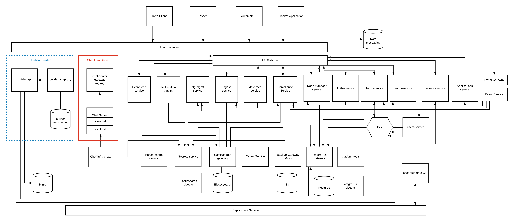

# Automate

    
Automate provides a unified view into infrastructure managed by
Chef, Inspec, and Habitat.

Key features include:

- Aggregation and analysis tools for Chef Client and Chef Server data,
- Compliance history and reporting, and
- Compliance scanning of both individual servers and cloud APIs.

For more information see:

- Documentation: https://automate.chef.io/docs/
- Release Notes: https://automate.chef.io/release-notes/

## Components

Chef Automate is a collection of microservices.  Each service is
developed independently.

### Core Applications

* [Automate UI](components/automate-ui)
* [Automate Gateway](components/automate-gateway)
* [Config Management Service](components/config-mgmt-service)
* [Compliance Service](components/compliance-service)
* [Event Service](components/event-service)
* [Ingest Service](components/ingest-service)
* [Nodemanager Service](components/nodemanager-service)
* [Notifications Service](components/notifications-service)

### Authentication, Authorization, & Administration

* [AuthN Service](components/authn-service)
* [AuthZ Service](components/authz-service)
* [Automate-Load-Balancer](components/automate-load-balancer)
* [Dex (OpenID Connect)](components/automate-dex)
* [Local User Service](components/local-user-service)
* [Teams Service](components/teams-service)
* [Session Service](components/session-service)

### Management and Backend Services

* [Backup Gateway](components/backup-gateway)
* [Data Lifecycle Service](components/data-lifecycle-service)
* [Deployment Service](components/automate-deployment)
* [Elasticsearch Gateway](components/automate-es-gateway)
* [Elasticsearch Sidecar](components/es-sidecar-service)
* [License Control Service](components/license-control-service)
* [PostgreSQL Gateway](components/automate-pg-gateway)
* [PostgreSQL Sidecar](components/pg-sidecar-service)
* [Secrets Service](components/secrets-service)
* [Trial License Service](components/trial-license-service)

### Optional Additional Components

These components allow you to deploy other Chef projects as part of
Automate

* Chef Server
  * [Bifrost](components/automate-cs-oc-bifrost)
  * [Bookshelf](components/automate-cs-bookshelf)
  * [Chef Server Gateway](components/automate-cs-nginx)
  * [Erchef](components/automate-cs-oc-erchef)

* Chef Workflow (in-development)
  * [Chef Workflow Gateway](components/automate-workflow-nginx)
  * [Workflow](components/automate-workflow-server)

## Getting Started

Please see Quickstart and Development Basics in the [development
document](./dev-docs/DEV_ENVIRONMENT.md).

## Architecture

The following picture illustrates the Automate 2.0 architecture

## API Compatibility

At this stage in development, the Go libraries and other APIs found in
this repository are not intended for use outside of Chef Automate. If
you think part of this repository would help and would like to depend
on it, please open a GitHub issue so we can discuss it.
