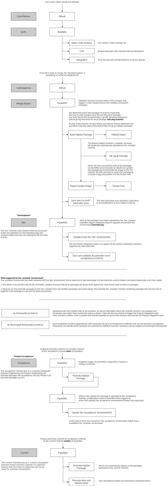

# Automate 2.0 Release Philosophy and Process

Automate's pipeline and release process adhere to the [patterns of continuous delivery](https://continuousdelivery.com/implementing/patterns/). Each time a PR/change is merged to master we produce a build which is a candidate for release to our end-users. Although it feels counterintuitive, we are actually lowering our risk by incrementally releasing small batches of change. It also creates a separation between the _technical_ decision to ship our software (by way of channel promotions) from the _business_ decision to fully release a new feature to our end-users. [Feature flags/toggles](https://martinfowler.com/bliki/FeatureToggle.html) allow us to continue merging partially implemented features to master, yet control when our end-users begin using these features.

## Channels

Changes are promoted through a series of channels

Channel | Description | Internal Environment | Dashboard
------- | ----------- | -------------------- | ---------
`dev` | The environment where “Technical Acceptance” occurs. Technical Acceptance, at this stage, should consist of our automated InSpec tests as well as any manual validation that may be required to confirm that the system is functional on a technical level (e.g. “Can I log in and create an API token?”). All engineering teams should feel empowered to perform their own Technical Acceptance. Each merge in the A2 repository automatically updates this environment.| `dev` |https://a2-dev.cd.chef.co
`acceptance` | The environment where “Product Acceptance” occurs. Product Acceptance is that same as it’s always been: an Engineer works with someone from the Product Team to confirm that the system functions according to the Acceptance Criteria. | `acceptance` | https://a2-acceptance.cd.chef.co
`current` | The first externally accessible channel in our release pipeline. Builds in this channel have passed through product acceptance and are "official" releases in the traditional sense. | None as of yet. Eventually the Ops team will run an internal A2 instance (eventually replacing ACC) which will be installed and updated off of the `current` channel | |

## Promotion Cadence

We strive to ship our work in small batches and get changes into our end-users hands ASAP. To this end we adhere to a frequent promotion cadence. We will also execute ad-hoc promotions as needed (e.g. for security fixes or other critical bug fixes). These scheduled promotions are in place just to ensure we are holding ourselves to a minimum cadence.

#### Promotion to Acceptance

The Release Engineering team executes this promotion every weekday at **7:30 PST/10:30 EST/19:30 CET**.

#### Promotion to Current

The Release Engineering team executes this promotion Mondays at **7:30 PST/10:30 EST/19:30 CET** (before the daily promotion to acceptance).

## Reverting

We don't revert, we roll forward! We also transform and roll out.

To be more specific we don't support/encourage customers rolling back to a previously promoted version of Automate 2.0. Instead, we should get a fix merged, promoted and into our end-users hands ASAP. This might be as simple as `git revert`-ing the bug while we we consider the proper long-term fix.

## Release Notes

Release notes allow product engineering to clearly communicate the list of features that are shipping in the builds being promoted to `current`. Remember release notes are not changelogs! The audience is our end-users, not other engineers. If you need a quick primer on what goes into good release notes, take a look at these excellent articles:

- [The Life-Changing Magic of Writing Release Notes](https://medium.com/@DigitalGov/the-life-changing-magic-of-writing-release-notes-4c460970565)
- [Let’s All Appreciate These Great Release Notes Together](https://www.prodpad.com/blog/writing-release-notes/)

The current (and evolving) process is to capture our release notes on [a simple wiki page](https://github.com/chef/automate/wiki/Current-Release-Notes). All edits should be completed before our weekly Prod Eng Demos which occur on Fridays at 10:00 PST / 13:00 EST / 19:00 CET. It is the responsibility of the _individual development teams_ to ensure the release notes are updated with any features and breaking changes which will ship as part of the weekly promotion to the `current` channel. We encourage teams to make updating these release notes part of their weekly rituals. Release Engineering will not chase down, nag or remind teams to update the release notes...whatever is in the wiki page at promotion time is what goes out with the release!

During our weekly promotion to the `current` channel, the week's release notes will be extracted from the wiki page and published to an S3 bucket. The published release notes are then available at the following URLs:

```
https://automate.chef.io/release-notes/
https://packages.chef.io/release-notes/current/automate/latest.md
https://packages.chef.io/release-notes/automate/<BUILD_VERSION>.md
```

These published release notes are used to communicate update availability across a number of distribution channels including:

- The Automate 2.0 download/landing page.
- Update notification prompts we'll be adding to the Automate 2.0 user interface.
- Discourse, blog and Slack posts

## Change Flow

The following diagram illustrates how a proposed change flows through the pipeline:


