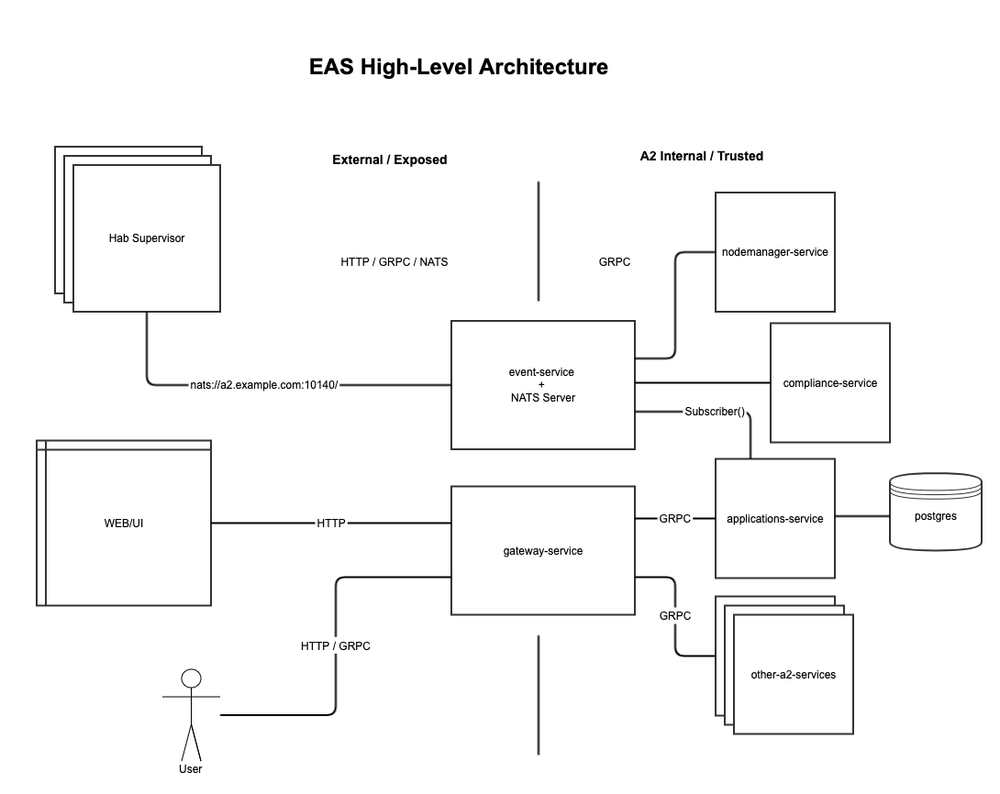
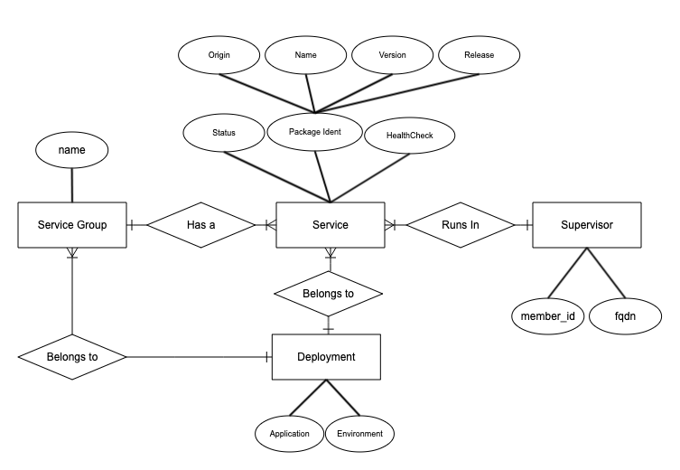

# Applications Service

The applications-service is in charge to digest the messages from Habitat supervisors, it has a
connection to our internal NATS Streaming Server as a Subscriber, a database connection to store
our digested messages and a gRPC Server to access the data going through the automate-gateway.

_NOTE: We are still in Spike/POC mode and therefor the designs and implementation details may change
at any time._

### High Level Architecture

### Entity Relationship Diagram

### Database Design

