# AuthZ Service

The AuthZ Service (short for "Authorization") provides the API
to determine if specific Automate actions are allowed on particular resources
based on a user's team membership.

_Contents of this file:_

[
The TOC below is auto-generated by the VSCode "Markdown TOC" plugin; do not edit manually.
With the plugin installed, this TOC will update automatically when you save the file!
]: #

<!-- TOC depthFrom:2 depthTo:3 -->

- [AuthZ Approach](#authz-approach)
  - [Terminology](#terminology)
  - [AuthZ with OPA](#authz-with-opa)
  - [Elements of the AuthZ Query](#elements-of-the-authz-query)
  - [Elements of the AuthZ Policy](#elements-of-the-authz-policy)
  - [Mapping Requests to Endpoints to Policies](#mapping-requests-to-endpoints-to-policies)
  - [Wildcards](#wildcards)
  - [Policy Semantics](#policy-semantics)
- [Managing Policies](#managing-policies)
  - [So You Want to Create Policies](#so-you-want-to-create-policies)
  - [Default Policies](#default-policies)
  - [Policy API](#policy-api)
  - [Introspection (How to Query Permissions)](#introspection-how-to-query-permissions)
- [Introducing Projects](#introducing-projects)
- [Spinning up the GRPC Service Locally](#spinning-up-the-grpc-service-locally)
  - [Start the service](#start-the-service)
  - [Connect to the service directly](#connect-to-the-service-directly)
  - [Connect to the service through Automate Gateway](#connect-to-the-service-through-automate-gateway)
- [Spinning up the GRPC Service in Habitat Studio Locally](#spinning-up-the-grpc-service-in-habitat-studio-locally)
  - [Start the service in Habitat Studio](#start-the-service-in-habitat-studio)
  - [Connect to the service directly in Habitat Studio](#connect-to-the-service-directly-in-habitat-studio)
  - [Connect to the service through Automate Gateway in Habitat Studio](#connect-to-the-service-through-automate-gateway-in-habitat-studio)
- [API](#api)
  - [func GetVersion](#func-getversion)
  - [func IsAuthorized](#func-isauthorized)
  - [type IsAuthorizedReq](#type-isauthorizedreq)
  - [type IsAuthorizedResp](#type-isauthorizedresp)
  - [type VersionInfo](#type-versioninfo)
- [Other Resources](#other-resources)

<!-- /TOC -->

## AuthZ Approach

### Terminology

#### Authentication (or AuthN)

Authentication establishes a user's identity.
AuthN is _not_ covered in this document; see [Authentication](https://github.com/chef/automate/blob/master/dev-docs/auth.md).

#### Authorization (or AuthZ)

Authorization defines an authenticated user's actions within the system.
This document is the comprehensive resource for authorization within Chef Automate.

#### OPA

AuthZ Service uses the
[Open Policy Agent](http://www.openpolicyagent.org/docs/) (OPA) library
for authorization decisions.
OPA uses general policies written in the declarative language `Rego` for decisions
on individual requests.

#### Policy

Policies specify the rights to access and act on resources within Chef Automate.
A single policy defines the rights of a set of users and/or teams of users
to access and act on a set of resources.
Policies and team membership are defined
by an admin user during Chef Automate setup.
A policy consists of a (`Subjects`, `Action`, `Resource`) tuple.

#### Query (or AuthZ Query)

Queries are used to determine that a user has the correct authorization
to proceed with an operation.
A query is an auto-generated message (IsAuthorizedReq) sent from the gateway
to the Authz service to check user authorizations against the policy store.
A query consists of a (`Subjects`, `Action`, `Resource`) tuple.

Note that the tuple for a Policy is different than a tuple for a query
only in that the former may contain wildcards, as explained in detail later.
More concretely, a policy states "who can do what to which resources",
while a query asks "can this person do this to that resource?"

(While a query can just as easily be talked about as a "request",
we are using "query" in this document to specifically mean the
message from the gateway to AuthZ, and "request" to mean the HTTP request
coming in to the gateway.)

#### Request (or HTTP Request)

This is a message sent from the Automate front-end to the gateway/back-end
that contains an HTTP endpoint, an HTTP method, and possibly parameters.
Parameters may be in the endpoint URL itself or in the body
of the request, depending on the HTTP method.
Example:

```text
HTTP endpoint: /auth/users
HTTP method: GET or PUT
Parameter: userID=123
```

### AuthZ with OPA

Every HTTP request to the gateway (from among all those defined in
proto files in the gateway project) is, after being _authenticated_, sent to the
AuthZ service to be _authorized_.
Authorization determines if that particular operation is
permitted for the current user.
(Note that there is _no_ authorization enforced at the individual service level,
only at the gateway.)
The AuthZ Service makes that determination with the OPA engine, which returns whether
or not the request is granted based on its knowledge of Automate policies.
These policies are all user-created, with the exception of the set of default
policies that are included out of the box.
Depending on your needs, you can delete some of the default policies,
which is necessary to have tighter permissions.
Note that the admin default policies, however, are non-deletable
to prevent locking yourself out of the system completely!

The figure shows the sequence of steps involved for each HTTP request received by
the gateway [1]. The _happy path_ through the system is:

a. A request enters the gateway.
   (Not shown, the gateway authenticates the user sending the request.)

b. The gateway creates a query and sends it to the AuthZ service to check
   for authorization [2]. The query contains the subjects, action, and resource.

c. The AuthZ service uses the OPA engine [3] to attempt to match the inputs
   against a policy.

d. If at least one such policy is found to match, it grants access
   to the given resource and action [5].

e. The AuthZ service can then send a response to the gateway [6] affirming this,
   so the gateway then allows the original request to proceed [7] and [8].

If a policy was _not_ matched against the inputs, the response from AuthZ to the query
is **deny**[4] so the gateway aborts the original HTTP request and returns a 403 HTTP status.

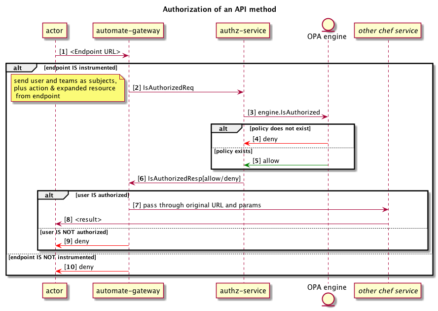

FIGURE 1 -- AUTHZ SEQUENCE DIAGRAM

> 
> It is important to note that in order to achieve a secure system,
> the default behavior is to _deny_ a request.
> This could occur if:
>
> 1. The API endpoint _is_ annotated with resource and action, but there is
>    no policy in place to allow that combination of resource and action [4].
> 1. The API endpoint is _not_ annotated with resource and action details [10].
>    This case should never happen in practice.

### Elements of the AuthZ Query

The gateway sends a query to the AuthZ service (the `IsAuthorizedReq`) to
determine authorization.
The AuthZ query has three required elements: `Subjects`, `Action`, and `Resource`.
As an example:

```text
Subjects: [ user:ldap:12345, team:ldap:audit, team:ldap:proj ]
Action: read
Resource: compliance:nodes:*
```

#### Query Subjects

A `Subject` is a user, client, or team that is requesting permission
to perform some operation.

For an HTTP request initiated by a _chef server_ or _chef client_,
the `Subjects` array will have just a single element with
the ID of the token that was used, in the form `token:`_SOME_ID_.

For an HTTP request initiated by a _browser_, this is an array containing
the user ID of
the requestor plus the IDs of any teams that user belongs to.
Teams may be locally maintained (within Automate) or may be those
managed by external identity management systems (LDAP or SAML).
The `Subjects` array will contain one element of the
form `user:`_PROVIDER_`:`_SOME_ID_
and zero or more elements of the form `team:`_PROVIDER_`:`_SOME_ID_.

#### Query Action

An `Action` is a verb being attempted by the requestor. This could be a CRUD verb
(e.g. "create") or a more specific action name.
Unlike the `Subjects`, which is inferred from the user,
the `Action` is inferred from the HTTP endpoint in the HTTP request that the user
has initiated.

Specifically, here is where it comes from:

Each public API method is specified by a definition in a proto file.
Included in that specification is the action associated with the endpoint.
Below the HTTP endpoint is `/auth/teams`, the HTTP method is `GET`, and the `Action` is `read`.

```Protobuf
  rpc GetTeams (teams.request.GetTeamsReq) returns (teams.response.Teams) {
    option (google.api.http).get = "/auth/teams";
    option (chef.automate.api.policy).resource = "auth:teams";
    option (chef.automate.api.policy).action = "read";
  };
```

As an example, in this query...

```text
subjects: [user:local:john@example.com]
action: read
resource: cfgmgmt:nodes
```

... the `Action` reveals what the user wants permission to do with
the `Resource` "cfgmgmt:nodes".

#### Query Resource

A `Resource` describes the data that the requestor is attempting to act upon.
This could be, for example, all Compliance profiles
or a particular Infrastructure Automation node.

Specifically, here is where it comes from:

Just like the `Action`, the `Resource` comes from the endpoint definition in the proto file.
In the example above, the `Resource` is `auth:teams`.
Unlike the other elements, a `Resource` may be _concrete_
(e.g. `/auth/teams` in the previous example)
or _abstract_ (e.g. `/auth/users/{email}`) as, for example:

```Protobuf
   rpc GetUser (users.request.Email) returns (users.response.User) {
    option (google.api.http).get = "/auth/users/{email}";
    option (chef.automate.api.policy).resource = "auth:users:{email}";
    option (chef.automate.api.policy).action = "read";
  };
```

When an actor (browser or chef client/server) sends an HTTP request,
it will, of course, provide a concrete path, (e.g. `/auth/users/foo@bar.com`).
The gateway matches that to either a concrete or abstract endpoint.
If it is an abstract one, as in this example, then the parameters recognized in the match
are applied to the resource, turning that abstract resource (`auth:users:{email}`)
into a concrete one (`auth:users:foo@bar.com`), which can then be evaluated for permissions.

### Elements of the AuthZ Policy

AuthZ _queries_ are comprised of a (`Subjects`, `Action`, `Resource`) tuple,
as just described.
Policy creation _requests_ are superficially the same -- a
(`Subjects`, `Action`, `Resource`) tuple -- but the values of each of those
differs between policies and queries, as does the origination.

That is, an AuthZ query is generated internally by the gateway
as actors interact with Automate, for any action that goes to the back end.
Creating a policy, on the other hand, is a specific action performed
by a system administrator, who explicitly provides
a (`Subjects`, `Action`, `Resource`) tuple.

#### Policy Subjects

The `Subjects` array contains one or more user IDs, team IDs, and/or token IDs
that the policy applies to.
As on the query side, an individual `Subject` can be a user, team, or non-human actor.
It can also include wildcards as described below.

#### Policy Action

An `Action` is either a specific verb or a wildcard `*` that applies the policy to _any_ verb.
A specific verb is typically a CRUD verb (e.g. "create") but could be a more specific action name.

#### Policy Resource

A Resource is the data the policy is protecting.
It can also include wildcards as described below.

### Mapping Requests to Endpoints to Policies

The (`Subjects`, `Action`, `Resource`) tuple of an AuthZ query is evaluated
by the AuthZ service as shown earlier (steps [3] to [5] in Figure 1 above).
These elements correspond to eponymous elements in Automate _policies_.
Thus, each Automate policy has `Subjects`, `Action`, and `Resource`.
The set of _all_ policies -- specified by an admin user during
Chef Automate setup -- collectively define what is allowed or denied for every Automate user.
The (`Subjects`, `Action`, `Resource`) tuple of an individual query
is matched against the set of policies, yielding one, none, or multiple policies.
As long as there is _at least one_ matching policy, the request is **allowed**.
If there are _no_ matching policies, the request is **denied**.

Consider a simple (demo) set of policies of the form (subject, action, resource):

```Protobuf
1: (team:local:admins, read, auth:teams)
2: (user:local:user1, update, compliance:node:*)
```

The first policy states that an actor that is a member of the local `admins` team
is granted `read` access to the `auth:teams` resource.
As noted earlier, the `auth:teams` resource is tied to the `GetTeams` RPC
and `/auth/teams` HTTP endpoint. Thus, this HTTP request coming in for
`/auth/teams` from an `admins` member --

```text
subjects: [user:local:123, team:local:admins, team:local:other]
action: read
resource: auth:teams
```

-- is allowed to proceed because it matches policy #1 above.
(See [5] in Figure 1.)

Figure 2 shows all of this again, slowed way down by a factor of -- well, a huge factor --
illustrating how the pieces interconnect.

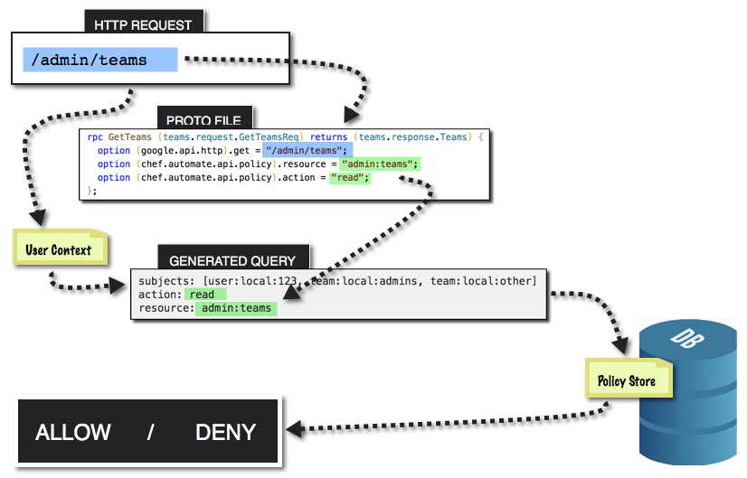

FIGURE 2 -- REQUEST-TO-DECISION

As another example--this time with wildcards--assume that a request comes in for
the `/compliance/special/5` endpoint.
Further assume that that endpoint is annotated with the `Action` of `update` and
`Resource` of `compliance:node:*` (conveniently in sync with policy 2 given above).
In this instance, the requesting user is `user2` so the generated AuthZ tuple is

```text
subjects: [user:local:user2, team:local:something]
action: update
resource: compliance:node:5
```

As the only policy (#2) regarding this particular
`Action` and `Resource` is for `user1`, the AuthZ service does _not_ authorize the call
so the gateway then denies the original HTTP request ([6] in Figure 1).

If, on the other hand, the request came in for `user1`, the result would be **allowed**
because the wildcard in policy #2 matches _any_ value at the end of that resource string,
so `compliance:node:5` or `compliance:node:00000000-0000-4000-8000-000000000000`
(or many others) would be allowed.

The next section provides further details about wildcards.

### Wildcards

AuthZ uses wildcards in policy definitions so that you can create a policy
that covers a large range of possible values. For example, if an `Action` may
be `create`, `read`, `update`, or `delete`, rather than having to create four
nearly identical policies each with a different `Action`, you can simply
specify an `Action` of `*` that will match any value in an AuthZ query.

Wild though they be, wildcards do have rules, however.
This section is focused on wildcards but by necessity has to introduce
general formats as well, but formats will be discussed more in the following section.

An `Action` consists of lowercase alphabetic characters, and possibly underscores...
or just a wildcard. Figure 3 illustrates this.

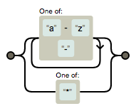

FIGURE 3 -- POLICY ACTION

A `Subject` may contain a wildcard in one of four possible locations, specifying:

- any users (or similarly any teams) of a certain provider, using e.g. `user:ldap:*`
- any teams (or similarly any users) at all, using, e.g. `team:*`
- any API tokens, using `token:*`
- any requestor at all, using `*`

Those are reflected in the railroad diagram in Figure 4.
(It is not critical to absorb the entire diagram. It is here more for completeness
for those who might want or need to know at some point.)
The easiest way to understand what the diagram conveys for our purposes here
is to trace a path through the diagram that "spells out" each of the above four expressions.
Start at the left terminus and look for a path that gets you all the way to the right terminus.

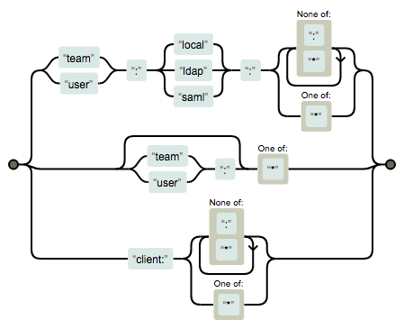

FIGURE 4 -- POLICY SUBJECT

A `Resource` is somewhat complex as well.
What you can immediately glean from Figure 5 -- given your mastery of Figures 3 and 4 --
is that a `Resource` may consist of ... a bunch of stuff... or a single wildcard.
But look closer. And squint.
It also shows that a `Resource` might also consist of ... a bunch of different stuff...
followed by a colon then a single asterisk.
So a resource may either be just a wildcard, or the last term in a resource may be a wildcard.
You can _not_ mix a wildcard with text within a single term, as in `stuff:pre*`.
A few examples of valid resources with wildcards
are `*` or `compliance:*` or `compliance:nodes:*`.

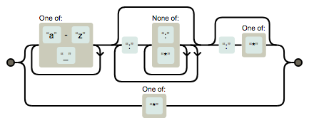

FIGURE 5 -- POLICY RESOURCE

### Policy Semantics

Arguably the key to understanding how AuthZ does permissioning
is understanding semantics of the policy.

It is important to keep in mind that an AuthZ query needs to only
match some policy to be granted access. To put that another way,
the permissions for a given query are determined by the _union_ of
all matching policies. For example,
if a user is part of team A and team B, but only team A is granted
permission by a policy to access a given resource, the query _is_ allowed.
(As long as _some_ policy covers a subject/action/resource, that is sufficient to grant access.)

Let's again consider the triumvirate of a policy definition.

#### Action Semantics

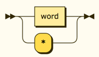

FIGURE 6 -- ACTION SEMANTICS

An `Action`, as you have seen, is very straightforward.
It is a verb (typically a CRUD operation) or a wildcard.
Nothing to add about it here, other than to include it for completeness.

#### Subject Semantics

Whoa! `Subjects` sure look different all of a sudden, though, compared to what you saw earlier.

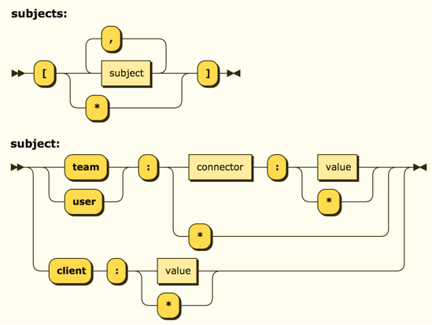

FIGURE 7 -- SUBJECT SEMANTICS

Figure 7 is divided into two. Mostly we have been talking about individual subjects.
The top part of the figure, though, is specifically describing the _plural_ `Subjects` property.
Which is to say, `Subjects` is either an array of `Subject` elements, or a single wildcard.

The lower half of Figure 7 expounds upon a single `Subject`, with arguably a bit
higher-level view than you saw in Figure 4.
The `provider` in the figure is one of the literals from Figure 4: `local`, `ldap`, or `saml`.
The `value` is an ID value appropriate to the provider.
You can also see here just which terms may specify a wildcard instead of a value.
Doing that means that the containing policy will allow all values for that term.
So you could, for example, create a policy to grant access to all users (`user:*`).
Alternately, if you want to restrict a policy to just local users, use `user:local:*` instead.
Likewise, a policy that would grant access to all chef servers and clients, as well as
any user using API tokens, would be `token:*`.

#### Resource Semantics

Taking a high-level perspective on resources also reveals some interesting patterns.

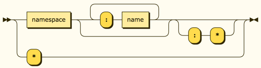

FIGURE 8 -- RESOURCE SEMANTICS

Resources are arguably the key to understanding permissioning because they involve
not just wildcards but also the added dimension of _hierarchy_.
Figure 8 reveals that there are ten types of valid resources.
Here are concrete examples of them, all quite deliberately rooted from
the same "branch" hierarchy here for discussion purposes.
In a nutshell, a resource can have any number of terms, separated by colons,
with a value or a wildcard at the end.

```text
[ 1] cfgmgmt:nodes:<some node id here>:runs:<some run id here>
[ 2] cfgmgmt:nodes:<some node id here>:runs:*
[ 3] cfgmgmt:nodes:<some node id here>:runs
[ 4] cfgmgmt:nodes:<some node id here>:*
[ 5] cfgmgmt:nodes:<some node id here>
[ 6] cfgmgmt:nodes:*
[ 7] cfgmgmt:nodes
[ 8] cfgmgmt:*
[ 9] cfgmgmt
[10] *
```

**Rule 1: A wildcard matches any value for the given term.**

You have already been exposed to this case, but just to be explicit,
say there is a `Resource` of `cfgmgmt:nodes:*` on a policy.

Now let's say a query came in checking permissions for node 23,
so the `Resource` in the query is `cfgmgmt:nodes:23`.
The AuthZ service would grant permission because the policy wildcard
matches any value. That is represented concisely here in the first row.
The additional rows show that this applies for any term of a `Resource`.

```text
Query                       Policy                 Allow or Deny?
-------                     ------                 --------------
cfgmgmt:nodes:23            cfgmgmt:nodes:*        Allow
cfgmgmt:nodes               cfgmgmt:*              Allow
cfgmgmt                     *                      Allow
compliance:nodes            cfgmgmt:*              Deny
compliance                  *                      Allow
```

**Rule 2: A wildcard is inclusive of everything deeper in the hierarchy.**

A policy with a `Resource` of `cfgmgmt:nodes:23:*` would match anything
deeper in the same branch:

```text
Query                       Policy                 Allow or Deny?
-------                     ------                 --------------
cfgmgmt:nodes:23:runs       cfgmgmt:nodes:23:*     Allow
cfgmgmt:nodes:23:runs:199   cfgmgmt:nodes:23:*     Allow
cfgmgmt:nodes:5:runs:199    cfgmgmt:nodes:23:*     Deny
```

**Rule 3: A wildcard is exclusive of its container.**

This case is notably _not_ included under rule 2:

```text
Query                       Policy                 Allow or Deny?
-------                     ------                 --------------
cfgmgmt:nodes:23            cfgmgmt:nodes:23:*     Deny
```

While that might seem odd at first glance, let's consider a variation,
just going up a level to look at a different set of semantic objects:

```text
Query                       Policy                 Allow or Deny?
-------                     ------                 --------------
cfgmgmt:nodes:23            cfgmgmt:nodes:*        Allow
cfgmgmt:nodes               cfgmgmt:nodes:*        Deny
```

Here we have a policy that says permission is granted for any value (node)
under `cfgmgmt:nodes`. So a query coming in to access node 23 is granted, clearly.
But the second query, to access the container of the nodes itself, is denied.
A `Resource` of `cfgmgmt:nodes` might, for example, be attached to a ListNodes
method or a CreateNode method.
And it is conceivable that you might want to grant access to particular
nodes, but not necessarily to see (list) all the nodes or to create a node.

**Rule 4: A literal (non-wildcard) is non-hierarchical.**

The absence of a wildcard in a policy means that requests must be exact matches.
There is no implied hierarchical permissions. A few examples:

```text
Query                       Policy                 Allow or Deny?
-------                     ------                 --------------
cfgmgmt:nodes               cfgmgmt:nodes          Allow
cfgmgmt:nodes:23            cfgmgmt:nodes          Deny
cfgmgmt:nodes:23            cfgmgmt:nodes:23       Allow
cfgmgmt:nodes:23:runs:99    cfgmgmt:nodes:23       Deny
```

**Rule 5: Overlapping policies are harmless.**

You can safely add policies with resources that overlap by wildcard hierarchy
inclusiveness.
(Note the same set of policies is used for each query.)

```text
Query                       Policy                   Allow or Deny?
-------                     ------                   --------------
                          / cfgmgmt:nodes:*         \
cfgmgmt:nodes:23            cfgmgmt:*                Allow
                          \ cfgmgmt:nodes:23:runs:* /

                          / cfgmgmt:nodes:*         \
cfgmgmt:nodes:42            cfgmgmt:*                Allow
                          \ cfgmgmt:nodes:23:runs:* /

                          / cfgmgmt:nodes:*         \
cfgmgmt:nodes:23:runs:11    cfgmgmt:*                Allow
                          \ cfgmgmt:nodes:23:runs:* /

                          / cfgmgmt:nodes:*         \
cfgmgmt:nodes:42:runs:11    cfgmgmt:*                Allow
                          \ cfgmgmt:nodes:23:runs:* /

                          / cfgmgmt:nodes:*         \
cfgmgmt:special             cfgmgmt:*                Allow
                          \ cfgmgmt:nodes:23:runs:* /
```

## Managing Policies

### So You Want to Create Policies

In order to create policies you need to know:

1. What provider your organization uses for users and teams.
   This could be `local`, meaning you will manage users and teams within
   Chef Automate, or it could be `ldap` or `saml`, depending on your needs.
1. Teams and/or user IDs to be permissioned.
1. Actions and resources associated with public API methods.

A cross-reference chart from API methods to actions and resources is provided
[here](../../docs/default_policies.md).

### Default Policies

Out of the box, Chef Automate provides a set of default policies
that provide access to all _non-administrative_ tasks to all users,
and access to all _administrative_ tasks to all users in the local admins group
(`team:local:admins`).
This allows you to explore the user interface immediately,
unencumbered with policy roadblocks limiting what you can see.
The set of default policies is [here](../../docs/default_policies.md).

That set of default policies may even be fine for certain organizations.
For others, it will be necessary to add and remove policies
to lock the system down so that known users are authorized to access
specific resources.

#### Adding New Default Policies

To add a new default policy, the following is needed:

1. A new IAM v1 policy: these are defined in [migrations](storage/postgres/migration/sql/),
   and the [v1 constants package](constants/v1/constants.go#L3-L4).
2. A new IAM v2 (system) policy: they are defined in [server/v2/system](server/v2/system.go#L31).
3. A new IAM v2 default policy (which can be deleted by users), or any additions
   to default roles, are done in [datamigrations](storage/postgres/datamigration/sql/).
3. Migration logic: When upgrading from IAM v1 to v2 (v2.1), v1 policies are
   converted. The conversion logic needs to be made aware of the new v1 policies, and
   how (and if) they are to be migrated (if they haven't been deleted). The procedure for
   converting legacy policies is defined in [server/v2/migration](server/v2/migration.go).

### Policy API

Documentation of the complete Policy API are available [here](TBD).
**Link to the swagger docs, or should the content be inline here??**

Managing policies is done via the command line.
These setup steps will make the process as productive as possible for you.

1. Install the `jq` JSON formatter to be able to get pretty-printed output (`brew install jq`).
1. Install the `jo` JSON generator to be able to type JSON concisely (`brew install jo`).
1. In habitat studio, generate a non-expiring token (`generate_supertoken`).
1. Copy that token into the `TOK` value in the following snippet and
  then execute to define these shell variables:

```bash
export TARGET_HOST=https://a2-dev.test/api/v0
export TOK="RyABKRdmg49UvOs7o73Q_Igcyng="
export TOKEN_ARG="api-token: $TOK"
```

With those preliminaries, the following concise syntax gives you access to the Policy API:

#### List Policies

This endpoint lists all the policies currently in the policy store.

```bash
curl -sSkH "$TOKEN_ARG" $TARGET_HOST/auth/policies | jq .
```

#### Introspect Permissions for Current User

Introspection lets you see which endpoints you have permission to access.
(If you used the supertoken generator above, you should have permissions for everything.)

```bash
curl -sSkH "$TOKEN_ARG" $TARGET_HOST/auth/introspect | jq .
```

#### Create Policy

`jo` saves typing a lot of quotation marks required by the JSON format.
This command executes an HTTP `POST` request.

```bash
curl -sSkH "$TOKEN_ARG" $TARGET_HOST/auth/policies --data "$(jo -p subjects=$(jo -a user:local:test@example.com) resource=auth:teams:* action=read version=v0)" | jq .
```

#### Delete Policy

Use "List Policies" above to find the unique identifier for the policy you wish to delete,
and supply it here with an HTTP `DELETE` request.

```bash
curl -sSkH "$TOKEN_ARG" $TARGET_HOST/auth/policies/f4fd7963-21db-4b5b-a8df-aa688056ed9d --request DELETE | jq .
```

### Introspection (How to Query Permissions)

In many cases it is useful to know a priori
what calls on a given view one can make before deciding what to render.
When UI code makes any call to the backend, e.g. "/cfgmgmt/stats/run_counts", the system
checks whether the current user has permission to access that endpoint.
If so, the call proceeds; otherwise, a 403 error is returned.
While that provides a robust security model, it does not by itself provide
a robust user experience.

_Introspection_, in the context of Chef Automate, is the process of determining permissions for a user.
That is, we take the user id and the team membership for the user, and check this against all policies
in the system, and return a list of those endpoints that the user is allowed to access
on at least one HTTP method. Endpoints where none of the methods are accessible are elided.

Introspection is intended for use by the Automate UI so that it may present a better
user experience. When rendering a page, the UI code should first make a call to the introspection endpoint.
From the list returned, it should then choose appropriate elements to render so that
they will _all_ perform permitted operations (as opposed to blindly putting controls for everything
and the user then encounters 403/unauthorized responses for the disallowed operations).
Note that policies may change at any time so there is no guarantee against 403 errors.

The introspection endpoint, `/auth/introspect`, supports two methods:

1. GET - Does an "IntrospectAll", returning permissions for all non-parameterized endpoints
   (i.e. concrete endpoints like "/auth/teams" but not abstract endpoints like "/auth/users/{email}").
2. POST - Does an "Introspect", returning data for the single endpoint path specified in the payload
   (an example payload might be "path=/auth/users/foo@bar.com" corresponding to "/auth/users/{email}").

Keep in mind that the POST here refers to the `/auth/introspect` endpoint --
_not_ to the target endpoint that is passed as an argument.
So though the target endpoint might use an HTTP GET method (such as with `/auth/users/{email}`)
you still introspect it with the POST method on the introspection endpoint.

Data from either call returns the same structure:

```text
{
  endpoints: {
    <endpoint_path>: {
      "get": <boolean>,
      "put": <boolean>,
      "post": <boolean>,
      "delete": <boolean>,
      "patch": <boolean>
    },
    <endpoint_path>: {
      "get": <boolean>,
      "put": <boolean>,
      "post": <boolean>,
      "delete": <boolean>,
      "patch": <boolean>
    },
    . . .
  }
}
```

Here is an example, looking at just one protobuf file and showing how the non-parameterized
methods in the proto file map to the resultant list.

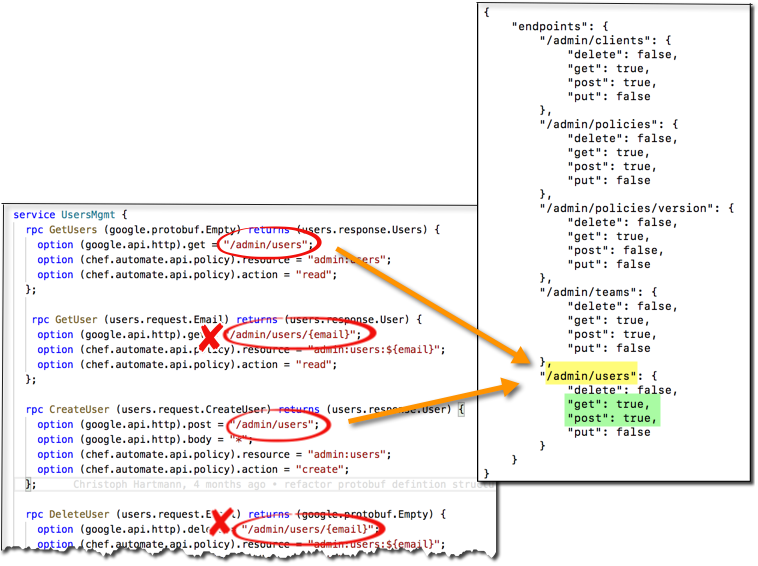

FIGURE 9 -- MAPPING PROTOBUFS TO INTROSPECTION

That list returned by `IntrospectAll` skips all the parameterized endpoints
because it would be impossible to know a priori the exhaustive set.
That is, if there is an endpoint `/compliance/nodes/{node_id}`, the UI will fill in
that `{node_id}` at the time of rendering for however many nodes are being displayed
and make those calls to the back end.
But if we want to get a list of permissions in advance, the backend does not
have a list of all possible node IDs and, even if it did, it would be prohibitive
to check all of them.

At the time of page rendering the UI code knows what set of IDs it is interested in
rendering.
So the second rpc method `Introspect` may be used to query a concrete (filled-in) version of
that single endpoint.
So it could, for example, it could introspect on `/compliance/nodes/23` to see
if permission on that node is granted and, if so, render it.
Then similarly for the remaining ones to be considered for display.

Introspection supports single (e.g. `/abc/def/{email}`)
 or multiple (e.g. `/abc/def/{email}/runs/{id}`) place holders within a path.
In the degenerate case, this also includes _no_ place holders, so you could introspect
_any_ single endpoint, parameterized or not.

Thus one may introspect for _concrete_ forms of any of these and more:

- /auth/users
- /auth/teams/_{id}_/users
- /auth/users/_{email}_
- /cfgmgmt/nodes/_{node_id}_/runs/_{run_id}_

Here is what happens with a parameterized endpoint (Figure 10).
The system checks all abstract, parameterized endpoints against the user's input,
matching against the place holders.
For those that match, the parameter from the URL is swapped into the same place holder
in the resource. Then, just like standard introspection (Figure 2), that resource/action pair
is sent off to the policy store to determine if any policies permit the operation.

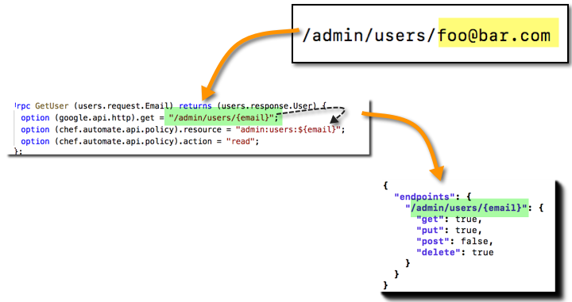

FIGURE 10 -- PARAMETERIZED INTROSPECTION

Most, but not all, endpoints in the public API put their parameters directly in the URL,
similar to the above example. But a given endpoint might accept its data in the body of the
request rather than in the URL (using the HTTP POST method, for example).

Introspection provides support for this as well.
You need to provide an additional parameter in the introspection request, called `parameters`.
This should be a list containing the name and value of each parameter of the target endpoint.
For this example, there is only one necessary parameter (`entity_uuid`).

```json
{
  "parameters": [
    "entity_uuid=zz123"
  ],
  "path": "/ingest/events/chef/run"
}
```

The list of parameters provided to the introspection call should include only
those parameters required by the abstract resource. In the above example the resource
is `ingest:nodes:{entity_uuid}:runs`.
That is, even if the actual target endpoint requires more parameters,
those should not be included when introspecting the endpoint.

Introspection on these POST endpoints works almost the same as shown for GET in Figure 10.
But rather than extract parameters from the URL, they come from the request body.

## Introducing Projects

With IAM v2.1, we introduce projects into the mix.
Figure 11 is analogous to Figure 1, but now includes projects.
The major thing to note here is that now downstream services need to be an active participant
by typically filtering results by the allowable projects (extreme right in the figure) .


FIGURE 11 -- AUTHZ SEQUENCE DIAGRAM *WITH* PROJECTS

The next figure sheds light on how a request for "all projects" is handled.

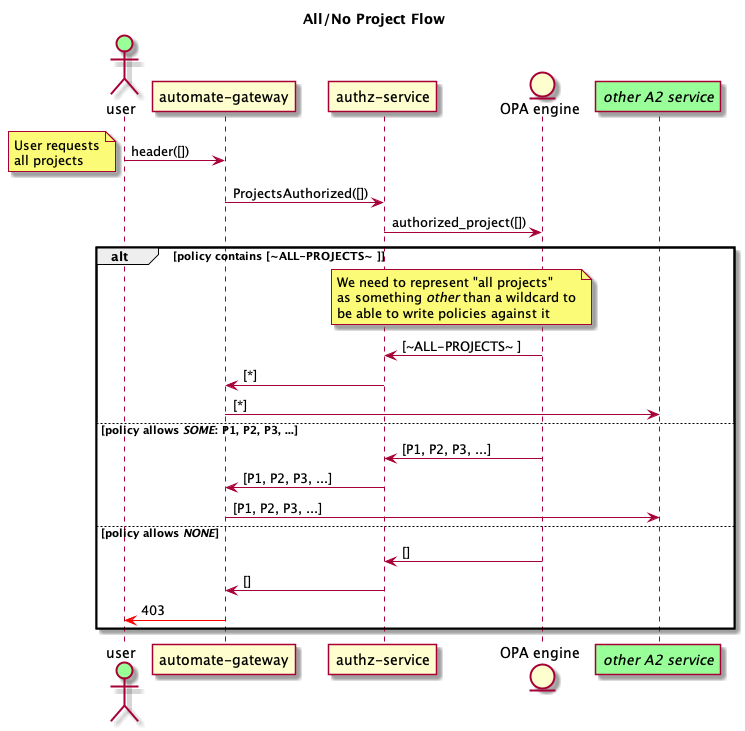

FIGURE 12 -- HANDLING OF "ALL PROJECTS" REQUESTED

There is a lot more to say about projects, but this at least serves as a place holder for now.

## Spinning up the GRPC Service Locally

This section describes how to bring up services in a standalone fashion.
It is the quickest for iterative development but farthest from the way
services are used in the "real world".
This is NOT the recommended way to exercise services -- see the next section
on running in the Habitat Studio -- but this involves fewer moving parts so it
is quite useful if this is your first time here or for troubleshooting.
If, for example, you want to use the interactive debugger, it is easier
outside Habitat Studio (not sure if it is even possible inside).
On the other hand, if you are already familiar with Habitat Studio, then using
the studio might be simpler as you do not need your
own GO setup and configuration.

### Start the service

In this directory, launch the service in the background:

```bash
$ make start &
```

### Connect to the service directly

From the root of the service directory, confirm the service is responding properly with this sanity check:

```bash
$ grpcurl -insecure -cert ../../dev/certs/authz-service.crt --key ../../dev/certs/authz-service.key localhost:9094 chef.automate.domain.authz.Authorization/GetVersion

<Version Response>
```

Next, test creating a policy using the Policy API:

```bash
$ echo '{"subjects": ["teams:local:admins"], "resource": "compliance:nodes:foo", "action": "read" }' | grpcurl -v -insecure -cert ../../dev/certs/authz-service.crt -key ../../dev/certs/authz-service.key -d @ localhost:9094 chef.automate.domain.authz.Authorization/CreatePolicy
```

Then, when you send an IsAuthorized query with the same parameters as the policy,
you should see that the query is authorized:

```bash
$ echo '{"subjects": ["teams:local:admins"], "resource": "compliance:nodes:foo", "action": "read" }' | grpcurl -v -insecure -cert ../../dev/certs/authz-service.crt -key ../../dev/certs/authz-service.key -d @ localhost:9094 chef.automate.domain.authz.Authorization/IsAuthorized

<Successful Authorization Response>
```

Test the `IsAuthorized` call with an unauthorized group name by using any other
string in the subjects, action, or resource field:

```bash
$ echo '{"subjects": ["teams:local:unauthorized_team"], "resource": "compliance:nodes:foo", "action": "read" }' | grpcurl -v -insecure -cert ../../dev/certs/authz-service.crt -key ../../dev/certs/authz-service.key -d @ localhost:9094 chef.automate.domain.authz.Authorization/IsAuthorized

<Failed Authorization Response>
```

You can also try adding policies with wildcard attributes.
The policy created with the command below allows any user to do any action on
any Compliance resource:

```bash
$ echo '{"subjects": ["*"], "resource": "compliance:*", "action": "*" }' | grpcurl -v -insecure -cert ../../dev/certs/authz-service.crt -key ../../dev/certs/authz-service.key -d @ localhost:9094 chef.automate.domain.authz.Authorization/CreatePolicy
```

NOTE: `grpcurl` is configured to omit empty responses, which is why the returned unauthorized
response is an empty object.

### Connect to the service through Automate Gateway

If not already running, launch the gateway service in the background:

```bash
$ cd ../automate-gateway
$ make run &
```

The `GetVersion` method is exposed on the gateway, so may be invoked:

```bash
$ curl --insecure -H "Authorization: Bearer dev" https://localhost:2000/authz/version
{"name":"authz-service","version":"0.0.1","sha":"TODO","built":"TODO"}
```

The `IsAuthorized` method, however, is not exposed on the gateway;
it is intended strictly for use by other gateway services.

## Spinning up the GRPC Service in Habitat Studio Locally

This section describes how to bring up services in Habitat Studio.
It is a bit closer to "real world" conditions but involves a bit more
overhead. Even so, it provides commands to make iterative development nearly as
quick as running services in isolation as discussed above,
and is the recommended way to exercise services locally.

### Start the service in Habitat Studio

First, enter the studio. Make sure you are in the root of the a2 repository!

```bash
$ cd your-code-dir
$ cd a2
$ rm -r results  # usually a good idea to clean this dir out first!
$ hab studio enter

... Lots of useful details reported about using the studio here...

[1][default:/src:0]#
```

Generally it is useful to always start with this `export` command to make
subsequent tasks faster, as the studio preamble describes:

```bash
[1][default:/src:0]# export GO_FAST=true
```

Next, invoke the `start_*` command to launch the service of interest:

```bash
[2][default:/src:0]# start_authz_service
```

Note that in the studio, these `start_*` commands automatically run
services in the background; you do not need to force that with a trailing ampersand.

### Connect to the service directly in Habitat Studio

Confirm the service is responding properly with this sanity check.
Note that the paths to the certificates differ from the same invocation
outside the studio, simply because you are in a different directory.
Here you are in the a2 root, whereas earlier you were in the service directory.

```bash
[3][default:/src:0]# grpcurl -v -insecure -cert dev/certs/authz-service.crt -key dev/certs/authz-service.key localhost:9094 chef.automate.domain.authz.Authorization/GetVersion

<Version Response>
```

Next, populate the service with a policy.

```bash
[3][default:/src:0]# echo '{"subjects": ["teams:local:admins"], "resource": "config-mgmt:nodes:foo", "action": "read" }' | grpcurl -v -insecure -cert dev/certs/authz-service.crt -key dev/certs/authz-service.key -d @ localhost:9094 chef.automate.domain.authz.Authorization/CreatePolicy

<Created Policy Response>
```

Test the `IsAuthorized` call with the policy you just created.

```bash
[4][default:/src:0]# echo '{"subjects": ["teams:local:admins"], "resource": "config-mgmt:nodes:foo", "action": "read" }' | grpcurl -v -insecure -cert dev/certs/authz-service.crt -key dev/certs/authz-service.key -d @ localhost:9094 chef.automate.domain.authz.Authorization/IsAuthorized

<Successful Authorization Response>
```

### Connect to the service through Automate Gateway in Habitat Studio

Just above you launched the target service of interest. Now you need to add the
gateway service.

```bash
[5][default:/src:0]# start_gateway_service
```

The `GetVersion` method is exposed on the gateway, so may be invoked.
However, Habitat Studio is like a clean room; very little in the way of
utilities are pre-installed. Thus, to use `curl` you need to install it first.
Then you can run the same `curl` invocation you saw earlier.

```bash
[6][default:/src:1]# hab pkg install -b core/curl

[7][default:/src:1]# curl --insecure -H "Authorization: Bearer dev" https://localhost:2000/authz/version
{"name":"authz-service","version":"0.0.1","sha":"TODO","built":"TODO"}
```

Keep in mind that the Automate gateway exposes services through conventional
HTTP protocols. Thus, you can run the very same `curl` command *outside*
Habitat Studio and it will still work!

As mentioned in the previous section, the `IsAuthorized` method is not
exposed on the gateway;
it is intended strictly for use by other gateway services.
Thus, you cannot access it with the HTTP protocol.

## API

### func GetVersion

```go
func GetVersion() VersionInfo, Error
```

Returns details about the version of the Authorization service.
The Error is always returned as `nil`.

### func IsAuthorized

```go
func IsAuthorized(IsAuthorizedReq) IsAuthorizedResp, Error
```

Determines if an API request is authorized.
If so, `IsAuthorizedResp.Authorized` is `true` and the Error is `nil`.
If not, the Error is non-`nil` and the `IsAuthorizedResp` is `nil`.

### type IsAuthorizedReq

```go
type IsAuthorizedReq struct {
  Subjects  string // the user, and the teams they belong to, whose access is being determined
  Resource string // the resource for which access is wanted
  Action   string // the action on the resource
}
```

### type IsAuthorizedResp

```go
type IsAuthorizedResp struct {
  Authorized bool // set to true to indicate access is allowed
}
```

### type VersionInfo

```go
type VersionInfo struct {
  Name    string // service name
  Version string // service version
  Sha     string // checksum of the git HEAD used to build the binary
  Built   string // creation date of the binary
}
```

## Other Resources

To be sure, there are a lot of moving parts to understand to successfully
navigate the world of Automate2 services. Besides the above, be sure to review
the [A2 Development Environment](https://github.com/chef/automate/blob/master/docs/DEV_ENVIRONMENT.md).
