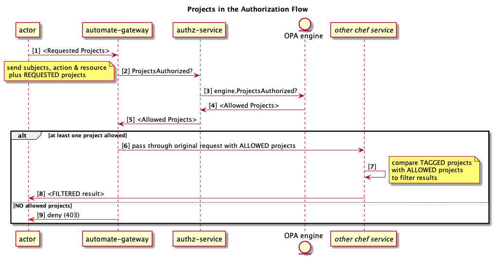

# AuthZ Service

The AuthZ Service (short for "Authorization") provides the API
to determine if specific Automate actions are allowed on particular resources
based on a user's team membership.

## AuthZ Approach

### Terminology

#### Authentication (or AuthN)

Authentication establishes a user's identity.
AuthN is _not_ covered in this document; see [Authentication](https://github.com/chef/automate/blob/master/dev-docs/auth.md).

#### Authorization (or AuthZ)

Authorization defines an authenticated user's actions within the system.
This document is the comprehensive resource for authorization within Chef Automate.

#### OPA

AuthZ Service uses the
[Open Policy Agent](http://www.openpolicyagent.org/docs/) (OPA) library
for authorization decisions.
OPA uses general policies written in the declarative language `Rego` for decisions
on individual requests.

#### Query (or AuthZ Query)

Queries are used to determine that a user has the correct authorization
to proceed with an operation.

#### Request (or HTTP Request)

This is a message sent from the Automate front-end to the gateway/back-end
that contains an HTTP endpoint, an HTTP method, and possibly parameters.
Parameters may be in the endpoint URL itself or in the body
of the request, depending on the HTTP method.
Example:

```text
HTTP endpoint: /auth/users
HTTP method: GET or PUT
Parameter: userID=123
```

> 
> It is important to note that in order to achieve a secure system,
> the default behavior is to _deny_ a request.
> This could occur if:
>
> 1. The API endpoint _is_ annotated with resource and action, but there is
>    no policy in place to allow that combination of resource and action [4].
> 1. The API endpoint is _not_ annotated with resource and action details [10].
>    This case should never happen in practice.

#### Adding New System Policies

To add a new default policy, the following is needed:

New IAM v2 (system) policy: they are defined in [server/v2/system](server/v2/system.go#L31).

### Introspection (How to Query Permissions)

In many cases it is useful to know a priori
what calls on a given view one can make before deciding what to render.
When UI code makes any call to the backend, e.g. "/cfgmgmt/stats/run_counts", the system
checks whether the current user has permission to access that endpoint.
If so, the call proceeds; otherwise, a 403 error is returned.
While that provides a robust security model, it does not by itself provide
a robust user experience.

_Introspection_, in the context of Chef Automate, is the process of determining permissions for a user.
That is, we take the user id and the team membership for the user, and check this against all policies
in the system, and return a list of projects for all or some of the endpoints that the user is allowed
to access on at least one HTTP method. Endpoints where none of the methods are accessible are elided.

Introspection is intended for use by the Automate UI so that it may present a better
user experience. When rendering a page, the UI code should first make a call to the introspection endpoint.
From the list returned, it should then choose appropriate elements to render so that
they will _all_ perform permitted operations (as opposed to blindly putting controls for everything
and the user then encounters 403/unauthorized responses for the disallowed operations).
Note that policies may change at any time so there is no guarantee against 403 errors.

## Introducing Projects

With IAM v2.1, we introduce projects into the mix.
Figure 11 is analogous to Figure 1, but now includes projects.
The major thing to note here is that now downstream services need to be an active participant
by typically filtering results by the allowable projects (extreme right in the figure) .



FIGURE 11 -- AUTHZ SEQUENCE DIAGRAM *WITH* PROJECTS

The next figure sheds light on how a request for "all projects" is handled.


FIGURE 12 -- HANDLING OF "ALL PROJECTS" REQUESTED

There is a lot more to say about projects, but this at least serves as a place holder for now.

## Data Layer

There are a lot of moving parts in Authz service.
To aid in visualizing the various pieces here is an entity-relationship diagram detailing the data layer.


FIGURE 13 -- ENTITY RELATIONSHIP DIAGRAM

## Other Resources

To be sure, there are a lot of moving parts to understand to successfully
navigate the world of Automate2 services. Besides the above, be sure to review
the [A2 Development Environment](https://github.com/chef/automate/blob/master/docs/DEV_ENVIRONMENT.md).
