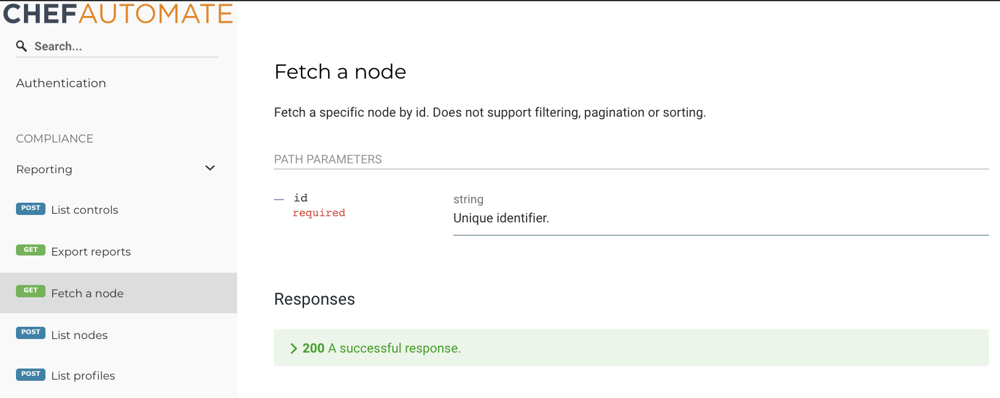

# Automate 2.X - Website

A new static website for Automate is based on [Hugo](https://gohugo.io), the Go-powered static site generator.

## Getting Started

### One Time Install

1. Disable smart quotes. OS X tries to use smartquotes by default when editing Hugo docs. You want smartquotes disabled regardless if you are writing code. Here's how [you can disable it](http://www.iclarified.com/38772/how-to-disable-curly-quotes-in-mac-os-x-mavericks).

1. [Install Hugo](https://gohugo.io/getting-started/installing/). If you're using homebrew:

    ```shell
    brew install hugo
    ```

1. [Install go-swagger](https://goswagger.io/install.html). The currently supported version is 0.20.1. If you're using homebrew:

    ```shell
    brew tap go-swagger/go-swagger && brew install go-swagger
    ```

    If everything is up to date you should see output like this when running `swagger version`:

    ```shell
    $ Swagger version
    version: v0.20.1
    commit: (SHA)
    ```

1. [Install jq](https://stedolan.github.io/jq/)

    ```shell
    brew install jq
    ```

1. (Optional) [Install cspell](https://github.com/streetsidesoftware/cspell/tree/master/packages/cspell)

    To be able to run the optional `make spellcheck` task you'll need to install `cspell`:

    ```shell
    npm install -g cspell
    ```

### Development

1. From the `components/automate-chef-io` directory, run the following command to start the development server.

    ```shell
    $ make serve
    ```

    When this is running, any changes you make to content in the `components/automate-chef-io` directory will be automatically compiled and updated the browser.

    To view the docs in your browser, navigate to:

    ```shell
    http://localhost:1313/docs/
    ```

## Creating and Changing Docs

The site is built with [Hugo](https://gohugo.io/), a Go-based static site generator, and uses [Stencil](https://stenciljs.com/) for web components and [Sass](http://sass-lang.com/) for CSS.
You'll probably want to familiarize yourself with the Hugo documentation, which covers templating, layouts, functions, etc., but there are helpers to assist you with doing some common things, like creating a new blog post:

```shell
hugo new docs/my-sweet-new-page.md
```

Your new page will be created as a draft with enough [frontmatter](https://gohugo.io/content-management/front-matter/) to get you going. All content is authored in [Markdown](https://en.wikipedia.org/wiki/Markdown).

## Helpers

make sync
: Pull down the current chef hugo theme

make serve
: Start the live-reload development environment

make spellcheck
: Run the spellchecker against the files across the Automate project with documentation content

> If you get a `git clone` related failure when running these commands, you may not have your HTTPS GitHub credentials setup. These commands will clone down the hugo theme via HTTPS.
[Read these docs](https://help.github.com/articles/which-remote-url-should-i-use/#cloning-with-https-urls-recommended) to learn why we use HTTPS over SSH, and how to setup your GitHub credentials.

## Markdown Content

Please try to keep all your documentation in the `docs` directory. Any new documents should automatically show up in the sidebar. If you need to control the ordering of the sidebar, you can add `weight` to the frontmatter of the documents.

To add a new Markdown file, simply run the following command from the `components/automate-chef-io` directory:

```shell
hugo new docs/<filename>.md
```

This will create the file and fill in the necessary frontmatter automatically.

## Data Content

Hugo allows us to nest our data directory structure as much as necessary. You can add as many folders as necessary under `components/automate-chef-io/data/docs`.

```output
.
├── data
│   ├── docs
│   │   ├── cli
|   │   │   ├── command_one.yml
|   │   │   └── command_two.yml
```

## API Documentation

To view the API documentation locally, navigate to the `components/automate-chef-io` directory, run the following command to start the development server:

```shell
$ make serve
```

To view the API docs in your browser, navigate to:

```shell
http://localhost:1313/docs/api
```

### Building API Docs

Chef Automate generates API documentation from proto files comments using

* [grpc-gateway protoc-gen-swagger](https://github.com/grpc-ecosystem/grpc-gateway/tree/master/protoc-gen-swagger) as the protoc compiler
* [OpenAPI 2.0 specification](https://github.com/OAI/OpenAPI-Specification/blob/master/versions/2.0.md) as the API schema
* [ReDoc](https://github.com/Redocly/redoc) as the front-end display

To build the API documentation during development:

1. Make any edits to the .proto files necessary. Note that an "Authorization Action:" section will be added automatically in the next step.
2. Recompile the .proto files as described in the [Automate development guide](https://github.com/chef/automate/blob/master/dev-docs/DEV_ENVIRONMENT.md)
3. From the top of the `components/automate-chef-io` directory, sync the .swagger files generated with those in the docs component by running `make sync_swagger_files`
4. Run the hugo server and view the documentation in your browser
5. (Optional) From the top of the `components/automate-chef-io` directory, check for typos in documentation files by running `make spellcheck`

Rebuilding the API docs is necessary when adding documentation content to Automate's .proto files. Changing the code in the .proto files does not require rebuilding, but new or updated services, messages, or fields require documentation.
Our goal is to provide timely and accurate documentation for Chef Automate users.

You can build the API docs by running the following all-in-one command from the top-level `automate` directory:

`hab studio run "source .studiorc && compile_all_protobuf_components" && pushd components/automate-chef-io/ && make sync_swagger_files generate_swagger && make serve || popd`

Review the API docs in your browser:

`http://localhost:1313/docs/api`

#### Notes on building the docs

* If you end up with merge conflicts while writing API docs, don't attempt to resolve them in any generated files. It's better to resolve the conflicts in any human edited file and then regenerate the docs.
* The all-in-one build command above can fail somewhere in the middle and leave things in an inconsistent state.
It is safe to run this command multiple times in a row while fixing syntax errors in .proto files or similar, but since it changes directories, it can sometimes be necessary to change back to the root automate directory.

### API File Index

* **API Proto Files**: automate/components/automate-gateway/api/
* **Example API Proto File**: automate/components/automate-gateway/api/compliance/reporting/
* **Meta Swagger**: automate/components/automate-chef-io/data/docs/api-static/01-meta-swagger.json
* **Reporting Export**: automate/components/automate-chef-io/data/docs/api-static/01-reporting-export.swagger.json
* **Description**: automate/components/automate-chef-io/data/docs/api-static/02-meta-description.yaml
* **Tags**: automate/components/automate-chef-io/data/docs/api-static/03-tags.swagger.json
* **Compiled Swagger**: automate/static/api-docs/all-apis.swagger.json

### Tags and Tag Groups

* Endpoints need to appear in the rendered documentation as human-readable groupings. We use group and endpoint tags to create an organized and meaningful presentation for the Chef Automate API.
* Endpoints must have a tag that is a member of a tag group in order to appear in the rendered documentation. Endpoints without tags that are members of a tag group will not show up.
* An endpoint's default tag is the parent service where it was defined.
* Every service must have a unique tag name. For services without unique names, follow the explicit tagging process. Without unique service tag names, all endpoints for all of these services appear together in the rendered documentation.

#### Automatic tagging

Set up automatic tagging in the `components/automate-chef-io/data/docs/api-static/03-tags.swagger.json` file.

* Add the service's name to the `tags` list in a `tagGroup` or create a new `tagGroup` with the service's name in the `tags` list.
* Make the service name human-friendly by adding an entry to the `tags` in with a custom `x-displayName`.

#### Explicit tagging

* Each endpoint needs a tag specified in its definition, by adding a block like this to the endpoint definition in the proto file:

    ```go
    option (grpc.gateway.protoc_gen_swagger.options.openapiv2_operation) = {
      tags: "My Custom Tag"
    };
    ```

* All of the tags for an individual service should be the same, unless multiple groupings are desired in which case multiple independent tags can be used.
* After this, the process described for automatic tagging can be used, substituting the custom tag defined in place of the service's name.

## Notes

* Proto files can use tabs and spaces. We have a defacto convention for using tabs since our protos are primarily used with Go code.
* Endpoints will not show up in the UI unless one or more of their tags are assigned to a tag group, but they will still appear in the Swagger file accessible through the docs in the browser.
* multiline fields are not allowed in proto files. This the main reason we settled on using the comment style of endpoint documentation.

### API Style Guide

Add comments to protos file with standard Go block and inline comment syntax.

Block comments are usually placed before the start of a gRPC service definition. Block comments for API documentation are sometimes called "leading comments".

Inline are usually placed within the message formats. Inline comments for API documentation are sometimes called "following comments".

```go
/* This is a block comment.

Block comments can span multiple lines.

Block comments support Markdown */

// This is an inline comment.
```

Block comments support multiple lines:

```go
  /*
  Fetch a node

  Fetch a specific node by id.
  Does not support filtering, pagination or sorting.
  */
  rpc ListReportIds(Query) returns (ReportIds) {
```

Block comments supports common markdown elements, such as:

```go
  /*
  Code blocks support `highlighting`

  It also supports

  Using code blocks, if you need them.

  */
```

Block comments support markdown tables:

```go
  /*
  List reports

  Makes a list of reports. Adding a filter makes a list of all node reports that meet the filter criteria. Supports pagination, filtering, and sorting.

  | Sort parameter | Sort value |
  | --- | --- |
  | latest_report.controls.failed.critical | controls_sums.failed.critical |
  | latest_report.controls.failed.total | controls_sums.failed.total |
  | latest_report.end_time (default) | end_time |
  | latest_report.status | status |
  | node_name | node_name.lower |
  */
  rpc ListReports(Query) returns (Reports) {
```

### Excluding an endpoint

You can exclude an endpoint from the swagger generation by importing this in your proto file:

```go
import "protoc-gen-swagger/options/annotations.proto";
```

And adding this annotation to the rpc in question:

```go
option (grpc.gateway.protoc_gen_swagger.options.openapiv2_operation) = {
  tags: "hidden";
};
```

## Service Documentation

Not in iteration #1.

## Resource Documentation

Given a GRPC endpoint defined like this in the proto files:

```go
>.rpc ListReports(Query) returns (Reports) {
>.>.option (google.api.http) = {
>.>.>.post: "/compliance/reporting/reports"
>.>.>.body: "*"
>.>.};
>.};
```

* For the first iteration of the Chef Automate API docs, we need summaries and descriptions for all user-facing end points. This can be done two ways, in the comment style (preferred) or the attribute style.

* Comment style of endpoint documentation supports multiline fields. Attribute style does not.

* Descriptions support Github Flavored Markdown, which means that you can use lists, tables, code-blocks and more.

### Comment Style Descriptions

```go
  /*
  List reports
  This is the description.
  The description can span multiple lines and can contain `Github Flavored Markdown`
  */
  rpc ListReports(Query) returns (Reports) {
    option (google.api.http) = {
      post: "/compliance/reporting/reports"
      body: "*"
    };
    option (grpc.gateway.protoc_gen_swagger.options.openapiv2_operation) = {
      tags: "Reporting"
    };
  };
```

### Attribute Style Descriptions

```go
rpc ListReports(Query) returns (Reports) {
    option (google.api.http) = {
      post: "/compliance/reporting/reports"
      body: "*"
    };
    option (grpc.gateway.protoc_gen_swagger.options.openapiv2_operation) = {
      tags: "Reporting"
      summary: "List reports"
      description: "This is the description.\nThe description can span multiple lines and can contain Github Flavored Markdown."
    };
  };
```

Resource documentation provides RPC-level description. It is sometimes also called "method description" because it documents what you can do with a specific API HTTP Method.

Use block/leading comments for RPC-level/method documentation.

Compare the leading comments to the content of the API documentation for the `ReadNode(ID)` resource.

```go
  /*
  Fetch a node #(summary)

  Fetch a specific node by id. #(description)
  Does not support filtering, pagination or sorting.
  */
  rpc ReadNode(Id) returns (Node) {
```

The rendered documentation:



Note that once you recompile the proto files as described earlier, the actual source comment above will be updated to include an authorization action, for any relevant methods.

```go
  /*
  Fetch a node #(summary)

  Fetch a specific node by id. #(description)
  Does not support filtering, pagination or sorting.

  Authorization Action:

  ```
  compliance:reportNodes:get
  ```

  */
  rpc ReadNode(Id) returns (Node) {
```

### Message Level Descriptions

Document fields and parameters directly above the relevant code line, using `//` inline comments

## Message Documentation

Given messages defined like this in the proto files:

```go
message Dog {
  // The dog's name.
  string name = 1;
  // Intentionally blank.
  Food favorite_food = 2;
  // Types of food the dog is normally fed.
  repeated Food typical_foods = 3;
}
// A type of food eaten by a Dog
message Food {
  // The food's name.
  string name = 1;
  // Serving size in ounces.
  int32 serving_size =3;
}
```

* Use a period (`.`) at the end of a comment to set it as the `description` for a message field. Omit the period to set a comment as the `title` for a message field. Our convention is to set comments as descriptions in message fields by closing them with periods.
* Swagger relies on inheritance to document nested references. A parent message referenced in a child message inherits its description from the parent, not where it is referenced by the child (see the example of `favorite_food` above). The Chef API style uses `// Intentionally blank.` in the child message.
This convention makes the purpose of the comment clear, makes undocumented message code visible, and makes bad blank message comment lines stand out in the UI.

## Non-Proto File Sources for API Documentation

We use non-proto file sources to document API content in cases where proto files run up against the limitations of tool we use for the Swagger conversion and also in cases where expressing the content in proto files is cumbersome.
We support these cases by adding static Swagger JSON or YAML files that combine with the Swagger generated from the proto files.

### When to use Non-Proto Files

* Endpoints that do not automatically generate Swagger files during proto compilation. An example of this is the ReportingService's Export endpoint, which derives its endpoint from outside of the proto files, and is excluded in the proto to Swagger conversion process. See: `components/automate-chef-io/data/docs/api-static/01-reporting-export.swagger.json`.
* Documentation data that extends the protobuf or Swagger specs, for example the ReDoc `X-tagGroup` that we use for tag groups and tag display names. See: `components/automate-chef-io/data/docs/api-static/03-tags.swagger.json`.
* Metadata that is specific to the API documentation. For example, the support page URL, the logo image, etc. See: `components/automate-chef-io/data/docs/api-static/00-meta.swagger.json`.
* Large sections of prose or formatted text. With a few exceptions, proto files do not support multiline strings, so it is simpler to write and edit long content outside of the proto files. See: `components/automate-chef-io/data/docs/api-static/02-meta-description.yaml`.

### Creating Non-Proto File Documentation

* Create a new JSON or YAML file in the `components/automate-chef-io/data/docs/api-static/` directory and its contents will be added to the final Swagger JSON  file used to render the documentation.
* Files in this directory are sorted numerically so that the order in which things are applied is deterministic and predictable.
* The Swagger files are combined in an additive way. The static user-edited Swagger files are applied first, follwed by all of the Swagger files generated from compiling the proto files.
* The Chef API style prefers JSON files in nearly all cases, but uses YAML files to supply long text sections in the documentation.

## Grammar and Style

* Keep it short
* Use [active voice](https://www.grammarly.com/blog/active-vs-passive-voice/)
* Use [plain language](https://plainlanguage.gov/resources/checklists/checklist/)
* Use [present tense](https://www.grammarly.com/blog/simple-present/)
* Write [positively](https://www.plainlanguage.gov/guidelines/concise/use-positive-language/)

### Specific Tips

* Avoid "of the" for a [genitive case](https://www.learnenglish.de/grammar/casepossgen.html)
    * Example: "The node name" instead of "Name of the node". (A simple genitive)
    * Example: "The control's unique ID" instead of "The unique ID of the control".

Note: We have not yet settled on conventions for using the grammatically questionable "simple genitive" instead of the categorically correct posessive. Try finding what sounds best to your ears.

## External references

* [OpenAPI 2.0 (aka swagger) spec](https://github.com/OAI/OpenAPI-Specification/blob/3.0.0/versions/2.0.md)
* [An example proto file in the protoc-gen-swagger repo demonstrating how to use most features of the proto-to-swagger conversion](https://github.com/grpc-ecosystem/grpc-gateway/blob/master/examples/proto/examplepb/a_bit_of_everything.proto)
* [ReDoc extensions to the Swagger spec](https://github.com/Redocly/redoc/blob/master/docs/redoc-vendor-extensions.md)
* [An alternate Swagger spec](https://swagger.io/docs/specification/2-0/basic-structure/)
* [Documentation in a code comment of how protoc-gen-swagger converts comments in proto files to Swagger fields](https://github.com/grpc-ecosystem/grpc-gateway/blob/c3787b4d95d15f4c89484b44e108a6640c1943ca/protoc-gen-swagger/genswagger/template.go#L1294-L1305)
