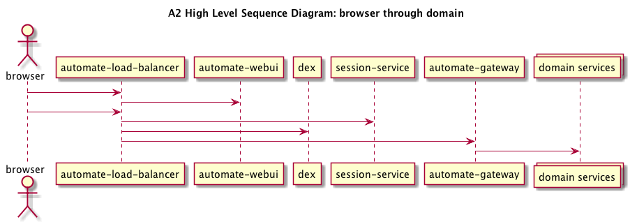

# Public-facing API Gateway for Chef Automate

Chef Automate's public-facing API is available in two forms: GRPC and
RESTful HTTP. Both flavors of the API are provided by the
automate-gateway component which sits in the application layer of
Automate's architecture. In this document, we'll use "gateway" to
refer to the automate-gateway component.

Here is a high-level sequence diagram showing communication paths from
a user's browser through to domain services. The gateway is accessible
via the external load balancer (automate-load-balancer). Its job is
to respond to API calls by leveraging one or more domain services. If
you're familiar with Model, View, Controller (MVC) architectures, it
may help you to think of the gateway as a controller and the domain
services as models.



## API Documentation

Today, we generate docs for the HTTP API only. They can be viewed from
within an Automate deployment by browsing to `https://$YOUR_A2/api/v0/openapi/ui/`.

(TODO: add notes on how to document your endpoints)

## Compatibility

Our goal is to maintain backward compatibility such that existing
clients and tooling that make use of our HTTP or GRPC API continue to
work across upgrades of Chef Automate.

Clients of our GRPC API can expect stability of:

* Method name
* Request message type
* Response message type

GRPC request and response message types can evolve by addition of new
fields. Fields cannot be removed from either. Note that for response
messages, values must continue to be set in responses.

Clients of our HTTP API can expect stability of:

* URL path and parameters
* Request body
* Expected fields in response body. The API may respond with
  additional fields.

Changes that alter the semantics of an API, even if signatures and messages do
not change, are considered breaking changes.

A change is compatible if:

1. Adds new functionality that is not required.

2. Does not change existing semantics.

   a. No change in default value or behavior.

   b. Does not change interpretation of fields or values.

3. Validation does not get more strict.

4. Consider a request body serialized before your change, and then sent after
   the change. Does the system still work and respond as expected?

5. A single property cannot be represented using multiple fields.

## Getting Started

1. Launch the Automate Habitat studio dev environment by following the
   [DEV_ENVIRONMENT.md](../../dev-docs/DEV_ENVIRONMENT.md)
   instructions.

2. Test the gateway with a request using the `gateway_get` helper:
   `gateway_get /version`

3. Run the gateway unit tests: `go_component_unit automate-gateway`

4. If you add or update any of the `.proto` files that define the API,
   you can regenerate code like this: `compile_go_protobuf_component automate-gateway`.
   If you see an error about `invalid ELF header`
   try unsetting the `CC` environment variable (`unset CC`) and retry.

## Structure

```bash
$ tree -L 1
.
├── api          - proto files + auto-generated go bindings
├── cmd          - cli to start the service
├── habitat      - Habitat configuration
├── config       - configuration and self-signed certs
├── gateway      - core grpc server
├── scripts      - build scripts
├── handler      - implementation of the backend services
├── protobuf     - protobuf helpers
└── third_party  - swagger ui
```

## Extend the API

All public APIs are described via a GRPC service definition in a `.proto` file.

### Add a new endpoint to an existing service

1. Determine the level of access an Admin, Viewer, and Editor should have on the API and add an authz smoke test to `a2-iam-no-legacy-integration/controls/chef_managed_role_access.rb`.
2. Add the method and any new message types for the request and response to the `.proto` file under `a2/components/automate-gateway/api` ([Example](https://github.com/chef/automate/blob/c41a1863627c950c9ec5f5b8d5cd48254b8d8b71/components/automate-gateway/api/auth/users/users.proto#L16)).
3. Annotate your API with an `http` option, defining its HTTP method and endpoint (e.g. `option (google.api.http).get = "/cfgmgmt/nodes";`).
4. Annotate your API with the authorization _resource_ and _action_ mappings
   (e.g. `option (chef.automate.api.policy).resource = "cfgmgmt:nodes"; option (chef.automate.api.policy).action = "read";`).
   In the example file just above, the `chef.automate.api.policy` options are for IAM v1 while the
   `chef.automate.api.iam.policy` options are for IAM v2. During the current transition time you must supply both sets of values.
5. Compile the proto file from within your habitat studio, using `compile_go_protobuf_component automate-gateway`.
6. Add an implementation for the new method in the appropriate file under `handler/...`.
7. If there is no default policy governing the API's resource and action, define one in [storage.go](https://github.com/chef/automate/blob/c41a1863627c950c9ec5f5b8d5cd48254b8d8b71/components/authz-service/storage/v2/storage.go#L84)
   and add a [migration](https://github.com/chef/automate/blob/c41a1863627c950c9ec5f5b8d5cd48254b8d8b71/components/authz-service/storage/postgres/migration/sql/05_telemetry_default_policy.up.sql#L3) to `a2/components/authz-service`.
   **Note** This whole step is necessary only if the API should be accessible to non-admins.

### Add a new service

1. Place your service in `api/...` following the existing pattern.
2. Follow above steps for adding a new endpoint to existing service. Be sure to generate code by running the following from the project root in the
   dev studio: `compile_go_protobuf_component automate-gateway`
3. Wire your service into `RegisterRestGWServices` and
   `RegisterGRPCServices` in `gateway/services.go`

### Authorization for API Endpoints

APIs are permissioned using Automate's [authorization system](https://github.com/chef/automate/blob/c41a1863627c950c9ec5f5b8d5cd48254b8d8b71/components/authz-service/README.md). Each public API needs to be mapped to an authorization resource and action. That resource and action must correspond to a default policy defined in the system, so you need to either map to a resource and action governed by an existing default policy, or define a new default policy governing the mapped resource and action.

Our authorization policies state which `subjects` have the right to perform which `actions` on which `resources`.  This means the choices we make in resources and action names define the vocabulary our customers will have to use to manage permissioning. That makes these definitions a product concern.

> **An Example** Let's say we have two APIs: list all nodes (1) and get node statistics (2).
>
> Should those APIs map to the same resource and action (e.g. `resource: nodes:*`, `action: read`) or should they have different mappings?
>
> To answer that question, it is important to understand whether our customers would expect that those interactions be permissioned separately from each other, or instead that if someone was allowed to list nodes, it should follow that they are also allowed to see statistics about those nodes.
>
> To put it another way, is the customer going to want *"Alex is allowed to read nodes"* to both mean Alex is able list all the nodes and get statistics on those nodes?

---
> **Another Example** If a user is allowed to read information about a node, should they also be able to read information about the converge runs for that node?
>
> If so, maybe the resource and action for both the `read node` and `read node runs` APIs should be `nodes:*` and `read`. If not, then maybe we should have separate `node:*` resource and a `node:{id}:run` resources (the actions might still both be `read`).

### Testing the API

The sorts of testing we want in place for exposed gateway APIs are meant to ensure:

1. Does each API have a resource/action mapping, and is it mapping to the correct resource and action? This testing is done automatically by inplace infrastructure. See [How Automate Ensures Integrity of Protobuf Files](docs/proto-integrity.md)

1. Does each API's resource/action mapping and the default policy governing it result in the expected access (e.g. if only admins should be able to access it, is that the case)? Add tests of this sort as [smoke tests](https://github.com/chef/automate/blob/c41a1863627c950c9ec5f5b8d5cd48254b8d8b71/inspec/a2-api-integration/controls/authz_access_control.rb).

### Documenting the API

Comments on service methods will be integrated into the swagger docs for HTTP.

## Data generation

From within the Habitat studio there are a few options for generating Chef converge runs. Running `chef_load_nodes 100` will generate 100 nodes that converged over the last hour through the data-collector endpoint. To have ongoing ingestion of nodes, run `chef_load_start`. This will start the ingestion of 10 nodes and 10 Chef actions every five minutes. If you only want to send one static Chef converge run, use the `send_chef_run_example` command. This sends data from the following file with only the IDs updated: https://github.com/chef/automate/blob/master/components/ingest-service/examples/converge-success-report.json.  This node will go missing quickly because of the old date for the end_time. 
