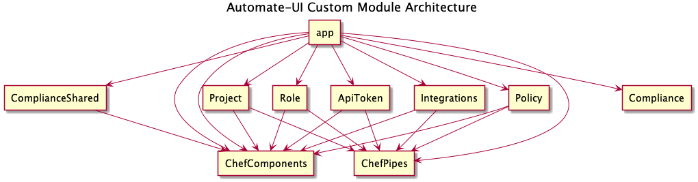
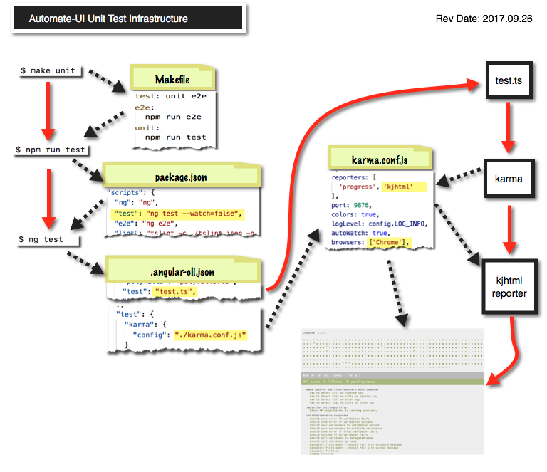

# Working with Automate UI

_Contents of this file:_

[
The TOC below is auto-generated by the VSCode "Markdown TOC" plugin; do not edit manually.
With the plugin installed, this TOC will update automatically when you save the file!
]: #

<!-- TOC depthFrom:2 depthTo:2 -->

- [Requirements](#requirements)
- [Angular Module Architecture](#angular-module-architecture)
- [Developing against the Hab Studio](#developing-against-the-hab-studio)
- [Project History](#project-history)
- [Best Practices for developing in Automate-UI](#best-practices-for-developing-in-automate-ui)
- [Creating a new component](#creating-a-new-component)
- [Running tests](#running-tests)
- [Fixing typescript lint errors](#fixing-typescript-lint-errors)
- [CSS, SCSS & Styling](#css-scss--styling)
- [Getting sample data into your Automate-UI instance](#getting-sample-data-into-your-automate-ui-instance)
- [Build](#build)
- [Further help](#further-help)
- [Troubleshooting](#troubleshooting)

<!-- /TOC -->

## Requirements

1. node. We currently use node 8.9.4, but the current version number is always
   present in the **.nvmrc** file. Use [NVM](https://github.com/creationix/nvm) to install node.

1. npm. We currently use npm 5.6.0 which ships with node 8.9.4 so no additional
   installation should be necessary.

1. [direnv](https://direnv.net/). This can be installed with `brew install
   direnv`. With this installed, once you enter the project directory you'll be
   prompted to run `direnv allow`.

1. To ensure you're using the correct version of node, run `nvm use` from `/automate-ui`
  and install the correct version if necessary.

1. Once everything is setup correctly you should be able to `npm install` without
   any permission errors.

Having a Github token in `.netrc` allows some command line utilities (including
git) to access private repositories in a secure way that is more granularly
revokable than using ssh or a password. [Read more about
accessing git and Github with tokens in this post from the Github blog..](https://github.com/blog/1270-easier-builds-and-deployments-using-git-over-https-and-oauth)

## Angular Module Architecture

As a very brief introduction to the Angular architecture, it all starts with app.module.ts,
shown at the top of the diagram. There are a variety of submodules included in that root module,
and then just a couple that are the shared modules, ChefComponents and ChefPipes.
Note that this does not show the external, Stencil component library.



## Developing against the Hab Studio

Please see the extensive "getting started" docs for developing against the
[habitat dev env](../../dev-docs/ui-development.md).

### Dirty Hack to get Live Reloading Working

You may notice that the npm command for running against habitat has a weird public-host flag.
That is because webpack makes some strange decisions when proxies are in play. I followed
this [example](https://github.com/angular/angular-cli/issues/2123#issuecomment-334803554)
and explicitly added `sockjs-node` to the proxy and things seemed to work.

## Project History

Much of our git history was lost when we migrated to the Angular CLI tool.
If you would like to access git history for older components, you can use
the tag `git-blame`.

- Locally: `git checkout -b git-blame git-blame`
- On GitHub: [https://github.com/chef/automate-ui/tree/git-blame](https://github.com/chef/automate-ui/tree/git-blame)

## Best Practices for developing in Automate-UI

Please familiarize yourself with the
[best practices](https://chefio.atlassian.net/wiki/spaces/ENG/pages/126910465/Best+Practices)
of this repo. Additional clarifying documents can be found in the [docs](./docs)
folder adjacent to this file.

## Creating a new component

Angular CLI has a great scaffolding tool -- no need to copy/paste minimal
components!

Run `ng generate component PATH/TO/COMPONENT-NAME` to generate a new component;
this creates a directory named with the COMPONENT-NAME, with four boilerplate
files in it name-spaced correctly. These files are
`COMPONENT-NAME.component.ts`, `COMPONENT-NAME.component.html`,
`COMPONENT-NAME.component.scss`, `COMPONENT-NAME.component.spec.ts`.

For components, the `generate` command also updates the appropriate module file to
inject the component itself into the application, so you don't need to add anything
extra to make sure the app knows about your new component!

Our components that are not page views but are specific to a page are currently kept
in `/page-components` directory. Components that are generic to the app are kept in
the `/components` directory.

So if you were making a new page component--say, an ice-cream picker component--you'd
run: `ng generate component page-components/ice-cream-picker --module app`
and it would be put in the correct place. The `--module app` option makes sure the
component is injected in the app.module.ts file.

Similarly to create a new generic component--say, an ice-cream name generator--you'd
run: `ng generate component components/ice-cream-name-generator --prefix chef --export true`.
Note the `--export` and `--prefix` bits. Since generic components are meant to be used all
over this app, and potentially other future apps, they have a different prefix and must
be exported in order to work properly. Due to the absence of a `--module` option the component
will be injected into the nearest module (chef-components.module.ts), which is the correct one.

You can also use
ng generate directive|pipe|service|class|guard|interface|enum|module. However,
this does _not_ necessarily update the module file; you may have to manually
import and inject your new service, etc.

Generating components happens often, so to help with the most common use cases there are a
few additional make targets that you can use.

- `make component/<component name>` will generate a standard reusable component. Equivalent
   to `ng generate component components/<component name> --prefix chef --export true`.
- `make page-component/<component name>` will generate a page specific component. Equivalent
   to `ng generate component page-components/<component name> --module app`.
- `make demo/<component name>` will generate a demo component for the component library.
   Equivalent to `ng generate component pages/component-library/demos/demo-<component name> --spec false`.
   Note that this does not add a new route to the component library router. You will still need
   to do that on your own.

## Running tests

There are a plethora of choices for running unit tests and linters, most detailed here.

- `make unit` to run unit tests NON-interactively on Chrome (actually, a headless Chrome)
- `make unit-all-browsers` to run unit tests NON-interactively on Chrome, Firefox, and Safari simultaneously
- `make e2e` to run e2e tests (we currently have nearly none of those)
- `make test` to run both `unit` and `e2e` tests
- `make lint-typescript` to run the typescript linter
- `make lint-sass` to run the scss/sass linter
- `make lint-html` to run the HTML linter
- `make lint` to run all linters

A couple notable options:

- During development, when you want to do edit-test cycles frequently, use
  `npm run test:watch` to run unit tests interactively in Chrome.
  This will keep the Chrome window open and re-run the tests whenever you save a file.
  If you prefer command-line, `npm run test -- --watch=true` will not launch
  a separate browser window but will still watch for file changes and then re-run
  your tests.

- When you are readying a pull request, use `make pr-ready`
  to run all available checks.

Sourcemaps are disabled by default when running tests because they add to the
app's compilation time and can obscure the source of errors. While debugging test failures
in the browser it can be useful to have sourcemaps enabled;
run the tests with `npm test -- --sourcemaps=true` to enable them for a test run.

Test execution also generates code coverage data, reporting on how much of
the code base is covered by the unit tests. After running `make unit` or `make test`
the coverage results will be immediately available in `/coverage/index.html`.
See the [Engineering Excellence wiki](https://chefio.atlassian.net/wiki/spaces/ENG/pages/128581633/Code+Coverage)
for further details about code coverage in Automate-UI.

Using any of the above unit test runners will execute _all_ the unit tests.
If you wish to have a quicker turn around append an `f` to any `describe`
or `it` blocks in the test files. Then just those tests will run.
(See [Jasmine's Focused Specs](https://jasmine.github.io/2.1/focused_specs.html)
for further details.)

You can run tests and perform other tasks at several different "layers":
from the makefile, from `npm`, and from `ng` (Angular) itself.
So, for example, if you want to use arguments other than the defaults for
a makefile operation, you can go to the layer beneath, and provide custom arguments.
The figure shows the structure and the associated configuration file for those
3 layers and more.



## Fixing typescript lint errors

If the typescript linter is generating errors, you can run `npm run lint -- --fix`
to have the linter automatically fix some types of lint problems.

## CSS, SCSS & Styling

[Best Practices](./docs/css_scss_and_styling.md)

## Getting sample data into your Automate-UI instance

`npm start` runs `ng serve --proxy-config proxy.conf.js` which reroutes api
requests to the appropriate service.
Once the Automate Gateway is up and running, your Automate-UI dev environment
should have data in both the converge and compliance tabs!

## Build

- `make build` is the canonical way to build the _production_ version of the project with [Habitat](https://www.habitat.sh/docs/get-habitat/).
- `npm run build` will build a _development_ version of the project.
- For more information on the difference between production and development builds,
  see [Angular CLI's wiki page on the build command](https://github.com/angular/angular-cli/wiki/build#--dev-vs---prod-builds)
- With either method the build artifacts will be stored in the `dist/` directory.

## Further help

To get more help on the Angular CLI use `ng help`
or the [Angular CLI README](https://github.com/angular/angular-cli/blob/master/README.md).

## Troubleshooting

When running `ng-serve` if you get this error:

```Shell
constructor(_configPath, schema, configJson, fallbacks = []) {
                                                          ^

SyntaxError: Unexpected token =
```

you are probably running the wrong version of npm/node. Please ensure you have
the correct versions and try again.

If you get `ng: command not found` when running `npm start`,
try running `rm -rf node_modules` followed by `npm install`. Then try running `npm start` again.
