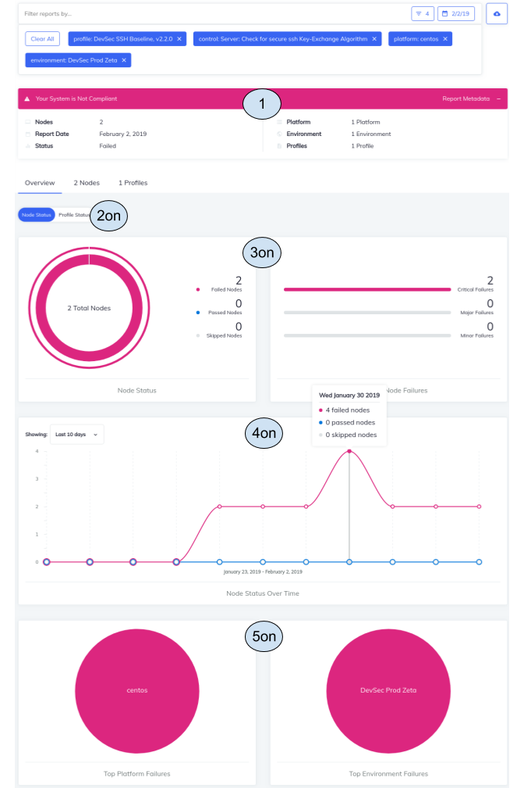
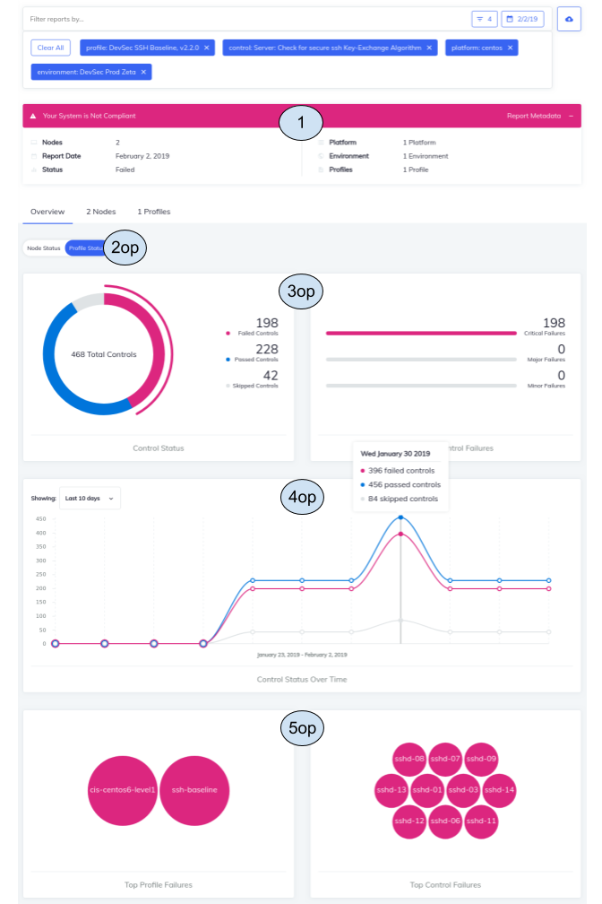
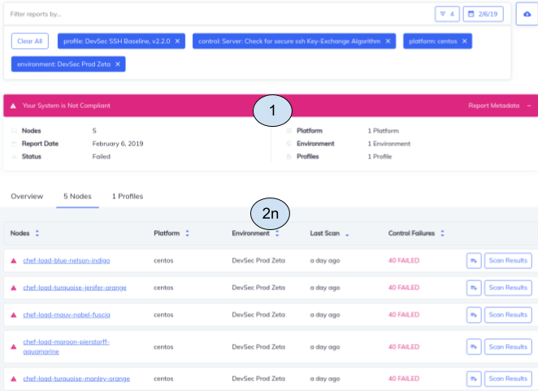

# Compliance Overview - Node View:


The compliance overview page renders data that is gathered as a result of several api calls.  Notice the numbers
that are present in the image shown above.  These numbers will be referenced in the following descriptions.

## Params used in most apis listed below:
They are listed here in an effort to take up less space and reduce duplicate code here.
Where extra params are sent into apis listed below, we will specify it under the respective api
```json
{
  "filters": [
    {
      "type": "start_time",
      "values": [
        "2019-01-26T00:00:00Z"
      ]
    },
    {
      "type": "end_time",
      "values": [
        "2019-02-05T23:59:59Z"
      ]
    },
    {
      "type": "profile_id",
      "values": [
        "f42d2f48c9acd48f52324d52ec575ca9028e405eb303f69cb34d79eb0e588b5c"
      ]
    },
    {
      "type": "control",
      "values": [
        "sshd-02"
      ]
    },
    {
      "type": "platform",
      "values": [
        "centos"
      ]
    },
    {
      "type": "environment",
      "values": [
        "DevSec Prod Zeta"
      ]
    }
  ]
}
```

## 1 - The report_ summary section
* API stack trace:
`/reporting/stats/summary -> GetStatsSummary`

* Sample response:
```json
{
  "controls_summary": null,
  "node_summary": null,
  "report_summary": {
    "stats": {
      "nodes": "49",
      "platforms": 3,
      "environments": 6,
      "profiles": 8
    },
    "status": "failed",
    "duration": 0,
    "start_date": ""
  }
}
```

## 2on - Node view of the overview has been selected here

## 3on - The node_summary section
* API stack trace:
`/reporting/stats/summary -> GetStatsSummary`
* Extra Params:
  `type: nodes`

* Sample response:
```json
{
  "controls_summary": null,
  "node_summary": {
    "compliant": 17,
    "skipped": 4,
    "noncompliant": 29,
    "high_risk": 15,
    "medium_risk": 3,
    "low_risk": 11
  },
  "report_summary": null
}
```

## 4on - The node_trend section
* API stack trace:
`/reporting/stats/trend -> GetTrend`
* Extra Params:
  `type: nodes`

* Sample response:
```json
{
  "trends": [
    {
      "report_time": "2019-01-26T23:59:59Z",
      "passed": 0,
      "failed": 0,
      "skipped": 0
    },
    {
      "report_time": "2019-01-27T23:59:59Z",
      "passed": 0,
      "failed": 2,
      "skipped": 0
    },
    {
      "report_time": "2019-01-28T23:59:59Z",
      "passed": 0,
      "failed": 2,
      "skipped": 0
    },
    {
      "report_time": "2019-01-29T23:59:59Z",
      "passed": 0,
      "failed": 2,
      "skipped": 0
    },
    {
      "report_time": "2019-01-30T23:59:59Z",
      "passed": 0,
      "failed": 4,
      "skipped": 0
    },
    {
      "report_time": "2019-01-31T23:59:59Z",
      "passed": 0,
      "failed": 2,
      "skipped": 0
    },
    {
      "report_time": "2019-02-01T23:59:59Z",
      "passed": 0,
      "failed": 2,
      "skipped": 0
    },
    {
      "report_time": "2019-02-02T23:59:59Z",
      "passed": 0,
      "failed": 2,
      "skipped": 0
    },
    {
      "report_time": "2019-02-03T23:59:59Z",
      "passed": 0,
      "failed": 2,
      "skipped": 0
    },
    {
      "report_time": "2019-02-04T23:59:59Z",
      "passed": 0,
      "failed": 2,
      "skipped": 0
    },
    {
      "report_time": "2019-02-05T23:59:59Z",
      "passed": 0,
      "failed": 2,
      "skipped": 0
    }
  ]
}
```
## 5on - The node top-failure section
* API stack trace:
`/reporting/stats/failures-> GetStatsFailures -> {both: getStatsPlatformsFailures AND getStatsEnvironmentsFailures}`
* Extra Params:
  {"type":"types","values":["platform","environment"]}

* Sample response:
```json
{
  "profiles": [],
  "platforms": [
    {
      "name": "centos",
      "failures": 2,
      "id": "",
      "profile": ""
    }
  ],
  "controls": [],
  "environments": [
    {
      "name": "DevSec Prod Zeta",
      "failures": 2,
      "id": "",
      "profile": ""
    }
  ]
}
```

# Compliance Overview - Profile View


## 1 - The report_ summary section
This is identical to #1 shown above above

## 2op - Profile view of the overview has been selected here

## 3op - The node_summary section
* API stack trace:
`/reporting/stats/summary -> GetStatsSummaryControls`

* Extra Params:
  `type: controls`

* Sample response:
```json
{
  "controls_summary": {
    "failures": 198,
    "majors": 0,
    "minors": 0,
    "criticals": 198,
    "passed": 228,
    "skipped": 42
  },
  "node_summary": null,
  "report_summary": null
}
```

## 4op - The node_trend section
* API stack trace:
`/reporting/stats/trend -> GetTrend`
* Extra Params:
  `type: controls`

* Sample response:
```json
{
  "trends": [
    {
      "report_time": "2019-01-23T23:59:59Z",
      "passed": 0,
      "failed": 0,
      "skipped": 0
    },
    {
      "report_time": "2019-01-24T23:59:59Z",
      "passed": 0,
      "failed": 0,
      "skipped": 0
    },
    {
      "report_time": "2019-01-25T23:59:59Z",
      "passed": 0,
      "failed": 0,
      "skipped": 0
    },
    {
      "report_time": "2019-01-26T23:59:59Z",
      "passed": 0,
      "failed": 0,
      "skipped": 0
    },
    {
      "report_time": "2019-01-27T23:59:59Z",
      "passed": 228,
      "failed": 198,
      "skipped": 42
    },
    {
      "report_time": "2019-01-28T23:59:59Z",
      "passed": 228,
      "failed": 198,
      "skipped": 42
    },
    {
      "report_time": "2019-01-29T23:59:59Z",
      "passed": 228,
      "failed": 198,
      "skipped": 42
    },
    {
      "report_time": "2019-01-30T23:59:59Z",
      "passed": 456,
      "failed": 396,
      "skipped": 84
    },
    {
      "report_time": "2019-01-31T23:59:59Z",
      "passed": 228,
      "failed": 198,
      "skipped": 42
    },
    {
      "report_time": "2019-02-01T23:59:59Z",
      "passed": 228,
      "failed": 198,
      "skipped": 42
    },
    {
      "report_time": "2019-02-02T23:59:59Z",
      "passed": 228,
      "failed": 198,
      "skipped": 42
    }
  ]
}
```
## 5op - The profiles top-failures section
* API stack trace:
`/reporting/stats/failures-> GetStatsFailures -> {both: getStatsProfilesFailures AND getStatsControlsFailures}`
* Extra Params:
  {"type":"types","values":["profile","control"]}

* Sample response:
```json
{
  "profiles": [
    {
      "name": "cis-centos6-level1",
      "failures": 2,
      "id": "dfc1f579fae911da0e2268b0c7dc15d2be65616069d7fd39dcff7724416e42f4",
      "profile": ""
    },
    {
      "name": "ssh-baseline",
      "failures": 2,
      "id": "f42d2f48c9acd48f52324d52ec575ca9028e405eb303f69cb34d79eb0e588b5c",
      "profile": ""
    }
  ],
  "platforms": [],
  "controls": [
    {
      "name": "sshd-01",
      "failures": 2,
      "id": "",
      "profile": ""
    },
    {
      "name": "sshd-03",
      "failures": 2,
      "id": "",
      "profile": ""
    },
    {
      "name": "sshd-06",
      "failures": 2,
      "id": "",
      "profile": ""
    },
    {
      "name": "sshd-07",
      "failures": 2,
      "id": "",
      "profile": ""
    },
    {
      "name": "sshd-08",
      "failures": 2,
      "id": "",
      "profile": ""
    },
    {
      "name": "sshd-09",
      "failures": 2,
      "id": "",
      "profile": ""
    },
    {
      "name": "sshd-11",
      "failures": 2,
      "id": "",
      "profile": ""
    },
    {
      "name": "sshd-12",
      "failures": 2,
      "id": "",
      "profile": ""
    },
    {
      "name": "sshd-13",
      "failures": 2,
      "id": "",
      "profile": ""
    },
    {
      "name": "sshd-14",
      "failures": 2,
      "id": "",
      "profile": ""
    }
  ],
  "environments": []
}
```
# Compliance Node List View


## 1 - The report_ summary section
This is identical to #1 shown above above

## 2n - The node list
* API stack trace:
`/reporting/nodes/search -> GetNodes -> getAllNodesForProfile` if profile_id is in filter
`/reporting/nodes/search -> GetNodes -> getAllNodes` if profile_id is NOT in filter

* Sample response:
```json
{
  "nodes": [
    {
      "id": "641cf422-675c-3a25-a748-2f2d62e75896",
      "name": "chef-load-blue-nelson-indigo",
      "platform": {
        "name": "centos",
        "release": ""
      },
      "environment": "DevSec Prod Zeta",
      "latest_report": {
        "id": "1a82514f-fec9-4192-af71-3657bf6f6ed4",
        "end_time": "2019-02-06T04:55:08Z",
        "status": "failed",
        "controls": {
          "total": 68,
          "passed": {
            "total": 7
          },
          "skipped": {
            "total": 21
          },
          "failed": {
            "total": 40,
            "minor": 0,
            "major": 0,
            "critical": 40
          }
        }
      },
      "tags": [],
      "profiles": []
    },
    {
      "id": "82723c9d-9527-3499-b8ab-5a30ce3ff4f5",
      "name": "chef-load-turquoise-jenifer-orange",
      "platform": {
        "name": "centos",
        "release": ""
      },
      "environment": "DevSec Prod Zeta",
      "latest_report": {
        "id": "7c1a9ee4-3702-4e2a-871e-b7bbc7a27df9",
        "end_time": "2019-02-06T04:55:08Z",
        "status": "failed",
        "controls": {
          "total": 68,
          "passed": {
            "total": 7
          },
          "skipped": {
            "total": 21
          },
          "failed": {
            "total": 40,
            "minor": 0,
            "major": 0,
            "critical": 40
          }
        }
      },
      "tags": [],
      "profiles": []
    },
    {
      "id": "afdcf7e2-5527-36a8-a161-20e8cf5e361b",
      "name": "chef-load-mauv-nobel-fuscia",
      "platform": {
        "name": "centos",
        "release": ""
      },
      "environment": "DevSec Prod Zeta",
      "latest_report": {
        "id": "d68e19ef-f80f-4210-ac4d-0fb4e2818a80",
        "end_time": "2019-02-06T04:55:08Z",
        "status": "failed",
        "controls": {
          "total": 68,
          "passed": {
            "total": 7
          },
          "skipped": {
            "total": 21
          },
          "failed": {
            "total": 40,
            "minor": 0,
            "major": 0,
            "critical": 40
          }
        }
      },
      "tags": [],
      "profiles": []
    },
    {
      "id": "bfb4d32d-1d2d-305a-81b1-bd2f8cf7ff31",
      "name": "chef-load-maroon-pierstorff-aquamarine",
      "platform": {
        "name": "centos",
        "release": ""
      },
      "environment": "DevSec Prod Zeta",
      "latest_report": {
        "id": "2b8c327c-ebfa-4d34-af4b-0f4780e20167",
        "end_time": "2019-02-06T04:55:08Z",
        "status": "failed",
        "controls": {
          "total": 68,
          "passed": {
            "total": 7
          },
          "skipped": {
            "total": 21
          },
          "failed": {
            "total": 40,
            "minor": 0,
            "major": 0,
            "critical": 40
          }
        }
      },
      "tags": [],
      "profiles": []
    },
    {
      "id": "c82f59ff-63c3-33d6-a63f-3c7d625b8cac",
      "name": "chef-load-turquoise-manley-orange",
      "platform": {
        "name": "centos",
        "release": ""
      },
      "environment": "DevSec Prod Zeta",
      "latest_report": {
        "id": "c332f421-eb1e-4ff9-8487-03c4299fdd63",
        "end_time": "2019-02-06T04:55:08Z",
        "status": "failed",
        "controls": {
          "total": 68,
          "passed": {
            "total": 7
          },
          "skipped": {
            "total": 21
          },
          "failed": {
            "total": 40,
            "minor": 0,
            "major": 0,
            "critical": 40
          }
        }
      },
      "tags": [],
      "profiles": []
    }
  ],
  "total": 5
}
```