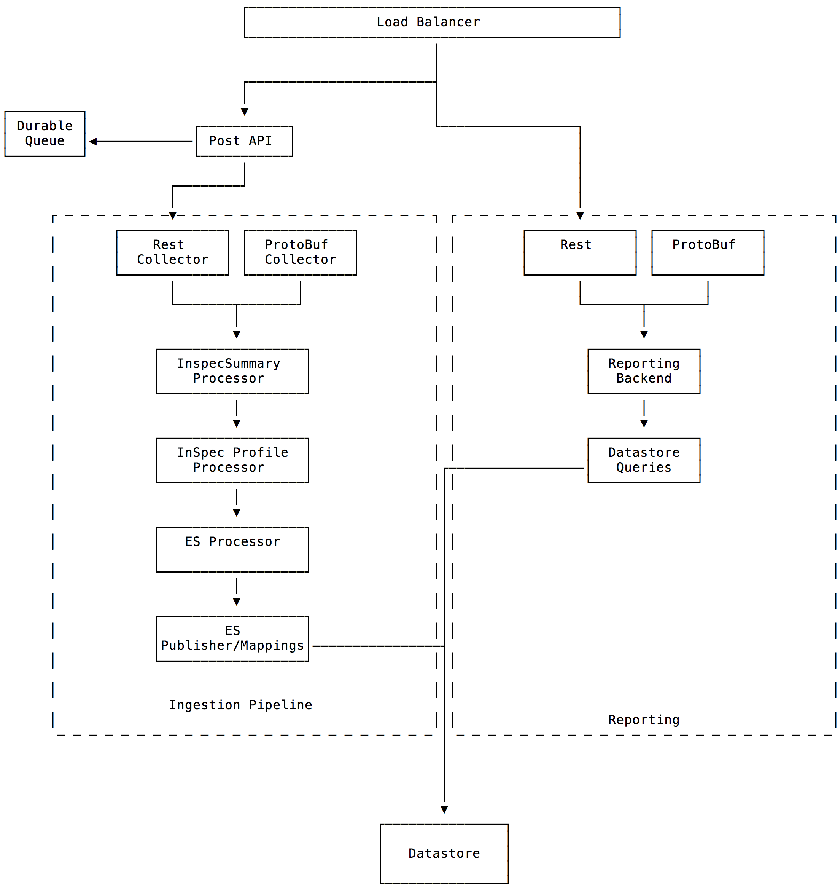

# Event Ingest Service

This service is the primary ingress event handler for InSpec events in Chef Automate 2.0.

## Event types

At this point the service is intended to handle the following event types:

- Compliance(InSpec + metadata) report events

## Design Goals

- small memory footprint
- fast event processing
- flexible pipelines

Automate 1.x was using Logstash for ingest events. This services replaces Logstash as the primary event handler. Many customers complained about the memory requirements for Logstash.

## Architecture


## Event Pipelines

We are going to use GoRoutines and GoChannels for our pipeline implementation. The following resources explain the concepts:

 - [Google I/O 2012 - Go Concurrency Patterns](https://www.youtube.com/watch?v=f6kdp27TYZs)
 - [Go Concurrency Patterns: Pipelines and cancellation](https://blog.golang.org/pipelines)
 - [Advanced Go Concurrency Patterns](https://blog.golang.org/advanced-go-concurrency-patterns)

### Compliance Report Pipeline



Then you can test it with:
```
http -f POST localhost:10121/events/compliance/report < examples/compliance-success-tiny-report.json
# or
curl --data "@-" localhost:10121/events/compliance/report < examples/compliance-success-tiny-report.json
```
