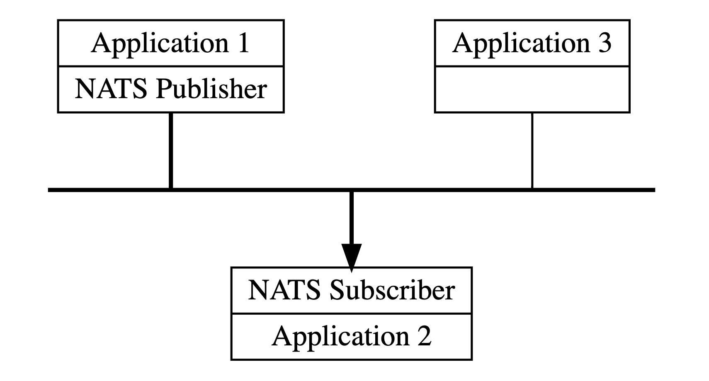

# Event Service

Event Service provides a NATS server for internal distribution of event messages.

Event-gateway provides a NATS protocol endpoint for external use. External connections are subject to authentication 
checks and must provide a valid token

In order to support these two authentication regimes, the event gateway is configured as a NATS gateway. 
The event gateway will initiate a connection to the events service, and then the two systems will share NATS routes to 
allow messages  coming in to the event gateway to reach consumers connected to the events service.

Note that we are using "embedded" NATS: we consume the NATS codebase as a normal Go library and then configure it and 
run it in-process within our own go application. 
This mode of operation lets us customize the authentication logic and use the full range of go TLS configuration 
settings, which is required for using mutual TLS.


## What is NATS?

NATS messaging enables the exchange of data that is segmented into messages among computer applications and services. 
These messages are addressed by subjects and do not depend on network location. This provides an abstraction layer 
between the application or service and the underlying physical network.

Data is encoded and framed as a message and sent by a publisher. 
The message is received, decoded, and processed by one or more subscribers.
NATS makes it easy for programs to communicate across different environments, languages, cloud providers and on-premise
 systems. 

Clients connect to the NATS system, usually via a single URL, and then subscribe or publish messages to subjects. 
With this simple design, NATS lets programs share common message-handling code, isolate resources and interdependencies, 
and scale by easily handling an increase in message volume, whether those are service requests or stream data.



## Event Configuration

NATS can be configured by using a patch toml as below:

```bigquery
[service]
host = "localhost"
port = 10132
event_limit = 100000
listener_limit = 10000

[tls]
cert_path = "../../dev/certs/event-service.crt"
key_path = "../../dev/certs/event-service.key"
root_ca_path = "../../dev/certs/Chef_Automate_FAKE_Dev.crt"

[log]
format = "text"
level = "debug"

[handlers]
feed = "0.0.0.0:10121"
cfgingest = "0.0.0.0:10122"
```

### event_limit
Event_limit defines the maximum size of the queue or the maximim number of messages the queue can hold at a time.

### listener_limit
Listener_limit defines the maximum number of concurrent listeners supported.

### handlers
Handlers are the workers to process the events. There are three type of handler supported:
- **feed**: to handle Compliance events
- **cfgingest**: to handle Config ingest or client run data 
- **event_feed**: to handle event feed data 

## Type of Events

These are the different type of events allowed as of now:
- compliance_ingest
- cfgingest
- event_feed
- scanJobCreated
- scanJobUpdated
- scanJobDeleted
- profileCreated
- profileUpdate
- profileDeleted
- nodeTerminated