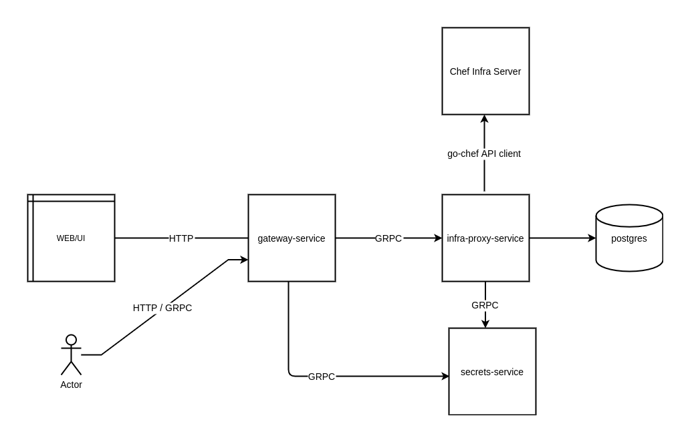
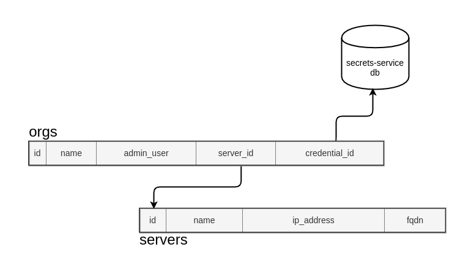

# Infra Proxy Service

Infra Proxy Service is an API for fetching and managing data of Chef Infra Server using Chef Infra Server API. Automate infra views consume these API to provides the capabilities of Chef Manage into Chef Automate in order to have single source of truth.

##### Slack Channel #automate-infra-views

## Getting Started

### High Level Architecture



### Database Design



### Development

 The development is done in hab studio. Look in the [.studio/infra-proxy-service](/.studio/infra-proxy-service) file for studio commands for development.
 
 Below are the steps to start development for more detail [DEV_ENVIRONMENT.md](/dev-docs/DEV_ENVIRONMENT.md).

 - From the Automate project root run hab studio enter
 - `build components/infra-proxy-service`

a) Run infra-proxy-service only:
  - `start_deployment_service`
  - `chef-automate dev deploy-some $HAB_ORIGIN/infra-proxy-service --with-deps`

b) Run all servers
 - `start_all_services`

In case on b) you can use automate infra views UI for further operations.
 Automate Dashboard >> Infrastructure >> Chef Servers

Any modifications to the infra-proxy-service API
 - `compile_go_protobuf_component api`

Changes in go files
 - `go_update_component components/infra-proxy-service`

### Dev Test Data

Look at [dev-docs/adding-data](/dev-docs/adding-data/adding_test_data.md#adding-data-to-infra-views)


### Running Tests

To run tests, first spin a pg docker container up:

```
make setup_docker_pg
```

simply run:

```
make test
```

If you wish to run the tests in VSCode or elsewhere, set the following in the proper environment:

```
export PG_URL="postgresql://postgres@127.0.0.1:5432/infra_proxy_test?sslmode=disable&password=docker"
```

Once you are done testing against the database, kill the container
and unset `PG_URL` if you previously set it:

```
make kill_docker_pg
unset PG_URL
```
