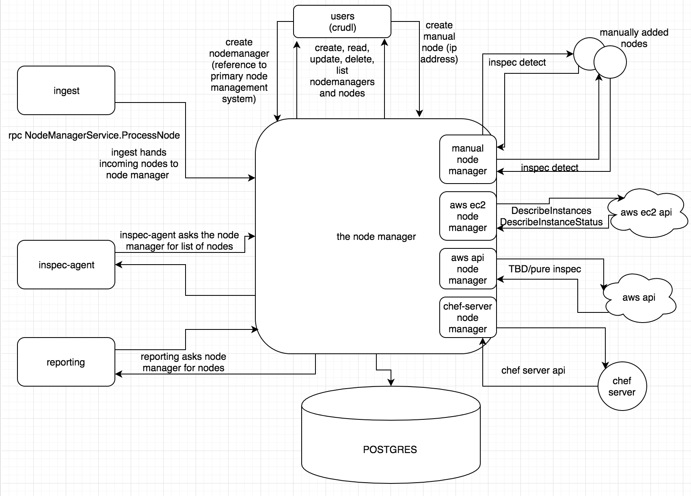
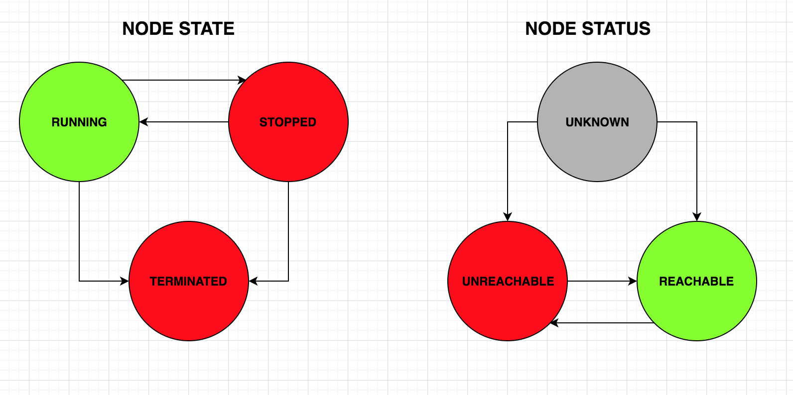
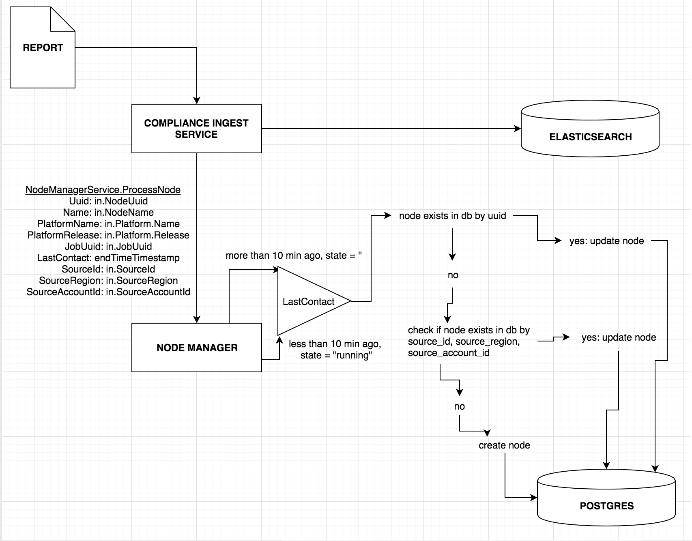
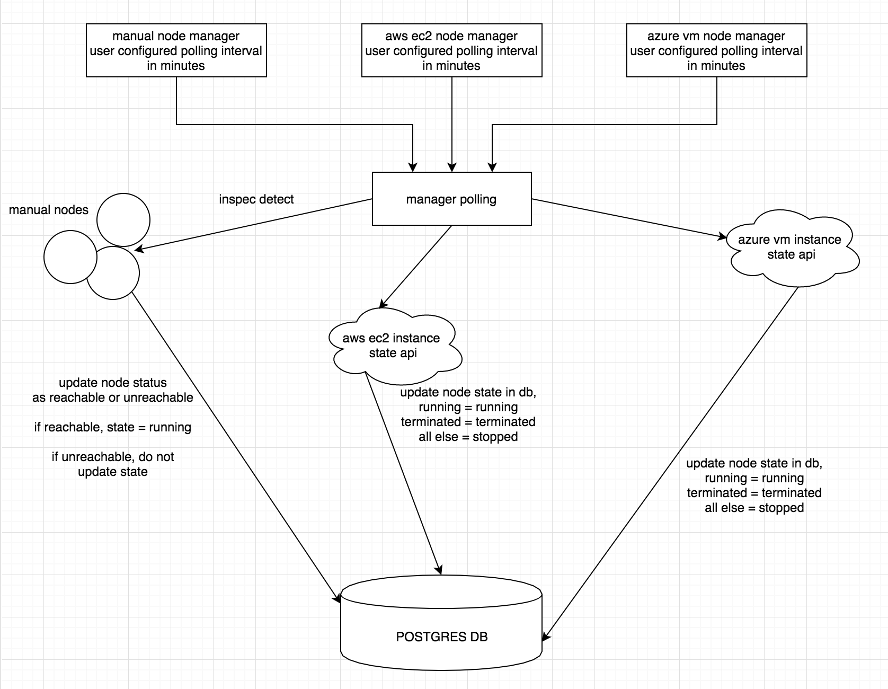
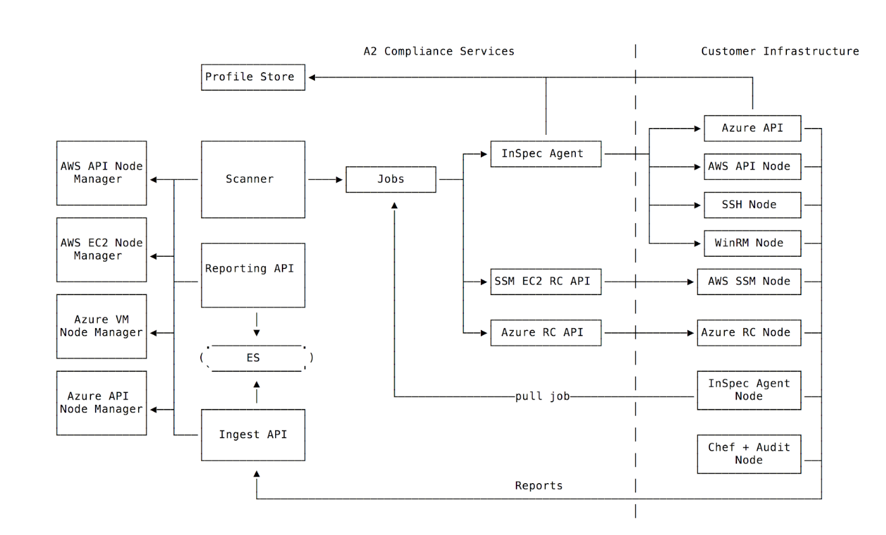

## The NodeManager

### The node manager needs to:
 * have a reference to every node in the system
 * keep track of node lifecycle over time

### Users should be able to add nodes:
 * manually, by ip address
 * via an integration (aws, azure, google cloud)

An integration is where the node physically lives; an enhancement is an abstraction over a group of nodes.

Integrations should provide means for:
 * node state
 * automatic node discovery (+ filtering)
 * field querying
 * command execution

### Currently supported integrations
 * the manual node manager
 * aws manager
 * azure manager

### The role of the node manager, overview diagram


### How the node manager keeps a reference to every node in system
In order to have a reference to every node in the system, in addition to storing a node reference anytime a manual node or node manager instance is created, the compliance ingestion service sends a call to ProcessNode for every incoming report.

### How the node manager keeps track of node lifecycle for every node in system
In order to keep track of lifecycle, each sub-manager needs to have a configurable polling time at which it can query the nodes or api for state/status and update the node appropriately.
This will start out as a push-based system, variant per sub-manager.
For the aws ec2 node manager, we will query the aws ec2 api for a list of instances and their states and update appropriately.

### State vs Status
#### Status
A node’s status can be one of three:
  - unknown (when no connection attempt has been made yet)
  - unreachable
  - reachable

Status refers exclusively to our ability to connect to the node via inspec detect/exec

#### State
Node state is defined a little differently per manager.
For the aws-ec2 manager, for example, state refers to the state reported by aws (running, stopped, terminated, pending, shutting-down, stopping, rebooting).

For the manual node manager, state will be a user action (rpc call to change node state).

If the node state for any node in the system is not running or unknown, the status of the node is automagically updated to unreachable.



### Current capabilities

 - ingesting a report creates or updates a node

 - manual node manager:
    * manual node creation: inspec detect automatically triggered on every manual node added
    * manual node polling: at user-configured interval, we run inspec detect on node and update status as needed
    * state: change the state of a manual node with an rpc call
        _(Note: be aware that changing the state of a node to stopped or terminated will prevent it from being picked up during polling)_

 - aws-ec2 manager:
    * aws-ec2 mgr creation: node created for each ec2 instance in account; inspec detect automatically triggered on each
    * aws-ec2 mgr polling: at user-configured interval, we query aws api for node state and update state and status as needed
    * inspec-agent: can create job with aws-ec2 mgr reference; correct node updated

 - aws-api manager:
    * aws-api mgr creation: node created for each region in account; inspec detect automatically triggered on each
    * inspec-agent: can create job with aws-api mgr reference; correct node updated

 - azure-api manager:
    * azure-api mgr creation: node created for each subscription in account; inspec detect automatically triggered on each
    * inspec-agent: can create job with azure-api mgr reference; correct node updated

 - azure-vm manager:
    * azure-vm mgr creation: node created for each vm in account; inspec detect automatically triggered on each
    * azure-vm mgr polling: at user-configured interval, we query azure api for node state and update state and status as needed
    * inspec-agent: can create job with azure-vm mgr reference; correct node updated

### Creating a node manager instance
To create a node manager instance, the user can call NodeManagerService.Create with:
```
  Manager::NodeManager.new(
    credential: AWS_SECRET_ID,
    instance_credentials: [
      Manager::CredentialsByTags.new(
        tag_key: "Name", tag_value: "compliance-tester", credential_ids: ["#{SSH_CRED_ID}"]
      ),
      Manager::CredentialsByTags.new(
        tag_key: "Name", tag_value: "VJ", credential_ids: ["#{OTHER_SSH_CRED_ID}", "#{SUDO_CRED}"]
      ),
      Manager::CredentialsByTags.new(
        tag_key: "Environment", tag_value: "Dev", credential_ids: ["#{AN_SSH_CRED_ID}"]
      ),
    ],
    name: manager_name,
    type: "aws-ec2"
  )
```
For aws managers, the credential added must have key/values of `AWS_ACCESS_KEY_ID` and `AWS_SECRET_ACCESS_KEY`.  Users running the binary in aws can use the environmental creds to connect to the sdk instead of the access creds, by simply leaving out credential data when creating the manager.

For azure managers, the credential added must have key/values of `AZURE_CLIENT_ID`, `AZURE_CLIENT_SECRET`, and `AZURE_TENANT_ID`.

`instance_credentials` is an ssh or winrm cred used to access the nodes.

`type` is "aws-ec2", "aws-api", "azure-vm", or "azure-api".

### Creating a job with a node manager reference

```
  job = GRPC JOBS, :create, Jobs::Job.new(
    name: job_name,
    type: "exec",
    retries: 1,
    node_selectors: [
      Jobs::ManagerFilter.new(
        manager_id: "#{AWS_EC2_MANAGER_ID}",
        filters: [
          Jobs::Filter.new(
            key: "region", values: ["us-west*"]
          ),
          Jobs::Filter.new(
            key: "Name", values: ["compliance-tester"]
          )
        ]
      )
    ],
    profiles: [profile, profile]
  )
```
Exclusion filters can also be added for the ec2 manager jobs, for example:
```
  Jobs::Filter.new(
    key: "region", values: ["us*"], exclude: true
  )
```

### What are all the ways a node can get added into the system?
 - via ingest: when a report comes thru compliance ingest, we make an rpc call to `NodeManagerService.ProcessNode` with node metadata.  this will update the node if it is already known to our system (either via uuid or a combination of instance_id, account_id, and region) or add the node if it is not known. the source_state of the node will be set to running, status will remain unchanged (as status refers exclusively to our ability to reach node via inspec detect/exec, and processing a report from a node does not mean we are able to reach it)

 - via manual node creation: all nodes added manually (by ip address) will be added with a manager of "automate"

 - via manager creation: anytime a node manager is added, nodes will be added to the system. For the aws-ec2 manager, this is one node per instance, for the aws-api manager, this is one node per region, and and for the azure-api manager, this is one node per subscription.

 - via polling: when polling cloud providers for instance states, we will pickup any new instances created since the manager was created/since the last time we polled.  any new instances discovered will result in a node being added to the system.

### What happens when someone...

####  - creates a node manager instance?
Nodes are added into the db.
For the aws-ec2 manager, this is one node per instance, for the aws-api manager,
this is one node per region, and and for the azure-api manager, this is one node per subscription.

#### - updates a node manager instance?
If the update involves no changes to credentials, we just update the manager.
If the update involves credentials that have access to more instances, only the new instances
will be added.

#### - deletes a node manager instance?
When the user deletes a node manager instance, they have three options: do nothing with the associated nodes, set all associated nodes to a given state (like terminated), or delete all associated nodes.

#### - deletes a node manager instance and then re-adds it?
This depends on the action taken when the node manager was deleted. If all nodes were deleted, we can simply add new nodes back in. If they were all set to terminated, we need to let the user know they are trying to re-activate terminated nodes, and give them a solution (tbd). If they were all set to stopped or if nothing was done to the nodes, we just re-associate the node manager with the nodes.

#### - terminates an instance in the aws account?
When we poll for instance state, the node will be updated with state of terminated, status of unreachable.

#### - stops an instance in the aws account?
When we poll for instance state, the node will be updated with state of stopped, status of unreachable.

#### - stops a manual node?
When we poll for node state, the node will be updated with state of stopped, status of unreachable.

#### - sets a manual node to state of stopped or terminated?
The node will be updated with the desired state and a status of unreachable.  This will prevent that node from getting picked up during poll time.

#### - adds a second node manager instance (of same type) with different credential but same level perms on account?
No new nodes are added, any existing nodes are associated with both managers.

#### - adds a second node manager instance (of same type) with different credential and has access to more instances than first node manager instance?
Only the new nodes are added, any existing nodes are associated with both managers.\

### More FAQ

#### How are aws-ec2 instances uniquely identified?
source_id (instance id), source_region ("us-west-2"), and source_account_id (aws account id)

#### How are azure-vm instances uniquely identified?
source_id (vm id), source_region ("useast"), and source_account_id (tenant id)

#### How are aws-api regions uniquely identified?
source_region ("us-west-2") and source_account_id (aws account id)

#### How are azure-api subscriptions uniquely identified?
source_id (subscription id) and source_account_id (tenant id)


### Ingest and Nodemanager Relation



### State Polling



### NodeManager, Credentialless Scanning



Reference Docs:
https://docs.google.com/document/d/1jIUf7ajLluroZCTY7gewU4b8fQeTET6FoqDTRkJVXjc/edit
https://docs.google.com/document/d/18QADlFQ0Saz0qg88pkP8pvBnH3c7V47sPVkMXBihIW8/edit