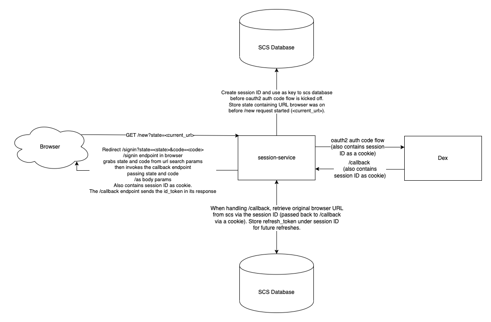
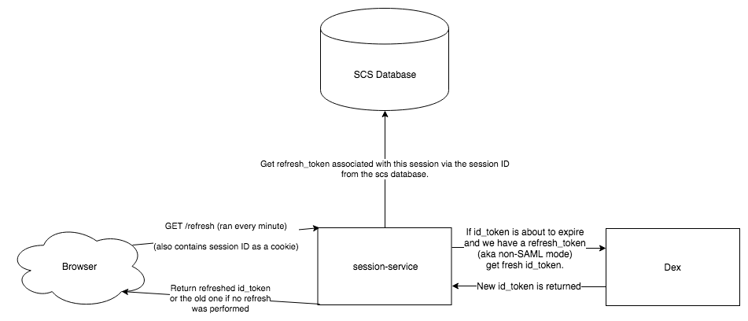

# Session-Service

This service stands between the browser and automate-dex.
It acts as an OIDC client to Dex, and uses the [Authorization Code Flow][1].

After having succeeded in this flow, it'll create a session for that client (browser), and store (in its end!) the client's `refresh_token`.
The `id_token` it passes on to the browser in a manner that is similar to the [Implicit Flow][2]. (It's only similar because we're currently ignoring the `nonce` parameter: automate-ui doesn't send it, and session-service doesn't handle it.)

This service uses [scs](https://github.com/alexedwards/scs) for storing information linked to a user's session.

## Rationale

The kind of session management this service introduces allows us to decouple _`id_token` expiry_ from _the user has to login again_.
By allowing for a session-based refresh of `id_token`s, we're informed by the upstream OIDC identity provider (Dex) about changes to the user's groups; or the user's existence: if the refresh fails, there's no new `id_token`, and when the already issued `id_token`s expire, there's no way to do API requests anymore (for deleted users).

We require the UI client to pass in their current `id_token` when trying to refresh a session, and the token will only be validated to a limited extent.
This is because we want to decouple token expiry from session expiry: It's quite possible the user has just reopened their laptop after lunch, and of course their old 10min-expiry `id_token` has expired by then.
However, if they're asking for a refresh although their token hasn't expired yet, `session-service` will just pass the old one back.
This allows `session-service` to _not have to know_ the specifics of any configured IdP connector:
If the system uses SAML (which doesn't work with `refresh_token`s), the interaction between `session-service` and `automate-ui` doesn't look any different than it does with connectors that support it.
The only exception, of course, is that upon expiry, the SAML case will fail to refresh (there's no `refresh_token`), so the client is sent to Dex to get a fresh token.

## HTTP API

The following endpoints are currently served. They are briefly summarized below. Please see the
Session Flow section below for more detail.

Note that we currently support two flows:
1. `/new`, `/callback`, and `/refresh` were originally created to support `automate-ui` in getting
  an initial `id_token`, and subsequently refreshing it.
2. `/new`, `/callback`, `/token`, and `/userinfo` were altered to support Builder in authenticating
  users using A2's authentication stack.

For flow (2.), session-service behaves in a way that resembles OAuth2 (and OIDC).
As far as Builder is concerned, authenticating using A2 is like authenticating with any other OAuth2
provider.
However, we're not as strict as we an OAuth2 server should be: there's no validation of client
credentials, nonces, or registered redirect URIs.

The _fork in the road_ regarding whether the flow is (1.) or (2.) is currently the existence of a
`redirect_uri` query parameter in the initial request to `/new`.

### GET /new

Initiate auth code flow; ending in a new session and a final redirect containing the `id_token`.

When the initial request includes a `redirect_uri` query parameter, the handler identifies this
as being part of a login flow for another client.
(Currently, this means Builder authenticating via A2.)
The `redirect_uri`, if provided, will be recorded in the session.
It's effective in the callback handler below.

### GET /callback

OIDC callback handler; exchanges `code`, stores `refresh_token`, creates a session, redirects
with `id_token` in URL fragment.

Diagram for /new -> /callback -> browser has session flow:

#### `redirect_uri` provided

If the session data carries a `redirect_uri`, the callback handler slightly changes its
behavior: it will generate a new `code`, associate the exchanged `id_token` with it, and
redirect the browser to the Builder Signin URL as configured with session-service.
In accordance to the OAuth2 specification's _Authorization Code Grant_ flow, this redirect
contains the generated `code`.

### GET /refresh

Expects session cookie, uses stored `refresh_token` to get a fresh `id_token`, return
it (issues a new session ID).

This is the only handler that expects an `id_token` to be passed in via the `Authorization`
header (e.g. `Authorization: bearer X.Y.Z`). The passed-in token is validated (checking signature
only, it's ignoring both the audience claim and the token's expiry).

### POST /token

This request is part of the _Authorization Code Grant_.
The handler expects a `code`, and looks up the `id_token` associated with that code in the
service's `/callback` handler.
If an `id_token` is found, it's returned.

### GET /userinfo

For Builder authenticating with A2, this is the OAuth2 "userinfo" endpoint.
It expects a request with an `Authorization: bearer ID_TOKEN` header, validates and decodes
the passed `id_token`, and returns a JSON object informing the caller about the user data
associated with that token.

Since we're using JWT ID tokens, the client (Builder) would be able to figure this out on its own,
but we're hiding this implementation detail from the client.

## Session Flow

Let's cover in detail the general flow that session-service implements.

### Get a New Session

When a user logs out or if no session yet exists, the UI will kick off a `/new` request to session-service.
The first thing the `/new` handler does is generate a `session` cookie that will be used to store
your session inside [scs](https://github.com/alexedwards/scs)'s store. Scs is a session storage
service that allows us to generate a `session` cookie per user session and store information linked
to that session. The `session` cookie will be returned to the browser. Since it's a cookie, it will be
sent up with subsequent requests to the `/refresh` endpoint (more on that later).

The browser also sends up `state` information that contains the original webpage the user was on
when the `/new` session request was kicked off so that we can drop them back there on completion.
This `state` is stored in scs under the `session` key as well.

Now that the `session` cookie has been added to the http request context for the `/new` handler,
session-service will kick off the oauth2 auth code flow by redirecting to Dex (with the
`session` cookie being forwarded in the cookie along with it).

Once there, Dex will allow the user to authenticate and redirect back to the session-service
`/callback` endpoint.

### Callback after Successful AuthN (handling the auth code flow)

The `/callback` endpoint handles the callback of the oauth2 auth code flow. For starters, it takes
the `code` returned from the Dex callback request to session service and exchanges it for an oauth2 token.

Now that it has an oauth2 token, it extracts both an `id_token` and the `refresh_token` from the
oath2 token.

The `id_token` is a short (shorter at least, more on that later) lived token that contains the
claims about the user (e.g. LDAP groups, etc) that the browser can then use to authenticate against
authn-service when making API requests. This is returned to the browser from both this `/callback` and
on requests to `/refresh`.

The `refresh_token` has no expiration and can be used to get new `id_token`s ad nauseam . We get
the `refresh_token` out of the initial oauth2 auth code flow response and it is scoped to a specific
user. The `refresh_token` is never exposed outside of session-service. Instead, it is stored in scs
database, using the `session` cookie string originally created in the `/new` call as the key. In
subsequent calls to `/refresh`, the `refresh_token` can be retrieved from the scs database by
looking it up via the `session` cookie.

Now that the `id_token` has been parsed out and the `refresh_token` has been successfully stored in scs
under the `session` cookie key, the `/callback` endpoint redirects back to the original URL that the
browser was at in Automate UI before the user logged out. This URL was stored in the scs database
under the `session` by the `/new` handler. After redirect, the browser parses the `id_token` out of a
fragment and stores `id_token` in its local storage. The `session` is also stored in a cookie for
future refreshes.

### Refresh that id_token

#### Quick Aside: id_tokens, refresh_tokens, expiries, oh my!

Now is a good time to talk about the lifetime of `id_token`s. An `id_token` should be very short-lived
for both local users and LDAP as those both support `refresh_token`s. This is so that we can ensure
that the claim information around LDAP groups stays relatively up to date as the `id_token` is constantly
expiring and needing to be refreshed. This is not the case for SAML is the Dex adapter for SAML does
not support `refresh_token`s, so the user will have the same `id_token` for their entire
session (`id_token` expiry is set to 24h in SAML mode). `id_token` expiry is configured in Dex.

Therefore, in non-SAML cases, a constant refresh is required to get a new `id_token` before the old
one expires and API requests start failing with 401s. The Automate UI sends a `/refresh` request every
minute to session-service. This request contains the `session` cookie ID string. As long as the UI
is making refresh requests faster than the `id_token`s are expiring, the user will remain logged in,
at least until they close their browser and don't refresh their `id_token`. When that happens,
the next time Automate UI tries to make an API request with the old `id_token` sitting in local
storage, it will get a 401, triggering the browser to get a whole new session.

#### Refresh Handler

When handling the `/refresh` request, session-service first grabs the `session` cookie ID string
out of the request. It uses this to get the `refresh_token` out of the scs store. If it can't
retrieve the session information out of the scs store, a 401 is returned (which should only
happen if a refresh request has been submitted for a logged out user, we have not currently
configured scs sessions to have an expiration).

Next, we take the existing `id_token` (sent up by to the `/refresh` request from the browser in the
`Authorization` header) and check to see if it is close to expiring. If the `id_token` isn't about to
expire, we simply return the old `id_token` back to the browser and it can continue to use it to make
requests against the API.

However, if the `id_token` is close to expiration, there are two cases:

1. We are in SAML mode and there is no `refresh_token`.
2. We are not in SAML mode and we now have a `refresh_token`.

In SAML mode, we always return the existing `id_token` since we can't refresh and get a new one anyway.
Once it expires, the API will return a 401 on the next API request and the browser will make a `/new`
session request, starting the whole process over, eventually returning an `id_token` with a 24 hour
expiration (expiry configured in Dex).

In non-SAML mode, we have a `refresh_token` we can use to get a new `id_token`. It uses the `refresh_token`
to send a refresh request to Dex, which returns a fresh `id_token`. The fresh `id_token` and the `session`
cookie are returned to the browser. It can then use the fresh `id_token` to make API requests and
the `session` cookie to start the `/refresh` process all over in another minute. In non-SAML mode,
this continues indefinitely (since we haven't configured a session expiry in scs and `refresh_token`s
live forever, we should probably think about setting a scs session expiration though) until either
the user logs out or they don't refresh their `id_token` before it expires and the browser gets a 401,
triggering a `/new` session anyway.

### Logging Out

When the user hits log out in the the browser, it actually just submits a `/new` request to session-service.
If there is an existing `session` cookie, it is sent up to `/new` which is used to retrieve and replace
the existing scs session. Regardless, a new `session` cookie is made, stored in scs (either overwriting
the existing store or creating a new one), and the whole process starts again as described
at the start of this `Session Flow` document.

## Future Use

This service will be used for managing (list/delete) active sessions.

[1]: http://openid.net/specs/openid-connect-core-1_0.html#CodeFlowAuth
[2]: http://openid.net/specs/openid-connect-core-1_0.html#ImplicitFlowAuth
