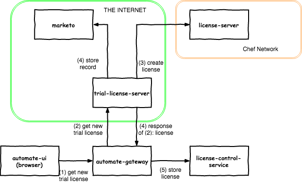

# trial-license-service

The trial-license-service (t-l-s) is a stand-alone service (not
deployed with A2) that vends trial licenses in exchange for basic
contact information. It plays a part in enabling a low-friction trial
experience for A2. When a user installs A2 and doesn't apply a
license, the A2 web UI presents a modal offering a trial. The user
enters name and email address. The system sends this info to t-l-s
which reaches out to the license-generation-service to obtain a new
customized trial license and sends the contact information to our
marketing data system (Marketo).

Here's the call sequence at play:


And here's a box diagram showing deployment and network flow:



## API

### Create a new trial

`POST /create-trial`

request body:
```json
{
    "first_name": "Sherry",
    "last_name": "Gess",
    "email": "SherryLGess@selectRight.com",
    "gdpr_agree": true,
    "deployment_id": "b36621fe-4089-42fd-8a4f-f17023cf82a1",
    "chef_automate_version": "20180426151108"
}
```

Response body:
```json
{
    "license": "eyJhbGciOiJFUzUxMiIsInR5cCI6IkpXVCJ9.eyJpZCI6IjBiZmUyMGFjLWNlMGYtNDU4YS05MWYzLWVlMTc0MTg4NWM2MiIsInZlcnNpb24iOiIxIiwidHlwZSI6ImNvbW1lcmNpYWwiLCJnZW5lcmF0b3IiOiJjaGVmL2xpY2Vuc2UtMi4wLjAiLCJrZXlfc2hhMjU2IjoiZTBkZjI4YzhiYzY4MTUwZWRiZmVmOThjZDZiN2RjNDM5YzFmODBjN2U3ZWY3NDc4OTNhNjg5M2EyZjdiNjBmNyIsImdlbmVyYXRpb25fZGF0ZSI6eyJzZWNvbmRzIjoxNTI0NzY4Mjc3fSwiY3VzdG9tZXIiOiJFeGFtcGxlIExpY2Vuc2UiLCJjdXN0b21lcl9pZCI6IjAwMDAwMDAwMDAwMDAwMDAiLCJjdXN0b21lcl9pZF92ZXJzaW9uIjoiMSIsImVudGl0bGVtZW50cyI6W3sibmFtZSI6ImJhc2UiLCJtZWFzdXJlIjoibm9kZXMiLCJsaW1pdCI6MTAwLCJzdGFydCI6eyJzZWNvbmRzIjoxNTI0NzAwODAwfSwiZW5kIjp7InNlY29uZHMiOjE1MjQ4NzM1OTl9fV19.AJpMy00qZ2u70iv7W4bXKtjUXY0gk1JxWn1fwH_hnWRzegrThjqfxxL_SJex1MgpwXT34nHgChYgnbXiZ6j2N4BKAXdwl-q1YP0GQJx-BWlHLK6eia8JXSuUlmhLuEef14EjjuPiuRUDvrqVVJFtp5_27na_dA6lzkEHtsXJ11wSqTkJ"
}
```

## Generating licenses via license-generation-service

Today, the [license-generation-service][1] lives outside of the a2
repo. This [helper script][2] describes the API and auth.

[1]: https://github.com/chef/license-generation-service
[2]: https://github.com/chef/license-generation-service/blob/master/scripts/request_license.sh

* Set `type` to `"trial"`.
* Set `customer` to `"$first $last <$email>"`
* ? Set `customer_id` to `"$deployment_id"` (and possibly also set
  `customer_id_version` to 2 ?)
* ? Do we want to attempt to make further use of entitlements? We
  could set name to "trial", measure to "days", and limit to "60".
* Ensure that start is `now` and end is `now + 60 days`

## Marketo

* https://github.com/FrenchBen/goketo
* http://developers.marketo.com/rest-api/
* https://github.com/SpeakData/minimarketo

## Deployment considerations

* Must be proper TLS
* Prevent access from embargo countries.
* Do we need to process email address to further identify embargo country?
