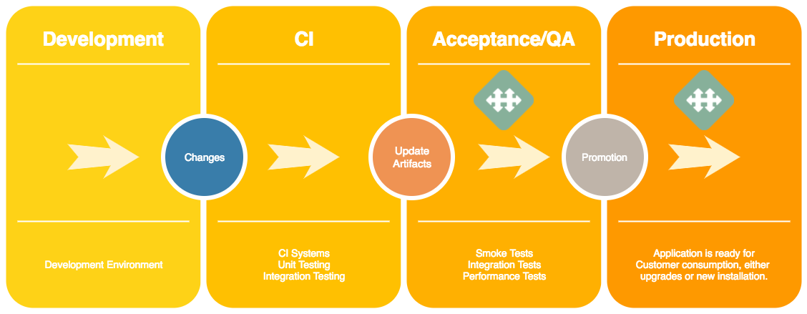
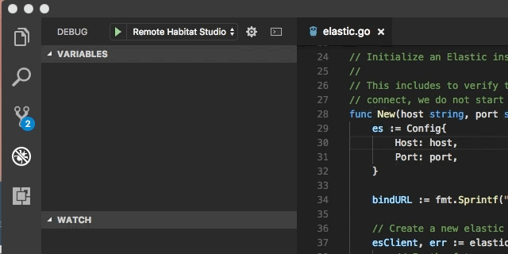

# A2 Development Environment

_Contents of ths file:_

[the TOC below is auto-generated by the VSCode "Markdown TOC" plugin; do not edit manually]: #
[User settings needed to get this level of detail: "markdown-toc.depthFrom": 2, and "markdown-toc.depthTo": 3]: #

<!-- TOC -->

- [A2 Development Environment](#a2-development-environment)
  - [Quickstart](#quickstart)
  - [Setup](#setup)
    - [Docker Setup](#docker-setup)
    - [Vagrant Setup](#vagrant-setup)
  - [Development Basics](#development-basics)
    - [Spin Everything Up](#spin-everything-up)
    - [Spin Up Just What You Need](#spin-up-just-what-you-need)
    - [Rebuilding a Habitat Component](#rebuilding-a-habitat-component)
    - [Rebuild Go Components](#rebuild-go-components)
    - [Recompiling Protobufs](#recompiling-protobufs)
    - [Accessing the Logs](#accessing-the-logs)
  - [Working with Secrets](#working-with-secrets)
  - [Working with Automate UI](#working-with-automate-ui)
  - [But Wait There's More](#but-wait-theres-more)
  - [Traditional Habitat Application](#traditional-habitat-application)
  - [Additional Resources](#additional-resources)
    - [Testing](#testing)
      - [Unit (Go)](#unit-go)
      - [Integration](#integration)
    - [Development Tools](#development-tools)
      - [grpcurl](#grpcurl)
    - [Debugging Go code](#debugging-go-code)
      - [VS Code](#vs-code)
    - [Developing Against LDAP](#developing-against-ldap)
    - [Live Development Tutorials](#live-development-tutorials)
      - [Working with a single component](#working-with-a-single-component)
      - [Working with multiple components](#working-with-multiple-components)

<!-- /TOC -->

The A2 Development Environment employs habitat and the chef-automate CLI to manage deploying an
instance of A2 to develop against, allows quick iteration on Go binary changes, re-building and hot
loading of habitat components, as well as other standard operations needed for working on A2.

By leveraging habitat, we have a environment we can spin up quickly. Additionally, we have a
common set of tools we can standardize on without worrying about version spread across developer
environments and other related issues.

Since the dev env is simply using the chef-automate CLI, it will be very similar to
a real deploy of A2, meaning we are developing against real infrastructure that will
be deployed in the wild. It also means we can leverage it in CI, so that testing
and deploying there and on your laptop looks the same.

## Quickstart

I just wanna run some commands and get rolling! What should I do?

``` console
$ hab studio enter
```

If you don't need local UI development:

``` console
# start_all_services
```

If you want to develop against the UI:

``` console
# build components/automate-ui-devproxy
# start_automate_ui_background
# start_all_services
```

Open <https://a2-dev.test> in your browser. Log in with `admin` and `chefautomate` as username and
password, respectively.

## Setup

To be able to build and run A2 on your workstation, you need the
following prerequisites:

1. Clone A2 repo locally

   From a terminal: run `git clone https://github.com/chef/automate.git`

1. Install `direnv` and integrate it into your shell

   a. First, install the package. On Homebrew: run `brew install direnv`, on Ubuntu: run `apt-get install direnv`
   b. Next, [hook direnv into your shell](https://github.com/direnv/direnv#setup)
   c. Finally, run `direnv allow` from the A2 source directory.

1. Install and configure Habitat

   From a terminal:

   a. To install version `0.59.0` of Habitat:
  `curl https://raw.githubusercontent.com/habitat-sh/habitat/master/components/hab/install.sh | sudo bash -s -- -v 0.59.0`

   b. To configure the Habitat cli run and follow the instructions:
  `hab cli setup`

There are currently two supported ways of running the dev env: inside a vagrant VM or on docker.
There are some small speed advantages of running inside vagrant but running inside docker
will be faster to spin up and down the actual studio (since you don't have the overhead of
building the vagrant box). Both are fully supported, so choose whichever suits your needs.

### Docker Setup

- [Install Docker](https://docs.docker.com/engine/installation/#desktop).
- Modify your `/etc/hosts` to resolve the hostname a2-dev.test to 127.0.0.1 (aka localhost)
  by adding `a2-dev.test` to the line for 127.0.0.1:

```text
127.0.0.1 localhost a2-dev.test
```

***NOTE*** Remove any other entry for a2-dev.test

- Run `hab studio enter`.

### Vagrant Setup

- Install Vagrant either from [the Vagrant website](https://www.vagrantup.com/downloads.html)
  or `brew cask install vagrant`
- [Install Virtualbox](https://www.virtualbox.org/wiki/Downloads)
- Modify your `/etc/hosts` to resolve the hostname a2-dev.test (only need to do this once)
  by including the line:

```text
192.168.33.222 a2-dev.test
```

***NOTE*** Remove any other entry for a2-dev.test

- `vagrant up`
- `vagrant ssh -- -R 4200:localhost:4200`

This will open the npm devserver port so you can develop the UI locally.

## Development Basics

### Spin Everything Up

To get started, run `start_all_services`. This will start the deploy service and use the chef-automate
CLI to deploy a fully functional installation of A2 in your studio. This will deploy all of the dev
versions of the hart packages. Once deployed, you can override any component from source.

When you are starting on a new piece of work, you might want to consider `rm -rf results/*` to get
rid of any old, outdated builds before firing up the studio. The deploy tool will look for local
builds before downloading the dev images, so if you have outdated builds lying around, you might run
into issues (see "Rebuilding a Habitat Component" for details).

The FQDN for the studio is <https://a2-dev.test>.

### Spin Up Just What You Need

If you don't need to spin up everything to work on your change, you can spin up just your service and
its dependencies!

``` console
start_deployment_service
chef-automate dev deploy-some chef/<SERVICE_NAME> --with-deps
```

Or if you want to build it from source first (see "Rebuilding a Habitat Component" for details):

``` console
start_deployment_service
rebuild components/<SERVICE_NAME>
chef-automate dev deploy-some $HAB_ORIGIN/<SERVICE_NAME> --with-deps
```

### Rebuilding a Habitat Component

You can rebuild a habitat component (which will replace the 'dev' build), by simply rebuilding it:

``` console
rebuild component/<COMPONENT_NAME>
```

The deploy tool will detect the rebuild and pick it up. It currently
polls at 30 seconds

but there is work in flight to make it detect changes and fire
instantly in dev mode.

### Rebuilding without Chef Software premium content

Currently, the default build includes two items which pull in
proprietary assets:

- automate-compliance-profiles: proprietary profiles available for use
  for Chef Automate users.

- automate-chef-io: Our documentation contains some proprietary
  assets, notably fonts.

To avoid pulling in these components, set

```
export AUTOMATE_OSS_BUILD=true
```

PLEASE NOTE: This flag only prevents the inclusion of the
above-mentioned items. It does NOT produce a build free of Chef
trademarks.

### Rebuild Go Components

You can re-compile just the Go binary instead of rebuilding the whole hab package by running

``` console
# go_update_component <COMPONENT_NAME>`
```

You can even do this against `dev` images you haven't done a hab rebuild on yet.

### Recompiling Protobufs

Anytime you edit a .proto file you need to recompile it.

``` console
compile_go_protobuf_component <COMPONENT_NAME>
```

### Accessing the Logs

You can run `sl` to see the supervisor logs. If you are running in docker, to access them on
a different terminal, run

``` console
# docker exec -i -t $(docker ps |grep studio | awk '{print $1}') tail -f /hab/studios/src/hab/sup/default/sup.log
```

If you are using vagrant, ssh into the VM again in a separate tab in
run `sl`.

### Running a Specific Build of Automate
* Save the manifest `.json` of the particular build you need (e.g., https://packages.chef.io/manifests/current/automate/20190806202030.json is for build 20190806202030)
* Run `chef-automate dev configure-deployment --config dev/config.toml --manifest-dir json-file-name`
* `rebuild components/automate-deployment`

## Working with Secrets

Some tests require access to build infrastructure and other secret
data. Chef employees have access to this data via an internal instance
of Vault. To get started, the `scripts/get_secrets.sh` script will
download the mostly commonly needed secrets:

1. Connect to the Chef VPN.

2. Run the `get_secrets` script as below:

``` console
CHEF_USERNAME=your-chef-ad-username scripts/get_secrets.sh
source dev/secrets-env.sh
```

You should only need to run `scripts/get_secrets.sh` when a new secret
has been added or an existing secret has been updated.  If you update
a secret, let other developers know via Slack.

You can interact with vault directly using the `vault` command:

1. Connect to the Chef VPN.

2. Install vault and log into our vault instance. One easy way to do
   this is to run the get_secrets script again:

``` console
CHEF_USERNAME=your-chef-ad-username scripts/get_secrets.sh
```

3. Setup your environment to run `vault`:

```
export VAULT_ADDR=https://vault.chef.co:8200
# If you are in the studio, install the cacerts:
export VAULT_CACERT="$(hab pkg path core/cacerts)/ssl/certs/cacert.pem"
```

4. Run your desired `vault` commands:

```console
vault kv list 'secret/a2'
```

## Working with Automate UI

There is a whole [separate document](./ui-development.md) devoted to developing for the Automate UI.
Go check it out!

## But Wait There's More

There are a variety of other tools to aid you in your quest.
Type `describe` to see all of them with a quick summary of each.

## Traditional Habitat Application

A traditional Habitat application will use Habitat in the following parts of
the Application Workflow:


By bringing Habitat to the left side of the workflow, inside the development
environment and CI Systems, we will be able to have consistency across:

1. Development environments
1. CI Systems
1. Acceptance/QA Environments
1. Production

This will ensure that every developer uses the same compilers and tools with
the correct version, has the same packaging and deployment methods,
and runs the application as it will run on customers' machines.

## Additional Resources

### Testing

Now that we have knowledge of how to do development using the Habitat studio,
it is time to learn how to test our micro-services.
The main benefit of running our tests inside the Habitat studio is that we will
be running the exact same tests we run locally in our CI System.

#### Unit (Go)

There are a number of A2 components that are written in Go, for those
micro-services you can use the method `go_component_unit COMPONENT_NAME` within
the hab-studio to execute its unit tests as the following example:

``` console
[1][default:/src:0]# go_component_unit ingest-service
(help) You can always set 'GO_FAST=true' to go faster!
=> Executing Go dependency solver (dep ensure -vendor-only)
=> Executing Go test
=== RUN   TestJsonMarshalling
--- PASS: TestJsonMarshalling (0.01s)
=== RUN   TestCCRToNode
--- PASS: TestCCRToNode (0.01s)
=== RUN   TestCountNumberOfValuesMapSimple
--- PASS: TestCountNumberOfValuesMapSimple (0.00s)
=== RUN   TestCountNumberOfValuesMapEmpty
--- PASS: TestCountNumberOfValuesMapEmpty (0.00s)
=== RUN   TestCountNumberOfValuesMapLarge
--- PASS: TestCountNumberOfValuesMapLarge (0.00s)
=== RUN   TestCCRToRun
--- PASS: TestCCRToRun (0.01s)
=== RUN   TestCCRToNodeAttribute
--- PASS: TestCCRToNodeAttribute (0.01s)
PASS
coverage: 65.1% of statements
ok  github.com/chef/automate/components/ingest-service/backend        0.038s  coverage: 65.1% of statements
?   github.com/chef/automate/components/ingest-service/backend/elastic        [no test files]
?   github.com/chef/automate/components/ingest-service/backend/elastic/mappings       [no test files]
?   github.com/chef/automate/components/ingest-service/cmd/ingest-service     [no test files]
?   github.com/chef/automate/components/ingest-service/cmd/ingest-service/commands    [no test files]
?   github.com/chef/automate/components/ingest-service/config [no test files]
?   github.com/chef/automate/components/ingest-service/events/chef    [no test files]
?   github.com/chef/automate/components/ingest-service/grpc   [no test files]
?   github.com/chef/automate/api/interservice/ingest [no test files]
?   github.com/chef/automate/components/ingest-service/pipeline       [no test files]
?   github.com/chef/automate/components/ingest-service/pipeline/message       [no test files]
?   github.com/chef/automate/components/ingest-service/pipeline/processor     [no test files]
?   github.com/chef/automate/components/ingest-service/pipeline/publisher     [no test files]
?   github.com/chef/automate/components/ingest-service/rest   [no test files]
?   github.com/chef/automate/components/ingest-service/server [no test files]
?   github.com/chef/automate/components/ingest-service/serveropts     [no test files]
[6][default:/src:0]#
```

#### Integration

Integration tests are the tests that require the micro-service to interact with
other component(s) and/or with it's data-store (`elasticsearch`, `postgres`, etc).
There are just a few components that have this functionality enabled
within the studio:

1. Config Management Service (`config_mgmt_integration`)
1. Ingest Service (`ingest_integration`)
1. Gateway Service (`gateway_integration`)
1. Secrets Service (`secrets_integration`)

The idea behind these kind of functions is that they have the knowledge of which
are the dependencies that they need to bring up
in order to run its integration tests, for instance, the `config-mgmt-service`
requires `elasticsearch` to be running so the
method `config_mgmt_integration` will first install & start elasticsearch and then
run the tests:

[](https://asciinema.org/a/8kNbUVkCvzLX3JF0VG5QmWae0)

### Development Tools

This is a very non-exhaustive list of tools useful while doing development against A2.

#### grpcurl

Like cURL, but for gRPC: You can issue GRPC calls from the studio by using the `grpcurl` tool.

**List all methods from the provided fully-qualified service name:**

``` console
[2][default:/src:0]# grpcurl --insecure -cert /hab/svc/config-mgmt-service/config/service.crt -key /hab/svc/config-mgmt-service/config/service.key localhost:10119 list
grpc.reflection.v1alpha.ServerReflection
service.CfgMgmt

[3][default:/src:0]# grpcurl --insecure -cert /hab/svc/config-mgmt-service/config/service.crt -key /hab/svc/config-mgmt-service/config/service.key localhost:10119 list service.CfgMgmt
GetAttributes
GetEventFeed
GetNodeRun
GetNodes
GetNodesCounts
GetOrganizations
GetPolicyCookbooks
GetRuns
GetRunsCounts
GetSourceFqdns
GetSuggestions
GetVersion
```

**GET Request:**

``` console
[4][default:/src:0]# grpcurl --insecure -cert /hab/svc/config-mgmt-service/config/service.crt -key /hab/svc/config-mgmt-service/config/service.key localhost:10119 list service.CfgMgmt.GetVersion
{
  "name": "config-mgmt-service",
  "version": "0.1.0",
  "SHA": "4f1un3",
  "built": "DATE"
}
Sent 0 requests and received 1 response
```

**POST Request:**

``` console
[5][default:/src:1]# grpcurl --insecure -cert /hab/svc/ingest-service/config/service.crt -key /hab/svc/ingest-service/config/service.key -d '@' localhost:10122 ingest.ChefIngester.ProcessChefAction
{
  "message_type": "action",
  "message_version": "0.1.1",
  "organization_name": "chef",
  "service_hostname": "chef-server.chef.co",
  "recorded_at": "2017-11-01T14:42:44Z",
  "remote_hostname": "10.194.12.215",
  "request_id": "g3IAA2QAEGVyY2hlZkAxMjcuMC4wLjEBAAIksQbkAAIAAAAA",
  "requestor_name": "chefdk-debian-7-tester-2d206b",
  "requestor_type": "client",
  "user_agent": "Chef Client/12.21.3 (ruby-2.3.1-p112; ohai-8.24.0; x86_64-linux; +https://chef.io)",
  "id": "action-id",
  "run_id": "run-id",
  "task": "delete",
  "entity_type": "node",
  "entity_name": "chefdk-debian-7-tester-2d206b",
  "remote_request_id": "8a64e85c-7ffb-4db3-a02e-1074d8aab25b",
  "data": {}
}
{

}
Sent 1 request and received 1 response
[6][default:/src:0]# sl
--> Tailing the Habitat Supervisor's output (use 'Ctrl+c' to stop)
ingest-service.default(O): time="2018-01-26T03:22:55Z" level=info msg="Running ChefAction pipeline" message_id=5f4e536f-97ba-440c-9ff3-c9031a249a16
ingest-service.default(O): time="2018-01-26T03:22:55Z" level=info msg="Performing action" message_id=5f4e536f-97ba-440c-9ff3-c9031a249a16
ingest-service.default(O): time="2018-01-26T03:22:55Z" level=error msg="Message failure" error="Zero nodes found with the provided filters"
ingest-service.default(O): time="2018-01-26T03:22:55Z" level=info msg="Transforming ChefAction" message_id=5f4e536f-97ba-440c-9ff3-c9031a249a16
ingest-service.default(O): time="2018-01-26T03:22:55Z" level=info msg="Setting revision ID for policy action" message_id=5f4e536f-97ba-440c-9ff3-c9031a249a16
ingest-service.default(O): time="2018-01-26T03:22:55Z" level=info msg="Publishing ChefAction" message_id=5f4e536f-97ba-440c-9ff3-c9031a249a16 publisher_id=0
elasticsearch.default(O): [2018-01-26T03:22:55,775][INFO ][o.e.c.m.MetaDataCreateIndexService] [IVRepjk] [actions-2017.11.01] creating index, cause [auto(bulk api)], templates [actions], shards [5]/[1], mappings [_default_, action]
elasticsearch.default(O): [2018-01-26T03:22:55,851][INFO ][o.e.c.m.MetaDataMappingService] [IVRepjk] [actions-2017.11.01/CFriiVKuTk6CWDH-j0JTCQ] create_mapping [actions]
ingest-service.default(O): time="2018-01-26T03:22:55Z" level=info msg=metric index=actions-2017.11.01 metric=elasticsearch ms=107 type=doc_insert
ingest-service.default(O): time="2018-01-26T03:22:55Z" level=info msg="Chef action ingested successfully" message_id=5f4e536f-97ba-440c-9ff3-c9031a249a16
```

### Debugging Go code

We have chosen [Delve](https://github.com/derekparker/delve) as our Go debugger tool.

#### VS Code

To enable the Go Debugger in VS Code, create a file named `.vscode/launch.json` with the content:

```json
{
    "version": "0.2.0",
    "configurations": [
        {
            "name": "Remote Habitat Studio",
            "type": "go",
            "request": "launch",
            "mode": "remote",
            "remotePath": "/hab/cache/src/go/src/github.com/chef/automate",
            "port": 2345,
            "host": "127.0.0.1",
            "program": "${workspaceRoot}",
            "env": {"GOPATH": "/hab/cache/src/go"},
            "args": [],
            "showLog": true
        }
    ]
}
```

Then you need to launch a Delve server for the service you're trying to debug.

For example, to debug the `config-mgmt-service` you will open a terminal and run:

``` console
$ hab studio enter
[1][default:/src:0]# debug_cfgmgmt
=> Starting headless Delve Server in port '*:2345'

      << suppressed output >>

API server listening at: [::]:2345
```

If you see something like

``` console
[1][default:/src:130]# debug_cfgmgmt
2018/04/24 14:03:38 server.go:73: Using API v1
2018/04/24 14:03:38 debugger.go:70: attaching to pid 17221
could not attach to pid 17221: decoding dwarf section info at offset 0x0: too short
```

it means that you need to rebuild the component. The reason this happens is because
most components strip their binaries before publishing them, so things pulled from
the hab depot won't be directly debuggable.

After that, you can open your VS Code editor and start debugging, you can set breakpoints,
start the service and a few other functionalities.



### Developing Against LDAP

If you wish to develop against an LDAP environment, you
can [spin one up in AWS](./ldap-development.md).

### Live Development Tutorials

These tutorials were written before the deploy tool was being used inside the dev vm,
so some of them might be slightly out of date, but they still contain great content and
are worth a look!

Let's go over a few exercises to learn how to do development inside the studio.
On every example you will find the written explanation as well as an
[Asciinema](https://asciinema.org/) recording that you can watch live!

#### Working with a single component

Let's make the simplest modification we can ever made: let's update the version
of one of our components. This will involve the following process:

1. Bring our development environment up. (Start our service, for this exercise
  we will use the `config-mgmt-service`)
1. Check the current version of the service. (We will use the tool `grpcurl` to
  do a quick grpc function call)
1. Make the modification in the source code to update the version.
  (You can use your favorite editor for this task)
1. Compile and Update the running service.
1. Verify the version once again.

[](https://asciinema.org/a/KR9PfD25xIGCtWU8ElWXwimCq)

#### Working with multiple components

There are some tasks that require you to modify more than one single component
at the same time. A very common pattern in A2 is the
creation of a new endpoint. In the following exercise we will create an endpoint
called `/cfgmgmt/demo` that will be defined in the
`automate-gateway` (our Open API), then the gateway will make an RPC call to the
`config-mgmt-service` that will print a message saying it ran.

Here are the steps we will follow:

1. Start the `automate-gateway` service.
1. Verify that the new endpoint does not exist. (Leverage helper method `gateway_get`)
1. Create the new endpoint `/cfgmgmt/demo` in the Gateway. This will involve:
    1. Compiling the protobuf definitions.
    1. Update the running service.
1. Verify the new endpoint exists.
1. Connect the new endpoint from the gateway to call the `config-mgmt-service`
    1. Create a new RPC function called `GetDemo()` in the config-mgmt-service.
    1. Start the `config-mgmt-service`.
    _NOTE: This process will detect the upstream dependency with the gateway and
       will restart it to connect it with the config-mgmt-service)_
1. Verify that the endpoint is calling the config-mgmt-service! :smile:

[](https://asciinema.org/a/UBTnbMhVAY93dF45X7WzRJx4o)
