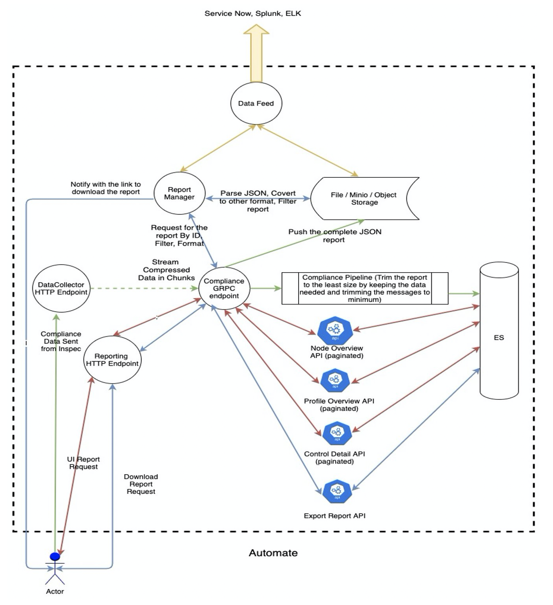
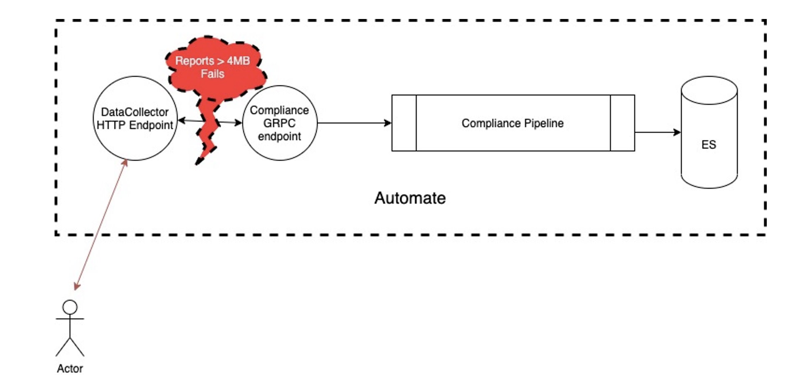
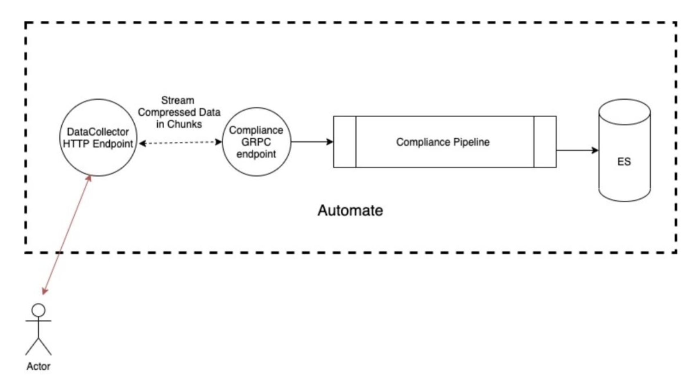
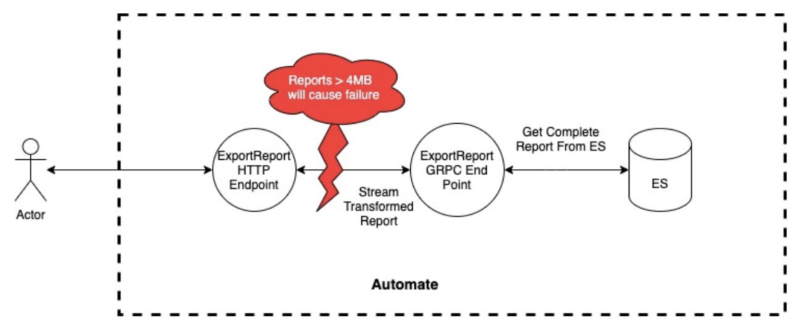
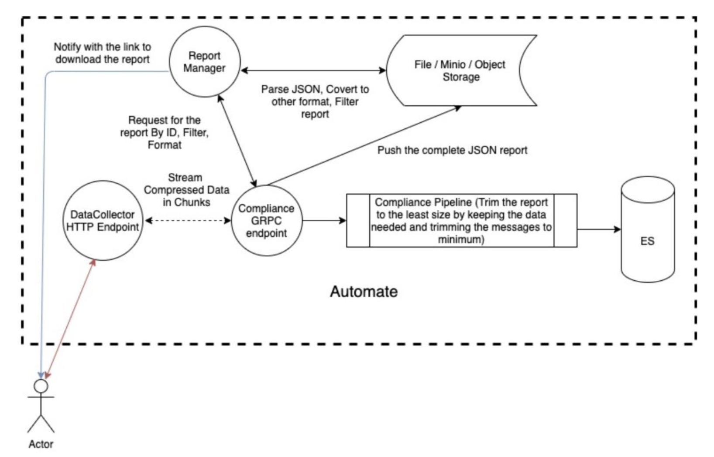

Automate DataCollector URL is a HTTP endpoint to be used by external software like Chef Server/Inspec/Infra Clients to send different types of data to Automate. This data after coming to the Data Collector HTTP end point is sent to the compliance-service through a GRPC call. This data then goes through a pipeline where the data processed and finally stored to Elastic Search.

# What is Large Compliance Report issue in Automate?
There are several issues:

* **4MB GRPC Limit**: 
GRPC has a default maximum request size limit of 4MB. And request more than the limit causes GRPC server to throw back an error back to the caller API in this case the DataCollector HTTP end point and in turn to the client.

* **Displaying Large Report on UI**: 
Ingesting large report to Elasticsearch has multiple disadvantages starting from the performance overhead ES would have. But displaying the data in the UI is a challenge which can cause:

    i. Failure while fetching the data

    ii. UI stuck for a long time while trying to load the data

    iii. Different features not working properly

* **Exporting/Downloading Large Report from UI and API**:Exporting large report from UI can cause user timeout and puts load on the ES.

# How can we solve it?
* The data will be streamed in chunks from the DC endpoint to the compliance service.
* Trim the report to the bare minimum and store the data in ES.
* Compliance Report is fetched to UI using multiple API endpoints which fetches data from ES through a series of GRPC calls. 
* Store the control messages in another index and fetch them on demand.

# Architecture Diagram
The following picture illustrates the complete architecture:

# What is Minio?
MinIO is a High Performance Object Storage released under GNU Affero General Public License v3.0. It is API compatible with Amazon S3 cloud storage service. MinIO is the only object storage suite available on every public cloud, every Kubernetes distribution, the private cloud and the edge. It can handle unstructured data such as photos, videos, log files, backups, and container images with (currently) the maximum supported object size of 5TB. Minio has the ability to mount a filesystem/folder as an Object Storage. It can also act as a gateway for public Object Storage like S3, Azure Blob storage etc.

# Minio Configuration
MinIO is 100% open source under the Affero General Public License Version 3 (AGPLv3). This means that MinIO’s customers are free from lock in, free to inspect, free to innovate, free to modify and free to redistribute. MinIO is hardware agnostic and runs on a variety of hardware architectures ranging from ARM-based embedded systems to high-end x64 and POWER9 servers. However, for a large scale data storage infrastructure, we recommend the following server configurations in high-density and high-capacity flavors.
- Processor: Dual Intel® Xeon® Scalable GoId CPUs (minimum 8 cores per socket).
- Network: 25GbE for high-density and 100GbE NICs for high-performance.
- Drives: SATA/SAS HDDs for high-density and NVMe SSDs for high-performance (minimum of 8 drives per server).
- Memory: 128GB RAM
- Cluster Size: The minimum cluster size is 4 nodes and the maximum cluster size is 32 nodes. Multiple MinIO clusters can be federated to create larger clusters.

# Changes in ingestion flow
 Even if Inspec does not implement the report compression, Automate can do it before sending to the GRPC endpoint.
 
 **Current Design** of Report Ingestion is:
 

 Requests more than the limit(4MB) causes GRPC server to throw back an error back to the caller API. So to solve this, the data will be streamed in chunks from the DC endpoint to the compliance service. 
 
 Hence **Proposed Design** of Report Ingestion is:
 

# Changes in download flow
Export of report can be of formats:
* JSON
* CSV

Export of report can be by:
* Date - This downloads the report for the latest scans of all the nodes on a given date.
* Node - This downloads all the scans for a node.

**Current System:**
Search report based on the filters, type in ES and export in the format user asked for.

**Proposed System:**
* Compliance service will fetch the reportIDs based on the search options from ES.
* It will pass the reportID, deep filters (if any), report format to the Report Manager.
* The report Manager on getting the request will look for the report in the local storage. The Report Manager would be responsible to look up to the object storage by the report id, parse the JSON data to fetch the data as per the filter and convert the JSON to the specified format (like CSV).

# How to enable Large Compliance report ingestion?
For enabling Large Compliance Report(LCR): 

Patch the below configuration

>[global.v1.large_reporting]                                
enable_large_reporting = true

