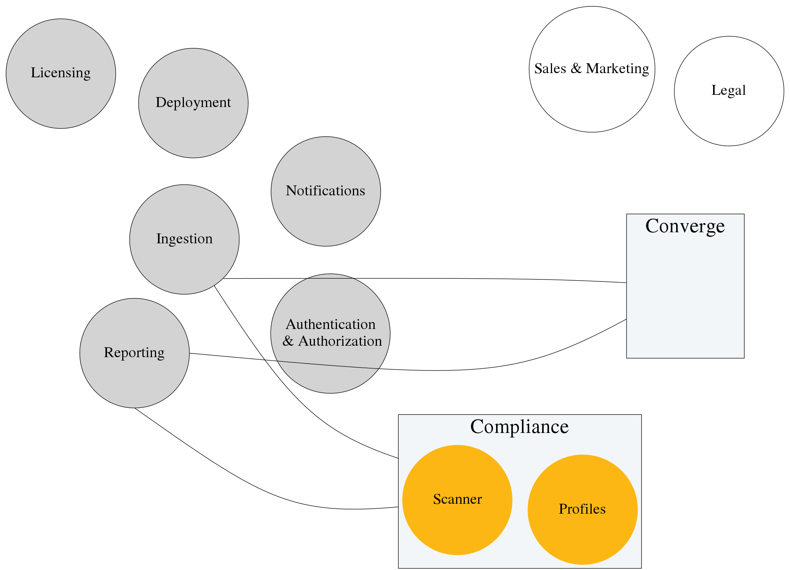
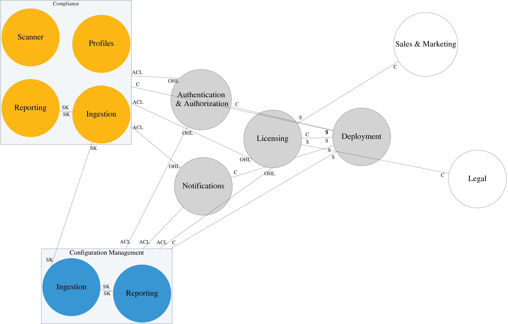
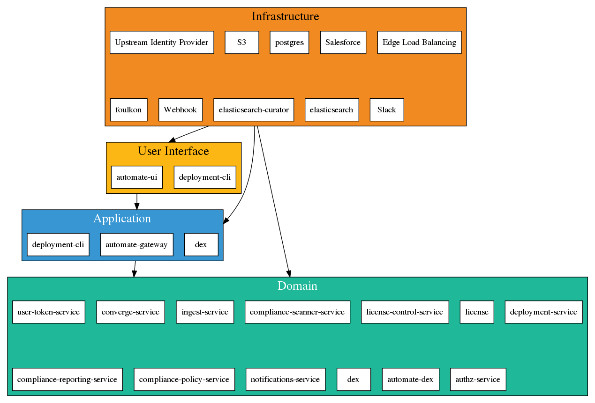
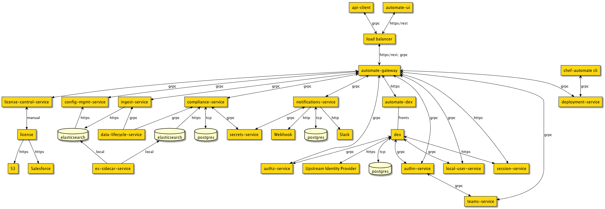
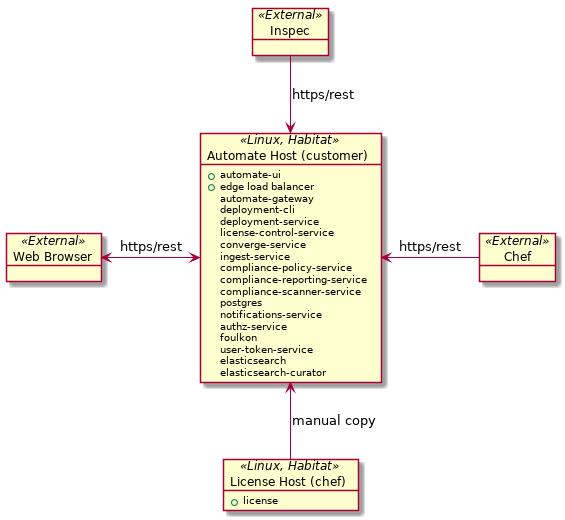
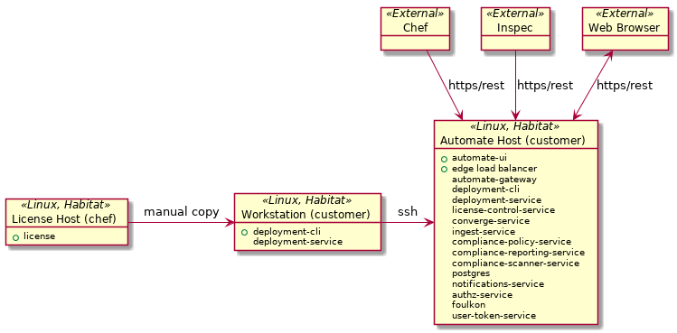
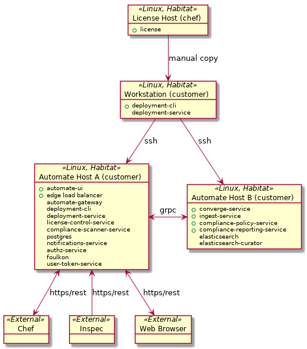
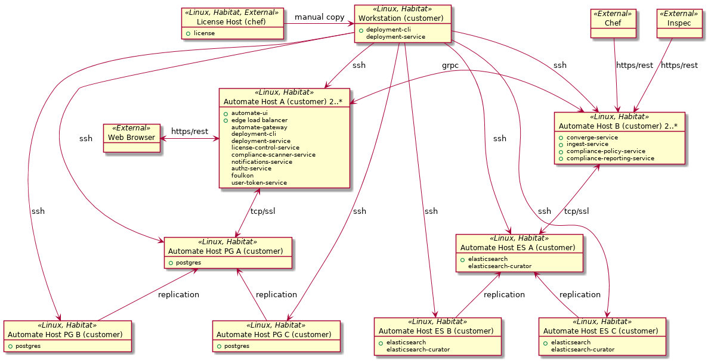

# Introduction

This document is meant to be a lightweight, living introduction to the Automate
2 architecture. The final authority for the architecture is the source code
itself; as such, this document serves as a guide to how the different pieces
fit together.

Chef has decided to use Domain Driven Design to guide and refine the
architecture for Automate 2. At the back of the document is a glossary, which
will have the definition of all the specific terminology we use. Presented here
are a few concepts you will need to be familiar with to read this overview:

**Domain**: What an organization does, and the world it does it in. 

**Core Domain**: Something that is core to the business - what we have to be the best in the world at.

**Subdomain**: Something the business needs to do, but that isn’t core. We have to be the
  best in the world at Compliance as code; but we don’t have to be best in the
  world at Authentication. 

**Supporting subdomain**: This is a subdomain that, while not core to the
  business, is necessary for us to produce the outcomes we desire.
  Authentication is a supporting subdomain.

**Generic subdomain**: A subdomain that provides functionality, but the specific
  implementation is completely unimportant. For example, Salesforce provides an
  implementation of the Sales and Marketing subdomain. It could just as easily
  be implemented by another CRM. It’s Generic to our business.

**Ubiquitous Language**: the language we use when we are talking about a given
  domain. It’s guided by what an expert in the domain would say, do, or think,
  and reflected throughout the system - from its high level design all the way
  to how we name functions and objects.

**Bounded Context**: An area where a team can work within a single Ubiquitous
  Language. “The Compliance Context” means work can happen without having to
  leave the language of Compliance. Contrast that with the “Authentication
  Context”, which means we can work on Authentication without having to
  understand the specific language of Compliance. In general, a team working in
  one bounded context should be able to do their work without impacting teams
  working in another bounded context.

The goal of a Domain Driven Architecture is to gain more clarity around our
bounded contexts, give teams more freedom to work without impacting others, and
to give us a common language for discussing our engineering choices, both
amongst ourselves and with the domain experts we work with in Product or the
Field.

Software Architecture starts with strategic design - understanding the domains
we work in, clarifying the boundaries between them, and deciding which bounded
contexts should exist to enable teams to work effectively. Then it cascades
down to individual services, components, objects, functions, and data - the
actual use of various engineering patterns in code. 

Finally - Software Architecture is a living, agile thing. Its truth is the
source code, not a diagram or a document. If the source code says something
different, we should update this document to reflect the truth, or be clear
that we are evolving toward a new truth. Do not be afraid to draw a diagram,
then throw it away. We can always draw another one. :) 

# Strategic Design
Chef’s domain is that we provide automation software that supports the creation
of software, from source code through to production systems, birth to death. 

We have a business model that sells subscriptions to a product called Chef
Automate. Chef Automate provides a platform for us to develop solutions within
3 different core domains: Configuration Management, Compliance, and Application
Automation. 

Chef Automate has a current production version, which we call “Automate 1.x”.
We are in the process of building a new platform moving forward, which we call
“Automate 2”. This document is concerned exclusively with the design of
“Automate 2”, in its current form, and in its next iteration.

As of September 2017, Automate 2 focuses exclusively on functionality in two of
our 3 core domains: Configuration Management and Compliance.

Work in the Application Automation domain is happening within the Habitat bounded
context, and for now, it is out of the Automate 2 domain. We expect this will
change in the future. 

## Problem Space



As of August 31, this is the Automate 2 architecture. Let's break it down:

* Converge Context, which maps to the Configuration Management Core Domain.
* Compliance Context, which maps to the Compliance Core Domain.
* Reporting Context, which will be used by both the Converge and Compliance context.
* Ingestion Context, which will be used by both the Converge and Compliance context.
* Deployment Context, which handles the installation, upgrading, and management
  of Automate. It is also a supporting subdomain. (Why, you ask? Well, we have
  people whose job is to deploy Automate - both customers and internal staff.
  Within this subdomain they have their own Ubiquitous Language, and the
  design of our deployment functionality should mirror it. So glad you asked!)
* Authentication & Authorization Context, which is responsible for allowing
  users or devices to authenticate with Automate, and authorizes them to take
  action. It is also a supporting subdomain.
* Notifications Context, which is responsible for notifying users via various
  channels that an event has occurred.
* Licensing Context, which is responsible for generating new licenses to
  Automate, and validating that a given deployment hasn’t exceeded the
  limitations placed on it. It is a also a supporting subdomain of the
  business.

Currently, there are no lines drawn between most of these components - this is a reflection of the fact that, as of now, very little integration has been done.

## Solution Space

The map of the problem space above shows us three things we should focus on immediately:

“Converge” is not a word that a domain expert in our business would use to
describe that piece of our business; they would use Configuration Management.
Let’s change that before it infects the rest of the ubiquitous language.

Neither the Reporting Context nor the Ingestion Context make sense as
supporting or generic subdomains of our business. Nobody outside of engineering
would talk about “ingestion” or “reporting” naturally. That likely means they
don’t make sense as separate bounded contexts, either, and are instead
components of both Configuration Management and Compliance, which may share
some implementation.

We should clarify the relationships between the contexts, so that we can give
more guidance to the teams as they approach integration, and we can make sure
that each develops its own, isolated ubiquitous language.

That results in the following map, targeted for October 2017:



The goal of this phase is to really focus on getting our supporting subdomains
into true platform capabilities, and clearly delineating between Configuration
Management and Compliance. Will we be able to add a notification, and test it,
without actually integrating with the Compliance or Configuration Management
context at all? (The answer should be yes!) How about experimenting with new
license models? Deployment targets?

Similarly, we should be able to develop new capabilities in the Configuration
Management context without impacting the Compliance context; new roles for
access control, as an example, or changing the trigger for a notification.

# Diagrams

## Layered Architecture

This is a high level representation of the various components of Automate,
using the Layered Architecture with the Dependency Inversion Principle applied.

> High-level modules should not depend on low-level modules.
  Both should depend on abstractions.  Abstractions should not depend upon
  details. Details should depend on abstractions.

The way to understand this is that we have Infrastructure components, which
provide services to all the layers in the stack.

We have the User Interface Layer, with components responsible for rendering our
application logic to users. They may include basic, incoming data validation as
part of the interactions.

We have the Application Layer, which ties together a transaction or request,
with authentication and authorization, and dispatches to the domain layer -
application components carry out a request by coordinating actions taken by the domain layer.

Finally we have the Domain Layer itself, which contains all of our business
logic, repositories, and data models.

A rule of thumb is that layers only talk to the next layer down (with the exception of
infrastructure).



## Package Diagram

This diagram shows all the different pieces of Automate, and draws their
dependencies. It's useful to understand the high level system - how each
component relates to the others.

Individual components will appear anywhere they would be required to deploy a
component - so, for example, the elasticsearch-curator appears anywhere it
would be necessary. We may well decide that, in many deployments, we only
need one - but this diagram's job is to show you that, if you're working on a
component, what other components you need to care about, and why.



## Deployment Diagrams

These are modified object diagrams, showing the layout of Automate in a given
deployment. The components are encapsulated in nodes, which are then linked 
together to give you a view of the entire system.

In these diagrams, services marked with green balls are exposed to the public.

### Single System Local



This diagram represents the entire Automate system deployed on a single
host.

### Single System SSH



This diagram represents the entire Automate system deployed on a single
host, but via the deployment-cli, which has been installed on a workstation.
It connects to the single host via SSH.

### Multi System SSH

_This is an unstable, uncommitted deployment model - it is here for discussion_



This diagram represents the entire Automate system deployed on two
hosts, via the deployment-cli, which has been installed on a workstation.

The hosts split the data store duties; host A has postgresql and related
services, while host b gets elasticsearch and related services.

### HA System SSH

_This is an unstable, uncommitted deployment model - it is here for discussion_



The system now has its data stores broken into clusters, deployed with a
leader/follower topology, or using native clustering. Multiple instances
of host type A and B must be deployed as well in this model.

# Domains

## Licensing

### Vision

The licensing domain handles the issuing of licenses to our software, and the
evaluation of a given license to inform the generation of a policy for use by
our software.

### Description

The current design has two major components:

* License Generation Service
* License Control Service

The License Generation Service will be responsible for:

* Generating Licenses
* Listing Licenses
* Storing Licenses
* Generating Signing Key Pairs
* Listing Public Signing Keys
* Storing Signing Key Pairs

The License Control Service will be responsible for:

* Interpreting the license as a set of rules and capabilities that form a policy
* Validating License Keys
* Returning a Policy via API for consuming services

The Automate License Process:

* If No Signing key pair exists, the Generation Service creates a new signing
   key pair and uses it for signing the license. The private key is stored with
   the Generation Service and the public key is made available to be shipped
   with the License Control Service.  Initially this will be done manually.
* The License Generation Service generates and stores a new license key in S3.
  A consuming service such as Salesforce may keep its own copy and record of
  the license key as well.
* The License Control Service is packaged into a Habitat package with one or
  more public signing keys.
* The License Control Service is installed as part of Automate.
* The license key will be provided to the customer via Sales Channels, Email,
  and eventually Customer Portal.
* The Automate Consumer queries the License Control Service to get a Policy to
  determine what it should enable, disable, account for, and other actions it
  should take.

### Language

**Customer**: a user entitled to Automate

**License**: A license is a collection of entitlements and other details about usage that
  describe how a customer can utilize Automate.

**License Key**: A token (JWT) that represents a License.

**Entitlement**: a description of something that is used to indicate what was sold and in what
  quantity. It will have a unit of measure and an associated subscription date.

**Capability**: a description of something that can be measured and used to signal the
  enabling or disabling of a feature or other mechanism in the software.

**Policy**: a set of metadata including license validity, expiry, rules and
  capabilities derived primarily from the License Key contents.

**Rule**: A key value pair used to provide context to an Automate Consumer about
  expected behavior.

**Signing Key Pair**: an ECDSA key-pair that is used to sign every Automate license. The public
  keys are distributed with the license policy service, allowing it to validate
  that a license originated with Chef.

**License Generation Service**: an internal service that creates and stores licenses in response to requests
  from upstream, usually Salesforce to automate consumers.

**License Control Service**: Service that uses a License as input to a rules engine that provides a Policy


## Auth

### Vision

The auth domain handles authentication and authorization for all interactions with and within Automate.

### Description

The current design has two major components:

* Authentication Service
* Authorization Service

#### Authentication
The Authentication Service is responsible for:

* Authenticating interactions initiated via web-browser
* Authenticating interactions initiated programmatically
* Supporting authentication against identity management systems that speak any of LDAP, OIDC and SAML
* Creating, (de)activating and deleting tokens that can be used to authenticate programmatic interactions
* Creating and deleting authenticatable local users

The Automate Authentication Process:

* Identity Management will be provided in Automate via a combination of integrations with external identity managers, locally defined users and locally defined tokens.
* Web browser-initiated requests will be authenticated against Automate's managed identities using OIDC; if an incoming web request doesn't include the necessary authentication information, Automate will automatically redirect the request to a login flow through which the user can demonstrate their bona fides, after which Automate will redirect them to the page they were attempting to access.
* Requests not originating from web browsers will be authenticated using tokens defined within Automate. Their distribution to actors will initially require copy-paste, but ultimately we will provide multiple mechanisms.
 
#### Authorization
The Authorization Service is responsible for:

* Receiving permissioning rules expressed in IAM policies for actions against resources
* Associating IAM policies with groupings of users
* Managing local user groupings and honoring external user groupings, if/as supported in our integrations with external identity managers
* Responding to authorization queries concerning authenticated actors' permissions to take actions on resources

The Automate Authorization Process

* A new install of Automate will be bootstrapped with a set of users permissioned to manage identity manager integrations, local users, tokens, user groupings, resources and IAM policies.
* Downstream domains in Automate can use Authorization's API to define their permissioning rules, expressed in terms of groupings of users, resources, tokens and IAM policies.
* Downstream domains query Authorization's API to determine if actor requests against resources should be honored.


### Language
**Action**: part of an IAM policy; the thing a requestor wants to do to a resource (e.g. *'create', 'delete', 'read', 'write'*).

**Actor**: the originator of a request. Actor is a more general term encompassing human users initiating requests through a web browser and software initiating requests programmatically.

**Authentication**: the determination of whether Automate knows the actor initiating a request, based on the credentials they provide.

**Authorization**: the determination of whether a requestor is allowed to execute an action against a resource.

**Bearer Token**: the token used to authenticate browser-initiated requests in Automate. Technically speaking these are ID tokens, not standards-compliant Bearer Tokens, but since we are using the "Authorization: bearer TOKEN" header, we are calling it bearer token. 

**Credentials**: the information needed to authenticate an actor. Automate uses Bearer Tokens to credential human users initiating requests through a web browser, and locally defined tokens to credential programmatically initiated requests.

**Group**: A grouping of users. Groups are defined either locally within Auth or in the identity managers Auth integrates with. A user can be in zero or more groups. IAM policies are associated with groups, so the actions a user is authorized to do are a function of the policies associated with the groups they are in.

**IAM Policy**: a definition of the access control rules for a resource. It consists of a set of *actions* that can be, or are forbidden on a *resource*. Example:

```{
  "id": "01234567-89ab-cdef-0123-456789abcdef",
  "name": "policy1",
  "path": "/example/admin/",
  "createdAt": "2015-01-01T12:00:00Z",
  "updateAt": "2015-01-01T12:00:00Z",
  "urn": "urn:iws:iam:org1:policy/example/admin/policy1",
  "org": "tecsisa",
  "statements": [
    {
      "effect": "allow",
      "actions": [
        "iam:getUser",
        "iam:*"
      ],
      "resources": [
        "urn:everything:*"
      ]
    }
  ]
}
```

**Identity Manager**: a system providing authentication for a set of actors (e.g. *a customer's enterprise Active Directory*). Identity managers can support one or more protocols for interacting with them, such as *LDAP*, *OIDC* and *SAML*.

**LDAP**: a protocol used to communicate with identity managers. LDAP can also provide a complete enumeration user groupings, while other protocols used to communicate with identity managers do not.

**OAuth 2.0**: the standard Automate is following for how to accomplish authorization for browser-initiated requests (available [here](https://oauth.net/2/)).

**OIDC**: "Open ID Connect" is the standard Automate is following for how to accomplish authentication for browser-initiated requests (available [here](http://openid.net/connect/)). It is also one of the protocols used to communicate with identity managers.

**Requestor**: entity from which an API request originates. It's the outcome of successful authentication, and refers to either a human or an API client such as Chef Client or InSpec, or a service account.

**Resource**: part of an IAM policy; the thing on which a requestor wants to perform an action (e.g. *the list of nodes in a chef organization*).

**SAML**: "Security Assertion Markup Language", a protocol used to communicate with identity managers.

**User**: a human initiating a request via a web browser.
