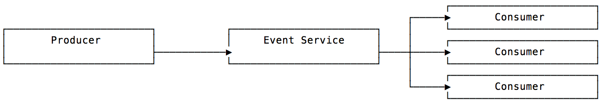
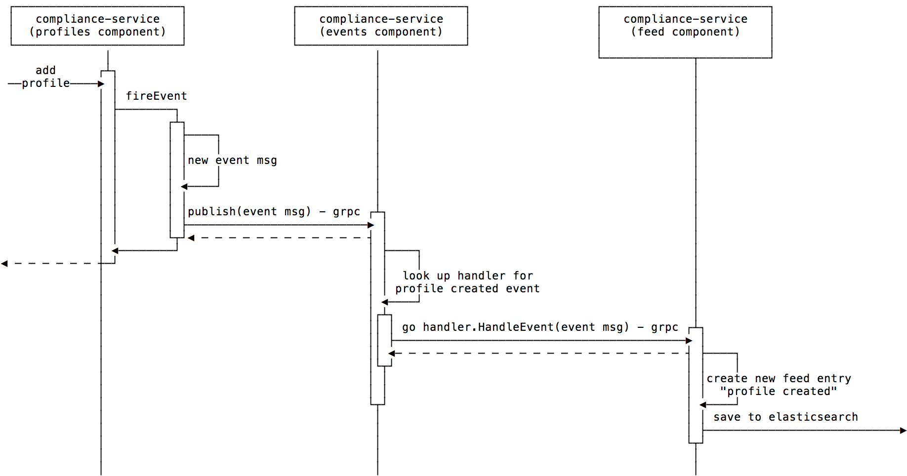
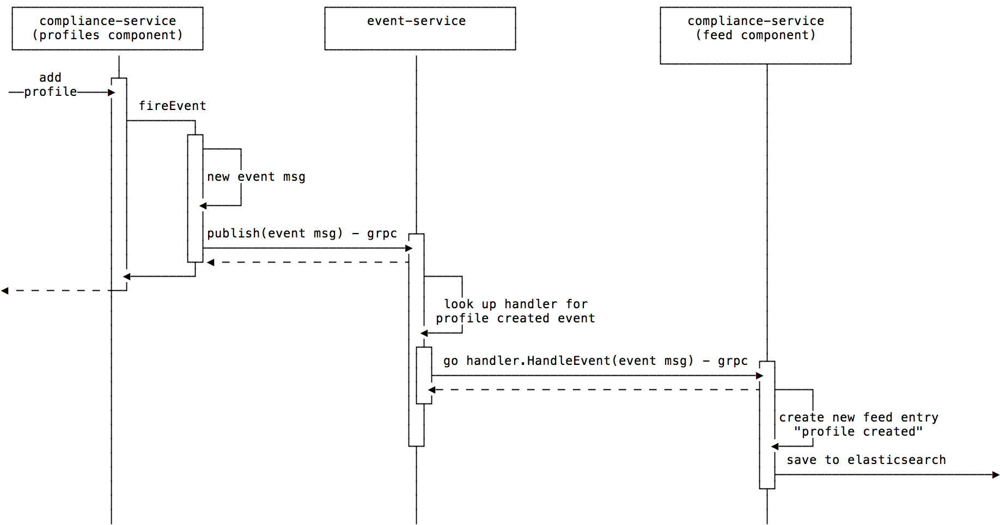

# ADR 2018-11-07: Enable event-driven computing for A2 via a shared, dedicated event service

## Status

* PROPOSED (2018-11-07)

## Context

We've adopted a microservices architecture for A2 in order to attain certain technical characteristics (scalability, performance, evolvability) which translate into competitive advantage for Chef (time-to-market, business agility). Small, single-purpose services which can be developed and deployed independently are the cornerstone of this architectural style; in order to reap its benefits, our services must collaborate without introducing counterproductive dependencies.

Event-driven computing (a.k.a. event-driven architecture, or EDA) allows services to communicate while remaining loosely coupled. In an event-driven system, event producers generate events in response to significant changes in state. Event consumers listen for these events and react by doing some additional processing. A dedicated intermediate component receives the events generated by producers and publishes them asynchronously to consumers which have registered interest. Producers are unaware of the consumers which react to their changes in state, and consumers just listen for events without knowing the details of where and how the events are produced. The only dependency introduced is that of producers and consumers on the event service which ingests and publishes events. Any service can be a producer, a consumer, or both.

Use cases for an event-driven model include:
- situations in which multiple components must be notified of a change in system state
- scenarios which demand a near real-time response to changes in system state
- cases where distributed transactions must be coordinated as a single logical unit of work, and two-phase commit is not feasible due to scalability and performance concerns
- complex event processing scenarios in which a consumer analyzes a series of events and reacts when conditions in aggregate meet prescribed thresholds
- the ability to recreate system state on demand by replaying actions that have occurred in the system (event sourcing)

Benefits
- High scalability, performance
- Facilitates parallelized operations
- Loose coupling between services
- No point-to-point integration; easy to add/remove/modify consumers
- Near real-time response to system events
- Lays the groundwork for event sourcing, should that become a direction we want to take

Challenges
- Asynchronous processing makes the system harder to test and reason about
- Guaranteed delivery requires additional infrastructure (pub/sub messaging, event streaming, etc.)
- Processing events in order or exactly once requires extra thought and effort
- Dealing with failure scenarios is more complex (retries, compensating events, etc.)

A2 Events: Current Flow Example

Currently, A2's compliance service fires events when a profile is created or deleted and when a scan job is created, updated, or deleted. The profiles component calls the service's internal events component via its gRPC interface to publish an event. The events component receives events on a channel and processes them one by one. During processing, the event component looks up the correct handler for the event (FeedServiceClient in the example above) and uses a new goroutine to make a gRPC call to HandleEvent on the feed component. The feed component then creates a new feed entry document in Elasticsearch. Feed entries are visible in the GUI'S event feed timeline.

Events are not persisted, and there are no retries or other compensating strategies in the event of a failure.

## Decision

Enable event-driven capabilities for all of A2 by exposing compliance service's events component as an independent service. The new event service will abstract the mechanics of event publishing from the rest of the system, acting as a generic interface over an event publishing and distribution mechanism which can evolve or be replaced over time.

A2 Events: Proposed Flow Example

The initial version of the new service will not persist events or perform retries. We will iterate on the event service as development use cases require new capabilities (message durability, guaranteed delivery, exactly-once and in-order processing, failure handling, etc.). We will consider third party solutions and frameworks (e.g., pub/sub messaging, event streaming) to underpin the event service abstraction as advanced features become necessary.

## Consequences

Once this decision is implemented, we will assess the resulting context by YYYY-MM-DD (tbd).