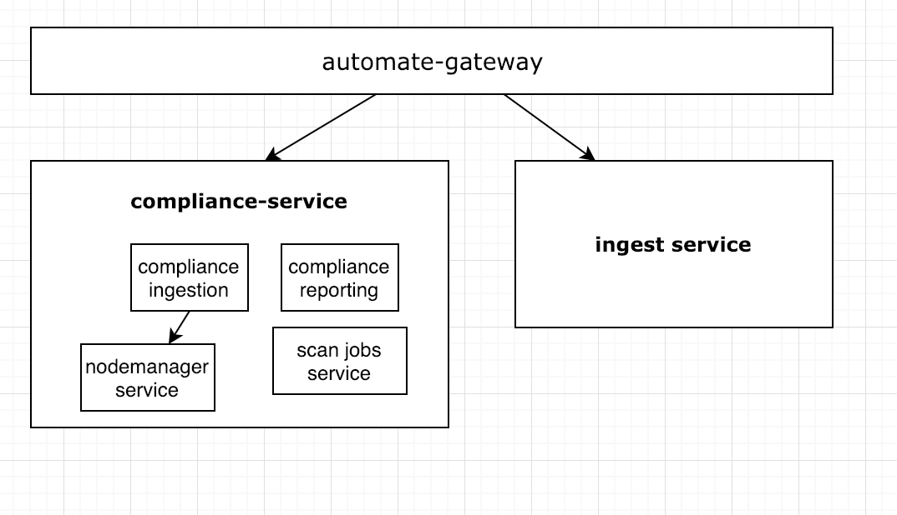
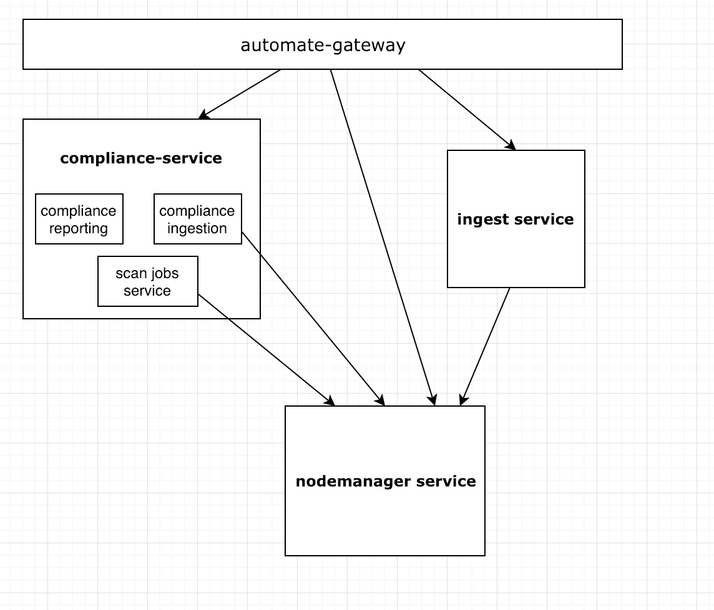

# ADR 2019-01-15: Nodemanager Package

## Context
We would like for the Nodes Service to be a central store of all the node objects across a user's infrastructure.  
This will allow us to provide the user with a way to easily map nodes between client-runs and compliance reports.
The Nodes Service maps to the `/nodes` endpoint.  
In today's world, nodes are added to that endpoint via manual node creation and cloud integration creation. Upon ingestion of a compliance report, the compliance ingest service makes a call to the ProcessNode endpoint in the Node Manager Service with some metadata information about the node.  The node is then updated or created.
In order to allow us to have a central store of all the nodes, we will need to have the client runs ingestion call the same ProcessNode endpoint with metadata about each incoming node.
The Node Manager Service and Nodes Service grew out of needs in the compliance service, and currently exists as part of that service/package. In order to enable the client run ingestion to make the call to Node Manager Service, the Node Manager service will need to be pulled out into its own independent package/service in A2.

### Current Architecture

### Desired Architecture

