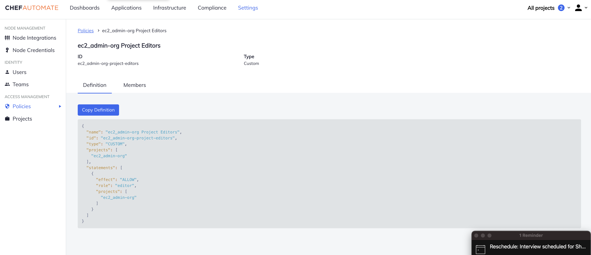
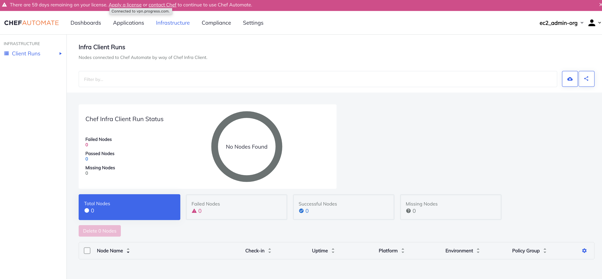
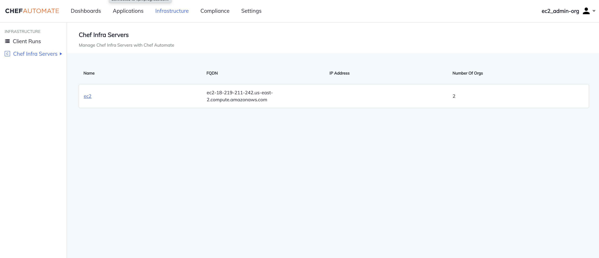
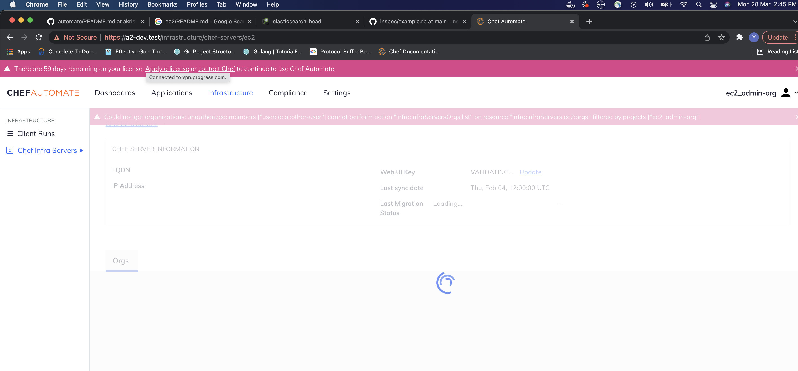

## Context
Do Performance testing and benchmarking to capture the API response times for 
the infra proxy APIs

## chef infra-proxy upload file API for sync org and users
API endpoint - "api/v0/infra/servers/migrations/upload"

Tested the different size of zip files with similar CPU and memory requirement of Automate as 
    - 16 GB of RAM
    - 80 GB of disk space (available to /hab)
    - 4 vCPUs

The following details are captured through the API

    | File Size  |  API response time
    | 10 MB      |  514ms
    | 512 MB     |  30.61s
    | 1 GB       |  58.73s
    | 1.5 GB     |  1.4min
    | 2 GB       |  Error: 413 Request Entity Too Large

The maximum size of zip file we can use is 1.5GB

## Chef infra-proxy project owners and project editors views testing

Used the below CPU and memory requirements of Automate as
    - 16 GB of RAM
    - 80 GB of disk space (available to /hab)
    - 4 vCPUs

The following details are captured

Infra Server Org Admins (Project-Owners)
    
1. All the tabs are visible like Application,Infrastructure,Compliance etc
2. Inside Settings tab the user is able to see the project assigned to him and change the members with the project policy.
3. The user is unable to see Chef Infra Servers Tab inside Infrastructure Tab

Settings Tab View:

Infrastructure Tab View:

Infra Server Org Non-Admins (Project-Editors)

1. All the tabs are visible like Application,Infrastructure,Compliance etc
2. Inside Settings tab the user is able to see only Projects and nodes section.
3. The User is able to see Chef Infra servers tab inside Infrastructure Tab and list of various servers added as well.
4. When the user clicks on the server it gives an authorisation error and page gets stuck on the waiting symbol

Chef Infra Servers View:

Server View:

