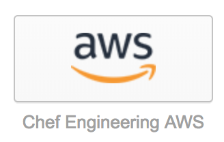
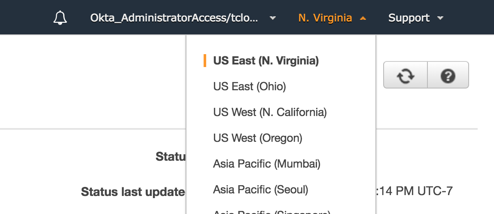
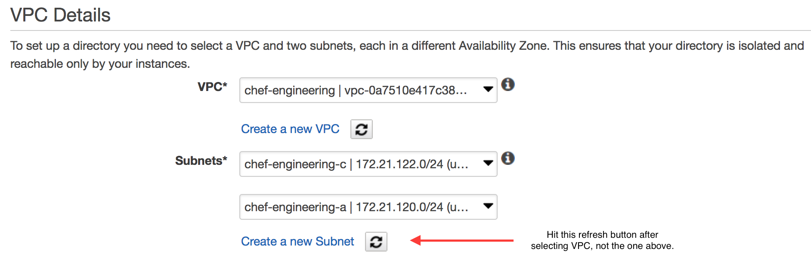
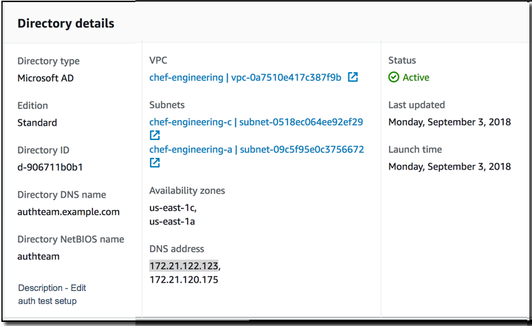
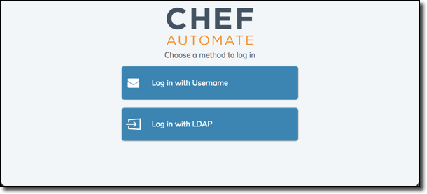
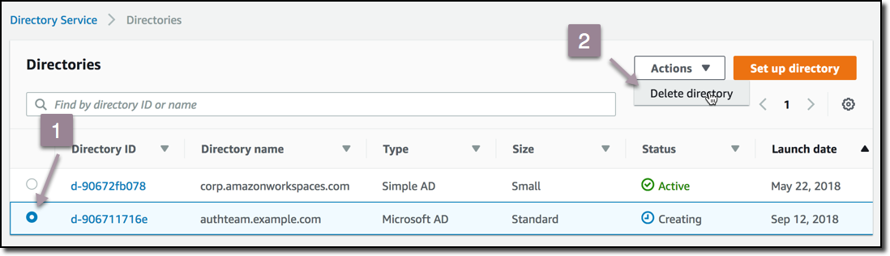

# LDAP Development via MSAD in AWS

You can spin up an ad-hoc MSAD (Microsoft Active Directory) environment for your LDAP
development needs. MSAD represents the vast majority of what we'll see on site with customers.
We'll be using AWS to spin up an ad-hoc MSAD environment within the chef-engineering
VPC (virtual private cloud).

## Step 1: Deploying your MSAD Server (takes around 30 minutes)

1. Log into the `chef-engineering` AWS account via Okta:

   

2. Ensure you are in the correct region (so you can use the VPC that is already
   configured with our VPN). You'll want to use `us-east-1` aka N. Virginia by selecting
   it from the dropdown:

   

3. Search `Directory Service` in the search bar.

4. Select `Set up Directory` -> `AWS Managed Microsoft AD`.

5. Select "Standard Edition" then fill out `Directory DNS` as desired.
   This will form the base_dn (base Distinguished Name)
   for your whole AD server. We've used `authteam.example.com` for this example.

6. (Optional) Fill out `NetBIOS name` if you desire to name your base OU (organizational unit)
   something specific. If you don't choose, it'll pick the first part of your `Directory DNS`
   FQDN (so in our example, `authteam`).

7. Enter an admin password. This will be used to bind as the admin to make changes to your AD
   environment. For this example, `ChefAutomate1#` meets the AWS password requirements.

8. For VPC, select the `chef-engineering` VPC (virtual private cloud). This VPC is already
   configured with VPN access via the standard engineering VPN. So, if you are on the VPN
   you can access private IPs within the VPC. This is important since AWS AD does not support
   public IPs so you must be within a VPC.

9. Next select two of the `chef-engineering-*` subnets.
   These subnets are already configured to talk to
   the internet (but only within the VPN) and have the proper network ACLs set up.
   (You should see those automatically but if not use the refresh button(s) next to the subnets
   (not the one by VPC).

   

10. Hit `Create Directory`! This will take about 25-35 minutes. ☕️ 🐶 😺 🐰
    (You will need to refresh your browser to see the status update from "Creating" to "Active".)

## Step 2: Test Out Your AD Instance

1. Once your AD instance is up, you should see a page like this. Verify that the info
   for your instance looks correct:

   

2. Log into the VPN.

3. Use `nc` to see if you can connect to the LDAP port of your AD server
   (`telnet` was replaced by `nc` as the de facto networking tool in macOS High Sierra):

   ```shell
   nc -v <your IP> 389
   ```

   You can use either of the IPs shown in the `DNS Address` from your AD overview as shown above.

   If successful, you'll see output like:

   ```text
   found 0 associations
   found 1 connections:
        1: flags=82<CONNECTED,PREFERRED>
           src 172.27.234.100 port 63146
           dst 172.21.122.203 port 389
           rank info not available
           TCP aux info available

   Connection to 172.21.122.203 port 389 [tcp/ldap] succeeded!
   ```

   At that point, just abort with `^C`.

4. Next, let's test a bind using the Admin user and `ldapsearch`. Here's what that looks like
   for our example:

   ```shell
   ldapsearch -x -h 172.21.122.19:389 -w ChefAutomate1# -D "CN=Admin,OU=Users,OU=authteam,DC=authteam,DC=example,DC=com" -b "CN=Admin,OU=Users,OU=authteam,DC=authteam,DC=example,DC=com"
   ```

   Or in more generic terms:

   ```shell
   ldapsearch -x -h <DNS address>:389 -w <Admin password> -D "CN=Admin,OU=Users,OU=<NetBIOS name>,DC=<your domain>,DC=<as separated>,DC=<by dots>" -b "CN=Admin,OU=Users,OU=<NetBIOS name>,DC=<your domain>,DC=<as separated>,DC=<by dots>"
   ```

Let's walk through each part:

* `-x` specifies simple bind.
* `-h` is the `DNS address` from the previous step combined with the default LDAP port.
* `-w` is the admin password you specified in step 7 of part 1.
* `-D` is the bind DN of your admin user (aka the distinguished name that is defined by
  the unique path to your admin user in AD). The bind DN path starts from your user to
  the top of the directory tree.
  * Starting with `CN=Admin`, this means `Common Name=Admin` and will always be `Admin`.
  * Next, we have `OU=Users`. This is the Organizational Unit (group) that all `Users` reside
    in (as opposed to `Computers` which can also be referenced by LDAP). This is a sub-OU of
    `OU=authteam`.
  * `OU=authteam` is the top-level OU that you optionally specified in step 6 of part 1.
    If you are unsure what this should be for you, look at the value for `NetBIOS name`.
  * Lastly, you have your Common Name (CN). Each entry of this is your `Directory name`
    as separated by the dots in the domain. In our example, it is
    `DC=authteam,DC=example,DC=com` since our `Directory name` is `authteam.example.com`.
* `-b` is the same as `-D` in this example since we are simply searching for ourselves.

Output should look like:

```ldif
# extended LDIF
#
# LDAPv3
# base <CN=Admin,OU=Users,OU=authteam,DC=authteam,DC=example,DC=com> with scope subtree
# filter: (objectclass=*)
# requesting: ALL
#

# Admin, Users, authteam, authteam.example.com
dn: CN=Admin,OU=Users,OU=authteam,DC=authteam,DC=example,DC=com
objectClass: top
objectClass: person
objectClass: organizationalPerson
...
```

And should contain the entire AD record of our Admin user.

## Step 3: Configure the Dev Env with your AD Server

1. Start the Dev Env

   ```bash
   $ hab studio enter
   # start_all_services
   ```

2. Make a file named `auth.toml` that will contain our LDAP config:

   ```toml
   [dex.v1.sys.connectors.ldap]
   host = "<DNS address>:389"
   bind_dn = "CN=Admin,OU=Users,OU=<NetBIOS name>,DC=<your domain>,DC=<as separated>,DC=<by dots>"
   bind_password = "<password>"
   # this is ok because all traffic is behind our VPN
   insecure_no_ssl = true
   base_user_search_dn = "DC=<your domain>,DC=<as separated>,DC=<by dots>"
   username_attr = "sAMAccountName"
   user_id_attr = "sAMAccountName"
   email_attr = "sAMAccountName"
   user_query_filter = "(objectClass=person)"
   base_group_search_dn = "DC=<your domain>,DC=<as separated>,DC=<by dots>"
   group_query_filter = "(objectClass=group)"
   ```

   Here is a filled-in version based on the example values used earlier (except for the DNS address!):

   ```toml
   [dex.v1.sys.connectors.ldap]
   host = "<DNS address>:389"
   bind_dn = "CN=Admin,OU=Users,OU=authteam,DC=authteam,DC=example,DC=com"
   bind_password = "ChefAutomate1#"
   base_user_search_dn = "DC=authteam,DC=example,DC=com"
   username_attr = "sAMAccountName"
   user_id_attr = "sAMAccountName"
   # default admin created by AWS does not have a mail field
   email_attr = "sAMAccountName"
   user_query_filter = "(objectClass=person)"
   base_group_search_dn = "DC=authteam,DC=example,DC=com"
   group_query_filter = "(objectClass=group)"
   # this is ok because all traffic is behind our VPN
   insecure_no_ssl = true
   ```

3. Apply the config and let automate-dex restart.

   ```bash
   $ chef-automate config patch auth.toml
   ```

   If automate-dex does not restart itself, kill its process and it will restart automatically.

4. Once automate-dex restarts, confirm that the configuration changes have been registered
   by viewing the active configuration.
   Here, the unrelated portions of the configuration have all been elided.
   If correctly registered, you should see the new `connectors` section detailing the LDAP config.

   ```bash
   $ cat /hab/svc/automate-dex/config/config.yml

   issuer: https://a2-dev.test/dex
   enablePasswordDB: true
   storage:
     . . .
   web:
     . . .
   grpc:
     . . .
   frontend:
     . . .
   logger:
     . . .
   oauth2:
     . . .
   staticClients:
     . . .
   connectors:
     - type: ldap
       id: ldap
       name: LDAP
       config:
         host: 172.21.122.123:389
         bindDN: $LDAP_BINDDN
         bindPW: $LDAP_BINDPW
         insecureSkipVerify: true
         insecureNoSSL: true
         userSearch:
           baseDN: DC=authteam,DC=example,DC=com
           filter: (objectClass=person)
           username: sAMAccountName
           idAttr: sAMAccountName
           emailAttr: sAMAccountName

           nameAttr: name
         groupSearch:
           baseDN: DC=authteam,DC=example,DC=com
           filter: (objectClass=group)
           userAttr: DN
           groupAttr: member
           nameAttr: name
   expiry:
     . . .
   ```

5. Log in as the Admin user.
   Open <https://a2-dev.test/> and instead of just showing a name and password prompt,
   your login screen should now show a choice of login providers:

   

   Select the `Log in with LDAP` choice and then log in as `Admin`
   with the password you configured above (the example used `ChefAutomate1#`).

6. Important: Remember to destroy your AD instance once you are done to save money. 🤑
   Do this by returning to the AWS Directory Service >> Directories page, select your directory (1),
   then from the Actions dropdown select Delete Directory (2).

   
