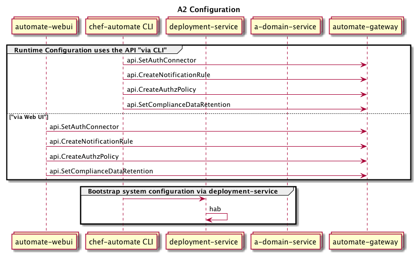

Chef Automate Platform Contracts
===

This document describes the contract guarantees that an A2 services must adhere
to in order to integrate with the Chef Automate platform.

Index
---

1. [Component Types](#component-types)
1. [Configuration](#Configuration)
    1. [Config Files](#config-files)
    1. [ConfigRequest Protobufs](#configrequest-messages)
    1. [Configuration Service Protobufs](#configuration-services)
    1. [Proxy Configuration Services](#proxy-configuration-services)
    1. [Component Obligations](#configuration-obligations)
1. [Upgrades](#upgrades)
1. [Health Checks](#health-checks)

Component Types
---

A2 components can be broken down along Domain Driven Design layers:

  * UI: Present information to the user and interpret user commands.
  * Application: Coordinates the application activity. It doesn't contain any
    business logic. It does not hold the state of business objects, but it
    can hold the state of an application task's progress.
  * Domain: Contains information about the business domain. The state of
    business objects is held here. Persistence of the business objects and
    possibly their state is delegated to the infrastructure layer.
  * Infrastructure: A supporting library for all the other layers. It provides
    communication between layers, implements persistence for business objects,
    contains supporting libraries for the user interface layer, etc.


You'll need the component type to determine the namespace in some required
protocol buffers.

Configuration
---

Generally, configuration files are preferred to command line arguments
and environment variables. CLI arguments and environment variables
require special handling in the service's habitat `run` hook which
reduces flexibility and conflates system and service configuration (see
below)

TOML is preferred to other formats.

#### System vs. Service Configuration

Services in A2 have two distinct types of configuration:

  * System: System configuration is any configuration that is required in order to
    start the service. It is the deployment service's responsibility to set this
		configuration at the time of deployment. It is the responsibility of the
		component service to expose this configuration via a config file and to be
		configurable via its hab user.toml.

    Examples: listen address, TLS certs, and service binds.

  * Service: Service configuration is any configuration that can be dynamically
    applied at runtime and is not required for the service to initialize. It
    is the service's responsibility to implement an API that will set and persist
    changes to service configuration.

    Examples: backup retention period, upgrade strategy, and LDAP/SAML settings.



#### Config Files

Every component service in the A2 platform is managed by habitat.
Each must be a hab package whose System level configuration can be applied via
a user.toml and hab run hooks.

Each component must also configure mutual TLS certs for secure communication
between gRPC services. For supporting services that are not gRPC services or
don't support mutual TLS, another secure transport mechanism must be used.

#### ConfigRequest Messages

A service's system configuration should be composed into a single `ConfigRequest`
protocol buffer with the System configuration nested into the
message. It should be namespaced to `chef.automate.$component_type.$component_name`
where component_type's are:

  * `domain` for domain components
  * `infra` for infrastructure components
  * `app` for application components
  * `ui` for ui components

The protobufs should be annotated with a fully qualified Go package name so
that they are importable into other components. Protobuf compilation should be
done with a [scripts/grpc.sh](https://github.com/chef/automate/blob/master/components/automate-deployment/scripts/grpc.sh)
file. The resulting Go package `ConfigRequest` structs should be annotated with
`lower_case_underscore` style `toml` tags. As in the script linked above, you'll
need to manually modify the resulting go files to include the `toml` tags.

It is also important to make sure that the generated configuration can distinguish
between language default values and missing values. This means you should avoid using
primitive types such as `string` because the generated code will not be able to distinguish
between a missing value and a default value. Instead, use the wrapper types found in
`google/protobuf/wrappers.proto`. The `github.com/chef/automate/api/config/shared/wrappers`
package provides helpers to create this wrapper types in go.

Example:

```protobuf
syntax = "proto3";

package chef.automate.domain.license_control;
option go_package = "github.com/chef/automate/components/component-name/pkg/api";

import "api/config/shared/global.proto";
import "api/config/shared/tls.proto";
import "google/protobuf/wrappers.proto";

message ConfigRequest {
  V1 v1 = 1;

  message V1 {
    System sys = 1;
    Service svc = 2;

    message System {
      chef.automate.infra.config.Mlsa mlsa = 1;
      chef.automate.infra.config.TLSCredentials tls = 2;
      Service service = 3;

      message Service {
        google.protobuf.StringValue host = 1;
        google.protobuf.Int32Value port = 2;
      }
    }

  }
}
```

and the resulting TOML representation:

```toml
[cfg.v1]
  [cfg.v1.sys]
    [cfg.v1.sys.mlsa]
      accept = true
    [cfg.v1.sys.tls]
      root_ca_contents = "root cert"
      cert_contents = "service cert"
      key_contents = "service cert key"
    [cfg.v1.sys.service]
      host = "0.0.0.0"
      port = 9999
```

By following this convention we can use the same object representation for the
habitat `user.toml`, the Automate config file, our deployment configuration requests,
and CLI/UI configuration change requests. The rendered user.toml would look like:

```toml
[mlsa]
  accept = true

[tls]
  root_ca_contents = "root cert"
  cert_contents = "service cert"
  key_contents = "service cert key"

[service]
  host = "0.0.0.0"
  port = 9999
```

In addition to the protobuf, the Go package should also contain a few exported
initialization and validation functions:

```golang
import "github.com/chef/automate/api/config/shared"

// DefaultConfigRequest returns a new ConfigRequest instance with default values
func DefaultConfigRequest() *ConfigRequest

// Validate validates that the config is sufficient to start the service. If
// the validation fails it returns an error containing all missing required
// keys and incompatible values.
func (c *ConfigRequest) Validate() *config.InvalidConfigError

// SetGlobalConfig takes a pointer to a config.GlobalConfig and applies any
// global configuration that the service requires.
func (c *ConfigRequest) SetGlobalConfig(c *config.GlobalConfig)

// PrepareSystemConfig returns a system configuration that can be used
// to start the service. It is provided the tls credentials it should
// use.
// The returned system configuration is rendered as the user.toml
func (c *ConfigRequest) PrepareSystemConfig(creds *config.TLSCredentials) config.PreparedSystemConfig
```

These functions will allow consuming packages to safely initialize structs
that we can unmarshal the config data into.


#### Proxy Configuration Services

In cases where the service does not have a persistence layer or does not
have a gRPC server but still needs to persist its configuration, it can
implement a proxy Configuration persistence endpoint in the deployment-service.

#### Configuration Obligations

Consult the following table to determine which configuration contracts your service
is obligated to fulfill.

<table>
  <tr>
    <th colspan="2">your service</th>
    <th colspan="4">your obligations</th>
  </tr>
  <tr>
    <th>gGRPC Server?</th>
    <th>Runtime Config Updates?</th>
    <th>Config File</th>
    <th>Config Message</th>
    <th>Config Service</th>
    <th>Proxy Config Service</th>
  </tr>
  <tr>
    <td>✔</td>
    <td>✔</td>
    <td>✔</td>
    <td>✔</td>
    <td>✔</td>
    <td>✘</td>
  </tr>
  <tr>
    <td>✔</td>
    <td>✘</td>
    <td>✔</td>
    <td>✔</td>
    <td>✔</td>
    <td>✘</td>
  </tr>
  <tr>
    <td>✘</td>
    <td>✘</td>
    <td>✔</td>
    <td>✔</td>
    <td>✘</td>
    <td>✘</td>
  </tr>
  <tr>
    <td>✘</td>
    <td>✔</td>
    <td>✔</td>
    <td>✔</td>
    <td>✘</td>
    <td>✔</td>
  </tr>
</table>

Upgrades (A2 to A2)
---

Services must handle their own upgrades. We must ensure that customers
can upgrade from any version N directly to any newer version (N +
M). To support rolling upgrades in the future, it must be possible for
version N of a service to continue to function along side version (N +
M).

Health Checks
---

Services must implement valid health check via Habitat. See the docs
here on Habitat hooks and look at what’s been implemented in the
local-user-service and also here.

The goal of the health check is to verify that the service is alive
and able to process requests. Request:

Each service must implement a Habitat hook health check. The health
check should validate that the service is running and able to process
requests.

